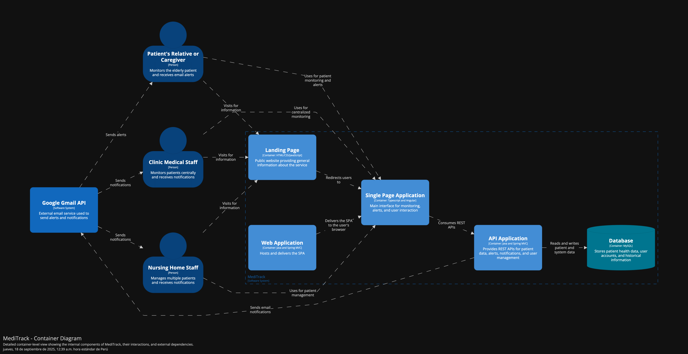

### UNIVERSIDAD PERUANA DE CIENCIAS APLICADAS

### Ingeniería de Software

### 5TO Ciclo

### Código: 1ASI0729

### Curso: Desarrollo de Aplicaciones Open Source - Presencial

### NRC: 7394

### Docente: Hugo Allan MoriPaiva

### Informe de Trabajo Final

### Startup: AlpacaFlow

### Producto: MediTrack

### Intregrantes:

<table>
  <thead>
    <tr>
      <th style="background-color: #333; color: #fff;">Apellidos y Nombres</th>
      <th style="background-color: #333; color: #fff;">Código de Alumno</th>
    </tr>
  </thead>
  <tbody>
    <tr>
      <td>Barrientos Quispe, Marcelo</td>
      <td>U20221E646</td>
    </tr>
    <tr>
      <td>Nikaido Vargas, Javier Masaru</td>
      <td></td>
    </tr>
    <tr>
      <td>Cuba Pareja, Joaquin Antonio</td>
      <td>U201621281</td>
    </tr>
    <tr>
      <td>Fernandez Camayo, Carlos Fredy</td>
      <td>U202320083</td>
    </tr>
    <tr>
      <td>Rivera Ayala, Gabriel Alejandro</td>
      <td></td>
    </tr>
  </tbody>
</table>

## AGOSTO - 2025

# Registro de Versiones del Informe

# Project Report Collaboration Insights

# Contenido

## Tabla de Contenidos

- [Student Outcome](#student-outcome)

- [Capítulo I: Introducción](#capítulo-i-introducción)

- [1.1. Startup Profile](#11-startup-profile)
  - [1.1.1. Descripción de la Startup](#111-descripción-de-la-startup)
  - [1.1.2. Perfiles de integrantes del equipo](#112-perfiles-de-integrantes-del-equipo)
- [1.2. Solution Profile](#12-solution-profile)
  - [1.2.1. Antecedentes y problemática](#121-antecedentes-y-problemática)
  - [1.2.2. Lean UX Process](#122-lean-ux-process)
    - [1.2.2.1. Lean UX Problem Statement](#1221-lean-ux-problem-statement)
    - [1.2.2.2. Lean UX Assumptions](#1222-lean-ux-assumptions)
    - [1.2.2.3. Lean UX Hypothesis Statements](#1223-lean-ux-hypothesis-statements)
    - [1.2.2.4. Lean UX Canvas](#1224-lean-ux-canvas)
- [1.3. Segmentos objetivo](#13-segmentos-objetivo)

- [Capítulo II: Requirements Elicitation & Analysis](#capítulo-ii-requirements-elicitation--analysis)

- [2.1. Competidores](#21-competidores)
  - [2.1.1. Análisis competitivo](#211-análisis-competitivo)
  - [2.1.2. Estrategias y tácticas frente a competidores](#212-estrategias-y-tácticas-frente-a-competidores)
- [2.2. Entrevistas](#22-entrevistas)
  - [2.2.1. Diseño de entrevistas](#221-diseño-de-entrevistas)
  - [2.2.2. Registro de entrevistas](#222-registro-de-entrevistas)
  - [2.2.3. Análisis de entrevistas](#223-análisis-de-entrevistas)
- [2.3. Needfinding](#23-needfinding)
  - [2.3.1. User Personas](#231-user-personas)
  - [2.3.2. User Task Matrix](#232-user-task-matrix)
  - [2.3.3. User Journey Mapping](#233-user-journey-mapping)
  - [2.3.4. Empathy Mapping](#234-empathy-mapping)
- [2.4. Big Picture EventStorming](#24-big-picture-eventstorming)
- [2.5. Ubiquitous Language](#25-ubiquitous-language)

- [Capítulo III: Requirements Specification](#capítulo-iii-requirements-specification)

- [3.1. User Stories](#31-user-stories)
- [3.2. Impact Mapping](#32-impact-mapping)
- [3.4. Product Backlog](#34-product-backlog)

- [Capítulo IV: Product Design](#capítulo-iv-product-design)

- [4.1. Style Guidelines](#41-style-guidelines)
  - [4.1.1. General Style Guidelines](#411-general-style-guidelines)
  - [4.1.2. Web Style Guidelines](#412-web-style-guidelines)
- [4.2. Information Architecture](#42-information-architecture)
  - [4.2.1. Organization Systems](#421-organization-systems)
  - [4.2.2. Labeling Systems](#422-labeling-systems)
  - [4.2.3. SEO Tags and Meta Tags](#423-seo-tags-and-meta-tags)
  - [4.2.4. Searching Systems](#424-searching-systems)
  - [4.2.5. Navigation Systems](#425-navigation-systems)
- [4.3. Landing Page UI Design](#43-landing-page-ui-design)
  - [4.3.1. Landing Page Wireframe](#431-landing-page-wireframe)
  - [4.3.2. Landing Page Mock-up](#432-landing-page-mock-up)
- [4.4. Web Applications UX/UI Design](#44-web-applications-uxui-design)
  - [4.4.1. Web Applications Wireframes](#441-web-applications-wireframes)
  - [4.4.2. Web Applications Wireflow Diagrams](#442-web-applications-wireflow-diagrams)
  - [4.4.3. Web Applications Mock-ups](#443-web-applications-mock-ups)
  - [4.4.4. Web Applications User Flow Diagrams](#444-web-applications-user-flow-diagrams)
- [4.5. Web Applications Prototyping](#45-web-applications-prototyping)
- [4.6. Domain-Driven Software Architecture](#46-domain-driven-software-architecture)
  - [4.6.1. Software Architecture Context Diagram](#461-software-architecture-context-diagram)
  - [4.6.2. Software Architecture Container Diagrams](#462-software-architecture-container-diagrams)
  - [4.6.3. Software Architecture Components Diagrams](#463-software-architecture-components-diagrams)
- [4.7. Software Object-Oriented Design](#47-software-object-oriented-design)
  - [4.7.1. Class Diagrams](#471-class-diagrams)
- [4.8. Database Design](#48-database-design)

  - [4.8.1. Database Diagrams](#481-database-diagrams)

- [Capítulo V: Product Implementation, Validation & Deployment](#capítulo-v-product-implementation-validation--deployment)

- [5.1. Software Configuration Management](#51-software-configuration-management)
  - [5.1.1. Software Development Environment Configuration](#511-software-development-environment-configuration)
  - [5.1.2. Source Code Management](#512-source-code-management)
  - [5.1.3. Source Code Style Guide & Conventions](#513-source-code-style-guide--conventions)
  - [5.1.4. Software Deployment Configuration](#514-software-deployment-configuration)
- [5.2. Landing Page, Services & Applications Implementation](#52-landing-page-services--applications-implementation)
  - [5.2.1. Sprint 1](#521-sprint-1)
    - [5.2.1.1. Sprint Planning 1](#5211-sprint-planning-1)
    - [5.2.1.2. Aspect Leaders and Collaborators](#5212-aspect-leaders-and-collaborators)
    - [5.2.1.3. Sprint Backlog 1](#5213-sprint-backlog-1)
    - [5.2.1.4. Development Evidence for Sprint Review](#5214-development-evidence-for-sprint-review)
    - [5.2.1.5. Execution Evidence for Sprint Review](#5215-execution-evidence-for-sprint-review)
    - [5.2.1.6. Services Documentation Evidence for Sprint Review](#5216-services-documentation-evidence-for-sprint-review)
    - [5.2.1.7. Software Deployment Evidence for Sprint Review](#5217-software-deployment-evidence-for-sprint-review)
    - [5.2.1.8. Team Collaboration Insigths during Sprint](#5218-team-collaboration-insigths-during-sprint)
- [5.3. Validation Interviews](#53-validation-interviews)

  - [5.3.1. Diseño de Entrevistas](#531-diseño-de-entrevistas)
  - [5.3.2. Registro de Entrevistas](#532-registro-de-entrevistas)
  - [5.3.3. Evaluaciones según heurísticas](#533-evaluaciones-según-heurísticas)

- [Conclusiones](#conclusiones)

  - [Conclusiones y recomendaciones](#conclusiones-y-recomendaciones)
  - [Video About-the-Product](#video-about-the-product)

- [Bibliografía](#bibliografía)

- [Anexos](#anexos)

# Student Outcome

# Capítulo I: Introducción

## 1.1. Startup Profile

### 1.1.1. Descripción de la Startup

### 1.1.2. Perfiles de integrantes del equipo

## 1.2. Solution Profile

### 1.2.1. Antecedentes y problemática

### 1.2.2. Lean UX Process

#### 1.2.2.1. Lean UX Problem Statement.

#### 1.2.2.2. Lean UX Assumptions.

#### 1.2.2.3. Lean UX Hypothesis Statements.

#### 1.2.2.4. Lean UX Canvas

## 1.3. Segmentos objetivo

# Capítulo II: Requirements Elicitation & Analysis

## 2.1. Competidores

### 2.1.1. Análisis competitivo

### 2.1.2. Estrategias y tácticas frente a competidores

## 2.2. Entrevistas

### 2.2.1. Diseño de entrevistas

### 2.2.2. Registro de entrevistas

### 2.2.3. Análisis de entrevistas

## 2.3. Needfinding

### 2.3.1. User Personas

### 2.3.2. User Task Matrix

### 2.3.3. User Journey Mapping

### 2.3.4. Empathy Mapping

## 2.4. Big Picture EventStorming

## 2.5. Ubiquitous Language

# Capítulo III: Requirements Specification

## 3.1. User Stories

## 3.2. Impact Mapping

## 3.4. Product Backlog

# Capítulo IV: Product Design

## 4.1. Style Guidelines

### 4.1.1. General Style Guidelines
Una guía de estilo o style guideline es un compendio de normas y recomendaciones
que definen cómo deben redactarse, diseñarse o presentarse documentos, contenidos 
web, software u otras producciones creativas. A continuación, se detallan las 
especificaciones correspondientes a los parámetros aplicados en la estructura del
proyecto:

 **Branding:**

**Brand Overview:**

AlpacaFlow se enfoca en desarrollar una solucion tecnologica orientada al sector de salud
para el cuidado de pacientes geriatricos mediante Meditrack. Por lo que implementa una plataforma encargada 
de administrar el cuidado mediante agentes de diferente contexto. Como allegados al paciente, personal 
de casas de reposo y personal medico de clinicas. Asimismo favorece a la gestion y calidad 
de cuidado del paciente, como alerta inmediata, dashboard intuitivo para la administracion y vigilancia
del estado del paciente.

**Mision:** Desarrollar herramientas digitales accesibles y efectivas que permitan a pacientes, 
familias e instituciones de salud monitorear y gestionar la salud de los adultos mayores en tiempo real,
brindando seguridad, confianza y eficiencia.

**Vision:**  En los próximos 5 años, consolidar a RurasqaySoft como una la empresa líder en soluciones
de salud digital en Latinoamérica, siendo reconocidos por nuestra capacidad de mejorar la calidad de 
vida y prevenir riesgos mediante el uso de innovación tecnológica accesible y escalable.

**Brand Name:**

El nombre de la propuesta de la solucion es Meditrack. Enfocada en el sector de salud y dispositivos tecnologicos
para dar sentido a una plataforma que emplea dispositivos IoT para maximizar la intervencion de la tecnologica en la salud.

**Colores:**

Los colores transmiten la presencia inicial hacia los usuarios. Mostrando indicios de la aplicacion
adecuada de la paleta de colores qe pueden generar un impacto. El rojo demuestra la urgencia, cuidado y salud medica 
para evidenciar el monitorio constante, el negro aporta seriedad y confianza tecnologica. El azul es empleado 
como la calma, tecnologica confiable y garantiza seguridad. El blanco complementa al rojo como signo de limpieza, claridad
y simplicidad.

**Tipografia**

La tipografía define la jerarquía visual entre los distintos grupos de contenido de la página y desempeña un papel
clave en la orientación del usuario dentro de la interfaz. Para este proyecto se eligió la familia tipográfica
“Montserrat”, en estilos Medium y Normal, con el fin de asegurar una lectura clara y fluida. Asimismo, se implementa 
una estructura jerárquica en cuatro niveles para organizar los elementos del modelado web (body y heading):
- Heading 01: Presenta un tamaño de 52px.
- Heading 02: Presenta un tamaño de 36px.
- Heading 03: Presenta un tamaño de 24px.
- Heading 04: Presenta un tamaño de 18px.

### 4.1.2. Web Style Guidelines
MediTrack emplea un enfoque serio y confiable, con un estilo que busca balancear datos tecnicos complejos con una 
experiencia visualmente amigable.

**Tarjetas y visualizaciones:**

Se emplea componentes "cards" para presentar elementos que el usuario pueda visualizar como prioridad y de manera organizada
para que pueda tener una adecuada visualizacion.

**Botones:**

Se utilizan los botones segun la utilidad requerida, teniendo botones redondeados para permitir acciones como continuar
o respuesta a propuestas de la plataforma, permiten al usuario acceder a funcionalidades importantes. 
Los botones cuentan con un estilo que permite al usuario conocer su utilidad sin realizar acciones innecesarias, asi como 
un contraste que permita identificarlos facilmente.

**Tablas:**

Las tablas muestran el contraste y organizacion adecuado para que no agoten la vision del usuario, asi como la ubicacion
para instanciar registros. Las tablas presentadas permiten acciones pertinentes para cumplir eficientemente su funcionalidad.

**Pantallas emergentes:**

Pop-ups propios (no de navegador) para confirmación de acciones importantes. Como confirmaciones o rechazos ante acciones
que el usuario pueda tomar la decision. Permiten mostrar el mensaje principal de manera pertinente con un diseño que se diferencie
de la pantalla y muestre su relevancia.

## 4.2. Information Architecture
Meditrack busca optimizar adecuadamente sus procesos y flujos funcionales, ya que es juega un rol importante en el nucleo del
negocio, ya que el usuario debe estar consciente del espacio donde se encuentra, lo que evita malas experiencias y orientan
su estancia en la aplicacion, por lo que los procesos donde se vea involucrado deben tener un adecuado orden. Mediante el panel de control
el usuario puede acceder a las funcionalidades de forma facil y centrada, asimismo los elementos encontrados orientan sobre el estado
del sistema.

### 4.2.1. Organization Systems
La organizacion visual de contenido se ha diseñada teniendo en cuenta las distintas funcionalidades que se tiene para 
cubrir el proceso de cuidado a pacientes geriatricos. A lo largo de la plataforma, se utilizan diferentes tipos de organizacion
visual para facilitar el acceso, comprension y uso eficiente de las herramientas disponibles.

**Organizacion Jeraraquica**

La estructura presentada en la Landing Page y paneles de administracion. En estos espacios, se presenta la informacion de manera descendente 
segun su relevancia, emepezando por el valor de la aplicacion, presentacion de solucion, productos y planes disponibles.

**Organizacion Secuencial**

En procesos como registro de usuario o de pacientes, se cuenta con la presentacion secuencial de paneles que revelan de manera
concreta el mensaje principal, dando la opcion de regreso para evitar malas experiencias y tenga facilidad de uso.

**Organizacion Matricial**

Los elementos presentados como el dashboard utiliza una organizacion matricial que permite al usuario tener una vista general del estado
de su operacion, asi como uso de elementos interactivos que dan valor a su permanencia en el sistema.

### 4.2.2. Labeling Systems

1. **Navegación Principal (Navbar)**

| Clave JS       | Etiqueta Simplificada |
| -------------- | --------------------- |
| `nav-home`     | Inicio                |
| `nav-services` | Servicios             |
| `nav-about`    | Nosotros              |
| `nav-plans`    | Planes                |
| `nav-contact`  | Contacto              |

2. **Sección Hero**

| Clave JS               | Etiqueta Simplificada |
| ---------------------- | --------------------- |
| `hero-title`           | Título principal      |
| `hero-description`     | Descripción destacada |
| `hero-discover-button` | Botón: Descubrir      |
| `hero-plans-button`    | Botón: Ver planes     |

3.  **Servicios - Parte 1: Problemas y Soluciones**

| Clave JS                              | Etiqueta Simplificada        |
| ------------------------------------- | ---------------------------- |
| `services-title`                      | Título de sección            |
| `services-description`                | Introducción a los servicios |
| `services-problems-title`             | Título: Problemas actuales   |
| `services-problems-description`       | Descripción de los problemas |
| `services-problem-[1-3]-title`        | Problema N (título)          |
| `services-problem-[1-3]-description`  | Problema N (descripción)     |
| `services-solution-title`             | Título: Nuestra solución     |
| `services-solution-description`       | Descripción de la solución   |
| `services-solution-[1-3]-title`       | Solución N (título)          |
| `services-solution-[1-3]-description` | Solución N (descripción)     |

4.  **Sección de Impacto**

| Clave JS            | Etiqueta Simplificada |
| ------------------- | --------------------- |
| `impact-title`      | Título de impacto     |
| `impact-[1-4]-text` | Métrica/Beneficio N   |

5.  **Servicios - Parte 2: Tecnología**

| Clave JS                                   | Etiqueta Simplificada      |
| ------------------------------------------ | -------------------------- |
| `services-part2-tag`                       | Etiqueta destacada         |
| `services-part2-title`                     | Título de sección          |
| `services-part2-description`               | Descripción tecnológica    |
| `services-part2-feature-title`             | Título: Características    |
| `services-part2-feature-description`       | Descripción general        |
| `services-part2-feature-[1-6]-title`       | Característica N (título)  |
| `services-part2-feature-[1-6]-description` | Característica N (detalle) |

6.  **Misión y Visión**

| Clave JS                     | Etiqueta Simplificada |
| ---------------------------- | --------------------- |
| `mission-vision-tag`         | Etiqueta filosófica   |
| `mission-vision-title`       | Título principal      |
| `mission-vision-description` | Descripción general   |
| `mission-title`              | Título misión         |
| `mission-description`        | Descripción misión    |
| `vision-title`               | Título visión         |
| `vision-description`         | Descripción visión    |

7.  **Planes de Servicio**

| Clave JS                   | Etiqueta Simplificada     |
| -------------------------- | ------------------------- |
| `plans-title`              | Título de sección         |
| `plan-[1-3]-title`         | Plan N (nombre)           |
| `plan-[1-3]-price`         | Plan N (precio)           |
| `plan-[1-3]-recommended`   | Plan N (destacado)        |
| `plan-[1-3]-feature-[1-5]` | Plan N - Característica M |
| `plan-[1-3]-button`        | Plan N - Botón CTA        |

8.  **Contacto**

| Clave JS                       | Etiqueta Simplificada |
| ------------------------------ | --------------------- |
| `contact-title`                | Título de sección     |
| `contact-description`          | Descripción breve     |
| `contact-name-placeholder`     | Campo: Nombre         |
| `contact-email-placeholder`    | Campo: Correo         |
| `contact-phone-placeholder`    | Campo: Teléfono       |
| `contact-interest-placeholder` | Campo: Interés        |
| `contact-send-button`          | Botón: Enviar         |

9. **Footer (Pie de página)**

| Clave JS                | Etiqueta Simplificada        |
| ----------------------- | ---------------------------- |
| `footer-brand-name`     | Nombre de marca              |
| `footer-brand-platform` | Nombre de la plataforma      |
| `footer-description`    | Descripción de empresa       |
| `footer-email`          | Correo de contacto           |
| `footer-phone`          | Teléfono                     |
| `footer-location`       | Ubicación                    |
| `footer-company-title`  | Sección: Empresa             |
| `footer-about-us`       | Enlace: Sobre nosotros       |
| `footer-contact`        | Enlace: Contacto             |
| `footer-product-title`  | Sección: Producto            |
| `footer-meditrack`      | Enlace: Meditrack            |
| `footer-features`       | Enlace: Características      |
| `footer-pricing`        | Enlace: Precios              |
| `footer-legal-title`    | Sección: Legal               |
| `footer-privacy`        | Enlace: Privacidad           |
| `footer-terms`          | Enlace: Términos de Servicio |
| `footer-cookies`        | Enlace: Cookies              |
| `footer-security`       | Enlace: Seguridad            |
| `footer-copyright-part` |                              |
| `[1-2]`                 | Aviso legal                  |

### 4.2.3. SEO Tags and Meta Tags

**Título:**
Es una de las etiquetas más relevantes y suele colocarse antes de cualquier otra metaetiqueta. Los motores de búsqueda 
la utilizan como encabezado en las páginas de resultados (SERP).

 `<title>Meditrack - Tecnologia confiable para el cuidado de pacientes geriatricos</title>`

**Codificación de caracteres:**

Permite que los caracteres especiales se representen correctamente en la página web.

`<meta charset="utf-8">`

**Descripción:**

Proporciona un resumen breve del contenido del sitio, ofreciendo a los usuarios una idea clara de lo que encontrarán al 
acceder a la página.

`<meta name="description" content="MediTrack is a web application focused on the care of geriatric patients"/>`

**Palabras clave:**

Incluye los términos relacionados con la temática o el contenido principal de la página, facilitando su indexación en 
los motores de búsqueda.

`<meta name="keywords" content="process, management, application, records, mushroom, analysis,
careful"/>`

**Autor y Derechos de Autor:**

Se emplea para registrar los datos del creador del sitio, así como la información referente a la propiedad intelectual y 
derechos de autor.

`<meta name="author" content="Meditrack"/>`

`<meta name="copyright" content="Copyright AlpacaFlow team" />`

### 4.2.4. Searching Systems
Los sistemas de busqueda de Meditrack estan diseñados para que el usuario pueda encontrar informacion especifica de manera 
agil, incluso dentro de grandes volumenes de datos historicos.
- Busqueda por texto: Pacientes, historial, datos.
- Filtros combinables: Variables, situaciones, fecha.
- Resultados con etiquetas para poder ordenar.

### 4.2.5. Navigation Systems
Los sistemas de navegación de MediTrack permiten al usuario recorrer los diferentes módulos y procesos de forma 
estructurada, intuitiva y adaptativa al dispositivo utilizado.

- Menú lateral fijo (web desktop): Accesos a los principales módulos.
- Menú hamburguesa (responsive): Versión simplificada para móviles.
- Barra superior contextual: Con accesos rápidos a perfil, notificaciones, ayuda.
- Flujo secuencial: Registro paso a paso.
- Breadcrumbs: En vistas de detalle, para mantener contexto.
- Call To Action claros: “Registrar cambios”, “Crear analisis”, “Ver historial”.

## 4.3. Landing Page UI Design
### 4.3.1. Landing Page Wireframe

**Landing Page para Desktop Web Browser**

Se presenta la landing page en el desktop web browser. Incluye secciones relevantes para la presencia del usuario, como 
mostrar informacion precisa sobre la solucion presentada, ademas de presentar el producto de la manera mas cercana a la 
plataforma web, mediante secciones como mision-vision, about the product y planes. 

**Landing Page para Mobile Web Browser**

Se presenta la landing page en la visa del mobile web browser. Se incluye los contenidos mostrados en la landing page para 
desktop, pero considerando el diseño responsibe para mantener el aspecto visual.

### 4.3.2. Landing Page Mock-up

**Landing page en español**

#### Landing Page para Desktop Web Browser
El wireframe de la versión desktop en navegador web de la landing page fue útil para estructurar la disposición de los 
elementos. Con base en este esquema, se desarrolló el mock-up de la landing page, que incluye los mismos contenidos 
descritos previamente. En la imagen siguiente se observa la aplicación de la paleta de colores primarios y secundarios, 
así como la tipografía previamente establecida.

#### Landing Page para Mobile Web Browser
De igual manera, el mock-up de la landing page en vista mobile web browser incorpora los mismos elementos señalados 
previamente. Se aprecia que la tipografía seleccionada y el contraste de colores entre el texto y el fondo favorecen la 
legibilidad de la información en ambos dispositivos.

### Landing page en inglés

#### Landing Page para Desktop Web Browser
Con el fin de mejorar la accesibilidad de la información, el equipo consideró importante incorporar la opción de cambio
de idioma en la landing page. Por esta razón, se muestran evidencias gráficas de la versión en español e inglés en la
vista desktop web browser.

#### Landing Page para Mobile Web Browser
Se incorpora el lenguaje ingles en la landing page para mobile.

## 4.4. Web Applications UX/UI Design

### 4.4.1. Web Applications Wireframes
Enlace para acceder al [Figma](https://www.figma.com/design/5pPYbw6ldTV7ILDVfciH8l/MediTrack?node-id=68-2&t=cLuXhW6jD5n7WWOn-1)

**Web Application para Desktop Web Browser**

Los siguientes Wireframes fueron para ser base a los muck-ups proximos a presentar.

- Selección de Usuario

Permite a nuestros usuarios escoger a que tipo de inicio de sesión accederán, para que posteriormente ingresen sus credenciales

- Inicio de Sesión

Permite al usuario iniciar sesión a través de sus credenciales.

- Escoger un plan

Permite a un nuevo usuario escoger un plan previo al registro.

- Registro

Permite a un nuevo usuario o entidad regitrarse a la plataforma adjuntando sus datos.

Registro allegado con el plan freemium:

Registro allegado con el plan premium:

Registro de una entidad:

- Registro de Adulto Mayor

Posterior al registro del allegado se permite registrar al adulto mayor

- Dashboard Allegado Freemium y Premium

Luego del registro del paciente, el allegado podrá visualizar el dashboard dependiendo del plan que elegido con anterioridad.

Dashboard Freemium

Perfil Adulto Mayor

Estadísticas

Alertas

Dashboard Premium

Perfil Adulto Mayor

Estadísticas

Alertas

Soporte

- Dashboard Personal de Clínica - Administrador

Se visualiza el dashboard donde el administrador encargado de una clínica ejecutará acciones con el fin de administrar a los doctores y los adultos mayores a quienes asignará un doctor encargado

Dashboard del administrador sin doctores

Formulario para agregar a un doctor

Doctor visible en el dashboard

Asignació de un adulto mayor para el doctor

Formulario para agregar a un adulto mayor

Adulto mayor visible en el dashboard

Formulario de soporte

- Dashboard Personal de Clínica - Doctor

Se visualiza el dashboard donde el doctor registrado de una clínica visualizará a los adultos mayores que se le fue asignado con el fin de comprabar su estado de salud y dar chequeos.

Perfil del adulto mayor asignado

Alertas del adulto mayor asignado

Estadísticas del adulto mayor asignado

- Dashboard Personal de Casas de Reposo - Administrador

Se visualiza el dashboard donde el administrador encargado de una casa de reposo ejecutará acciones con el fin de administrar a los cuidadores y los adultos mayores a quienes asignará un doctor encargado.

Dashboard del administrador sin cuidadores

Formulario para agregar a un cuidador

Cuidador visible en el dashboard

Asignació de un adulto mayor para el cuidador

Formulario para agregar a un adulto mayor

Adulto mayor visible en el dashboard

Formulario de soporte

- Dashboard Personal de Casas de Reposo - Cuidador

Se visualiza el dashboard donde el cuidador registrado de una clínica visualizará a los adultos mayores que se le fue asignado con el fin de comprabar su estado de salud.

Perfil del adulto mayor asignado

Alertas del adulto mayor asignado

Estadísticas del adulto mayor asignado

### 4.4.2. Web Applications Wireflow Diagrams

[Ver proyecto en lucidchart](https://lucid.app/lucidspark/b1c3fed1-0457-43fd-996b-a2e5f89d3dcd/edit?invitationId=inv_02b8548c-fef4-4095-b7f5-c52e0eec7ce6)
https://lucid.app/lucidspark/b1c3fed1-0457-43fd-996b-a2e5f89d3dcd/edit?invitationId=inv_02b8548c-fef4-4095-b7f5-c52e0eec7ce6

#### User Goal: Registro Usuario

User persona: Allegados
Explicacion de flujo: EL usuario ingresa a la plataforma e ingresa a registrarse, seguidamente selecciona el plan de su
preferencia y se registra en la plataforma.

#### User Goal: Registro Clinica o Casa de Reposo

User persona: Clinica y Casa de reposo
Explicacion de flujo: El administrador de la clinica o casa de reposo selecciona el plan Enterprise para que se contacte
con la platforma e ingresa sus credenciales para poder identificarse como administrador.

#### User Goal: Registro de paciente como allegado

User persona: Allegado
Explicacion de flujo: El allegado del paciente se registra como allegado y completa el formulario de registro de paciente
de allegado

#### User Goal: Registro de medicos

User persona: Clinica
Explicacion de flujo: El administrador de la clinica inicia sesion, agrega un medico mediante un formulario y verifica
que el registro haya sido exitoso.

#### User Goal: Asignar un paciente a un medico

User persona: Clinica
Explicacion de flujo: Se asigna un paciente a un medico registrado, mediante un formulario para completar los datos
personales y verificar si se asigno correctamente.

#### User Goal: Analisis de signos vitales

User persona: Clinica
Explicacion de flujo: Se selecciona a un paciente geriatrico para ver su historial de estado para el registro de salud,
ademas de contar con un analisis estadistico sobre el estado actual.

#### User Goal: Registro de cuidador

User persona: Casa de reposo
Explicacion de flujo: Se ingresa a la plataforma y se selecciona en agregar cuidador, se completa un formulario con informacion
personal del cuidador y se confirma el registro correcto.

#### User Goal: Asignar paciente a cuidador

User persona: Casa de reposo
Explicacion de flujo: Se selecciona al cuidador objetivo y se selecciona en agregar paciente,

#### User Goal: Analisis de estado de paciente geriatrico

User persona: Casa de reposo
Explicacion de flujo: Se selecciona a un paciente y se verifica el historial de notificacion, ademas se puede acceder a
un analisis estadistico en tiempo real para controlar los signos vitales.

### 4.4.3. Web Applications Mock-ups

Los siguientes Muck-ups fueron elaborados a base de los wireframes presentados con anteoridad. Representan con fidelidad lo que nuestros usuarios van a visualizar en nuestra aplicación web.

- Selección de Usuario

Permite a nuestros usuarios escoger a que tipo de inicio de sesión accederán, para que posteriormente ingresen sus credenciales

- Inicio de Sesión

Permite al usuario iniciar sesión a través de sus credenciales.

- Escoger un plan

Permite a un nuevo usuario escoger un plan previo al registro.

- Registro

Permite a un nuevo usuario o entidad regitrarse a la plataforma adjuntando sus datos.

Registro allegado con el plan freemium:

Registro allegado con el plan premium:

Registro de una entidad:

- Registro de Adulto Mayor

Posterior al registro del allegado se permite registrar al adulto mayor

- Dashboard Allegado Freemium y Premium

Luego del registro del paciente, el allegado podrá visualizar el dashboard dependiendo del plan que elegido con anterioridad.

Dashboard Freemium

Perfil Adulto Mayor

Estadísticas

Alertas

Dashboard Premium

Perfil Adulto Mayor

Estadísticas

Alertas

Soporte

- Dashboard Personal de Clínica - Administrador

Se visualiza el dashboard donde el administrador encargado de una clínica ejecutará acciones con el fin de administrar a los doctores y los adultos mayores a quienes asignará un doctor encargado

Dashboard del administrador sin doctores

Formulario para agregar a un doctor

Doctor visible en el dashboard

Asignació de un adulto mayor para el doctor

Formulario para agregar a un adulto mayor

Adulto mayor visible en el dashboard

Formulario de soporte

- Dashboard Personal de Clínica - Doctor

Se visualiza el dashboard donde el doctor registrado de una clínica visualizará a los adultos mayores que se le fue asignado con el fin de comprabar su estado de salud y dar chequeos.

Perfil del adulto mayor asignado

Alertas del adulto mayor asignado

Estadísticas del adulto mayor asignado

- Dashboard Personal de Casas de Reposo - Administrador

Se visualiza el dashboard donde el administrador encargado de una casa de reposo ejecutará acciones con el fin de administrar a los cuidadores y los adultos mayores a quienes asignará un doctor encargado.

Dashboard del administrador sin cuidadores

Formulario para agregar a un cuidador

Cuidador visible en el dashboard

Asignació de un adulto mayor para el cuidador

Formulario para agregar a un adulto mayor

Adulto mayor visible en el dashboard

Formulario de soporte

- Dashboard Personal de Casas de Reposo - Cuidador

Se visualiza el dashboard donde el cuidador registrado de una clínica visualizará a los adultos mayores que se le fue asignado con el fin de comprabar su estado de salud.

Perfil del adulto mayor asignado

Alertas del adulto mayor asignado

Estadísticas del adulto mayor asignado

### 4.4.4. Web Applications User Flow Diagrams
Enlace para acceder a [Lucidchard](https://lucid.app/lucidchart/a6da7c11-ad99-4658-a4c8-2b630c5794eb/edit?invitationId=inv_5c2699bb-77b5-4655-93e3-7e771f566105)

#### User Goal: Registro Usuario
User persona: Allegados
Explicacion de flujo: EL usuario ingresa a la plataforma e ingresa a registrarse, seguidamente selecciona el plan de su
preferencia y se registra en la plataforma.

#### User Goal: Registro Clinica o Casa de Reposo
User persona: Clinica y Casa de reposo
Explicacion de flujo: El administrador de la clinica o casa de reposo selecciona el plan Enterprise para que se contacte
con la platforma e ingresa sus credenciales para poder identificarse como administrador.

#### User Goal: Registro de paciente como allegado
User persona: Allegado
Explicacion de flujo: El allegado del paciente se registra como allegado y completa el formulario de registro de paciente
de allegado

#### User Goal: Registro de medicos
User persona: Clinica
Explicacion de flujo: El administrador de la clinica inicia sesion, agrega un medico mediante un formulario y verifica 
que el registro haya sido exitoso.

#### User Goal: Asignar un paciente a un medico
User persona: Clinica
Explicacion de flujo: Se asigna un paciente a un medico registrado, mediante un formulario para completar los datos 
personales y verificar si se asigno correctamente.

#### User Goal: Analisis de signos vitales
User persona: Clinica
Explicacion de flujo: Se selecciona a un paciente geriatrico para ver su historial de estado para el registro de salud, 
ademas de contar con un analisis estadistico sobre el estado actual.

#### User Goal: Registro de cuidador 
User persona: Casa de reposo
Explicacion de flujo: Se ingresa a la plataforma y se selecciona en agregar cuidador, se completa un formulario con informacion
personal del cuidador y se confirma el registro correcto.

#### User Goal: Asignar paciente a cuidador
User persona: Casa de reposo
Explicacion de flujo: Se selecciona al cuidador objetivo y se selecciona en agregar paciente, 

#### User Goal: Analisis de estado de paciente geriatrico
User persona: Casa de reposo
Explicacion de flujo: Se selecciona a un paciente y se verifica el historial de notificacion, ademas se puede acceder a 
un analisis estadistico en tiempo real para controlar los signos vitales.

## 4.5. Web Applications Prototyping
Para poder elaborar los prototipos de la interfaz de usuario de dispositivos desktop y moviles, se opto por seguir ciertos 
criterios, tales como:

1. Claridad y Usabilidad: Se buscó que la navegación dentro de la aplicación resultara sencilla e intuitiva, permitiendo a los usuarios comprender fácilmente sus funciones principales, como el registro de procesos y la consulta de reportes estadísticos.
2. Adaptabilidad del Diseño: Se consideró fundamental implementar un diseño adaptable o responsive, asegurando que la aplicación web funcione correctamente en diferentes tamaños de pantalla, sin importar el dispositivo utilizado.
3. Enfoque en la Información Esencial: El diseño prioriza la presentación de los datos más relevantes para el público objetivo, evitando la sobrecarga de contenido innecesario.

Direccionamiento al [Prototipo Mobile](https://upcedupe-my.sharepoint.com/:v:/g/personal/u202320083_upc_edu_pe/EXz4E9NdVZtIkEk7n6GaAXwBa8DvhRgeo7SjpotPW2Xmbw?e=qvh1pP&nav=eyJyZWZlcnJhbEluZm8iOnsicmVmZXJyYWxBcHAiOiJTdHJlYW1XZWJBcHAiLCJyZWZlcnJhbFZpZXciOiJTaGFyZURpYWxvZy1MaW5rIiwicmVmZXJyYWxBcHBQbGF0Zm9ybSI6IldlYiIsInJlZmVycmFsTW9kZSI6InZpZXcifX0%3D)

Direccionamiento al [Prototipo WebApp](https://upcedupe-my.sharepoint.com/:v:/g/personal/u202320083_upc_edu_pe/EVciWpoXIMpFoRcwCB0ujjgBQOgI-L9YpizFcXMiJbPZQw?e=VAR3eO&nav=eyJyZWZlcnJhbEluZm8iOnsicmVmZXJyYWxBcHAiOiJTdHJlYW1XZWJBcHAiLCJyZWZlcnJhbFZpZXciOiJTaGFyZURpYWxvZy1MaW5rIiwicmVmZXJyYWxBcHBQbGF0Zm9ybSI6IldlYiIsInJlZmVycmFsTW9kZSI6InZpZXcifX0%3D)

## 4.6. Domain-Driven Software Architecture
El Domain Driven Design (DDD) busca lograr una comprensión común del dominio que define el espacio del problema. Este 
enfoque facilita la colaboración entre desarrolladores y expertos del área gracias a la perspectiva que ofrece. No se 
limita únicamente al uso de un lenguaje ubicuo, sino que incluye un conjunto de patrones, prácticas y representaciones 
arquitectónicas del sistema. Todos estos elementos tienen como finalidad alinear el software con el dominio y fortalecer 
la visión compartida que promueve DDD.

### 4.6.1. Software Architecture Context Diagram
Este diagrama de contexto muestra la vista de alto nivel de las relaciones entre la plataforma MediTrack y los sistemas 
externos, asi como el rol de los usuarios. 

### 4.6.2. Software Architecture Container Diagrams

El diagrama de contenedores ofrece una visión general de alto nivel sobre las relaciones entre las aplicaciones y las
fuentes de datos que intervienen en la ejecución de a plataforma MediTrack

### 4.6.3. Software Architecture Components Diagrams

Los diagramas de componentes proporcionan una visión de las relaciones entre los principales elementos del sistema de 
software. Dichos componentes describen con mayor detalle la implementación de los módulos correspondientes dentro del programa.

**User Management Bounded Context**

**RelationshipManagement Bounded Context**

**Divice Management Bounded Context**

**Dashboard an analytics Bounded Context**

**Report Bounded Context**

## 4.7. Software Object-Oriented Design

### 4.7.1. Class Diagrams

En esta sección se presenta y explica el Diagrama de Clases UML correspondiente al sistema desarrollado. El propósito de este diagrama es representar de manera estructurada los elementos principales de cada producto de software y, cuando es aplicable, de cada bounded context identificado durante la fase de Event Storming.

El nivel de detalle incluye no solo las clases, interfaces y enumeraciones, sino también sus atributos y métodos, especificando el alcance (public, private, protected) en cada caso. Asimismo, se definen las relaciones entre clases, indicando la multiplicidad, la dirección y la calificación de los vínculos con nombres claros y consistentes.

Para garantizar la trazabilidad del diseño, se ha elaborado un diagrama independiente por bounded context (User Management, Device Management, Dashboard & Analytics, Relationship Management, Report, Identity & Access Management). Esto permite reflejar con precisión las responsabilidades de cada contexto y la forma en que interactúan sus entidades internas.

## 4.8. Database Design

### 4.8.1. Database Diagrams

# Capítulo V: Product Implementation, Validation & Deployment

## 5.1. Software Configuration Management

### 5.1.1. Software Development Environment Configuration

### 5.1.2. Source Code Management

### 5.1.3. Source Code Style Guide & Conventions

### 5.1.4. Software Deployment Configuration

## 5.2. Landing Page, Services & Applications Implementation

### 5.2.1. Sprint 1

#### 5.2.1.1. Sprint Planning 1

#### 5.2.1.2. Aspect Leaders and Collaborators

#### 5.2.1.3. Sprint Backlog 1

#### 5.2.1.4. Development Evidence for Sprint Review

#### 5.2.1.5. Execution Evidence for Sprint Review

#### 5.2.1.6. Services Documentation Evidence for Sprint Review

#### 5.2.1.7. Software Deployment Evidence for Sprint Review

#### 5.2.1.8. Team Collaboration Insigths during Sprint

## 5.3. Validation Interviews

### 5.3.1. Diseño de Entrevistas

### 5.3.2. Registro de Entrevistas

### 5.3.3. Evaluaciones según heurísticas

# Conclusiones

## Conclusiones y recomendaciones

## Video About-the-Product

# Bibliografía

# Anexos
