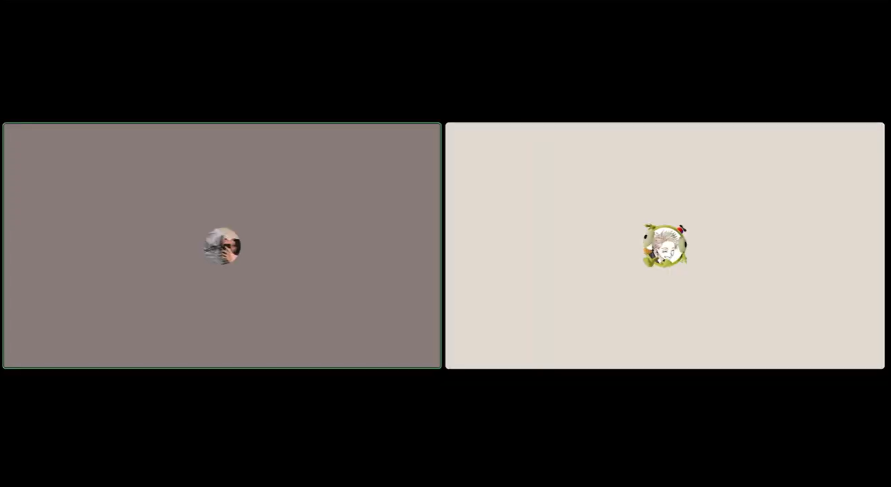

### UNIVERSIDAD PERUANA DE CIENCIAS APLICADAS

### Ingeniería de Software

### 5TO Ciclo

### Código: 1ASI0729

### Curso: Desarrollo de Aplicaciones Open Source - Presencial

### NRC: 7394

### Docente: Hugo Allan MoriPaiva

### Informe de Trabajo Final

### Startup: AlpacaFlow

### Producto: MediTrack

### Intregrantes:

<table>
  <thead>
    <tr>
      <th style="background-color: #333; color: #fff;">Apellidos y Nombres</th>
      <th style="background-color: #333; color: #fff;">Código de Alumno</th>
    </tr>
  </thead>
  <tbody>
    <tr>
      <td>Barrientos Quispe, Marcelo</td>
      <td>U20221E646</td>
    </tr>
    <tr>
      <td>Nikaido Vargas, Javier Masaru</td>
      <td>U20221G099</td>
    </tr>
    <tr>
      <td>Cuba Pareja, Joaquin Antonio</td>
      <td>U201621281</td>
    </tr>
    <tr>
      <td>Fernandez Camayo, Carlos Fredy</td>
      <td>U202320083</td>
    </tr>
    <tr>
      <td>Rivera Ayala, Gabriel Alejandro</td>
      <td>U202223279</td>
    </tr>
  </tbody>
</table>

## AGOSTO - 2025

#### Control de versiones

| Versión | Fecha    | Autor(es)                       | Descripción de cambios                                               |
| ------- | -------- | ------------------------------- | -------------------------------------------------------------------- |
| 1.00    | 03/09/25 | Barrientos Quispe, Marcelo      | Definición de la estructura inicial del proyecto.                    |
| 1.01    | 03/09/25 | Nikaido Vargas, Javier Masaru   | Agregados los resultados esperados para los estudiantes.             |
| 1.02    | 04/09/25 | Cuba Pareja, Joaquin Antonio    | Incorporación del Lean UX Canvas como herramienta base del proyecto. |
| 1.03    | 04/09/25 | Cuba Pareja, Joaquin Antonio    | Actualización del perfil del equipo de trabajo.                      |
| 1.04    | 05/09/25 | Barrientos Quispe, Marcelo      | Implementación de control de versiones con Git.                      |
| 1.05    | 08/09/25 | Nikaido Vargas, Javier Masaru   | Integración de la rama con el capítulo 1 (introducción).             |
| 1.06    | 09/09/25 | Barrientos Quispe, Marcelo      | Creación del capítulo 2 del proyecto.                                |
| 1.07    | 09/09/25 | Fernandez Camayo, Carlos Fredy  | Inclusión de preguntas para entrevistas con usuarios.                |
| 1.08    | 10/09/25 | Barrientos Quispe, Marcelo      | Elaboración e incorporación del análisis de la competencia.          |
| 1.09    | 10/09/25 | Nikaido Vargas, Javier Masaru   | Definición del recorrido del usuario basado en el user persona.      |
| 1.10    | 11/09/25 | Rivera Ayala, Gabriel Alejandro | Adición del mapa de empatía al capítulo 2.                           |
| 1.11    | 12/09/25 | Rivera Ayala, Gabriel Alejandro | Corrección y refinamiento del arquetipo de usuario.                  |
| 1.12    | 15/09/25 | Barrientos Quispe, Marcelo      | Inclusión de contenido detallado en el análisis de entrevistas.      |
| 1.13    | 15/09/25 | Fernandez Camayo, Carlos Fredy  | Agregados resúmenes estructurados de las entrevistas.                |
| 1.14    | 20/09/25 | Barrientos Quispe, Marcelo      | Se realizaron correcciones del informe en el capitulo 1, 3 y 5      |

#### Project Report Collaboration Insights

- Barrientos Quispe, Marcelo
- Cuba Pareja, Joaquin Antonio
- Fernandez Camayo, Carlos Fredy
- Nikaido Vargas, Javier Masaru
- Rivera Ayala, Gabriel Alejandro

Url del repositorio: [Report](https://github.com/UPC-PRE-202502-1ASI0729-7394-AlpacaFlow/report) 

https://github.com/UPC-PRE-202502-1ASI0729-7394-AlpacaFlow/report


#### TB1


# Contenido

## Tabla de Contenidos

- [Student Outcome](#student-outcome)

- [Capítulo I: Introducción](#capítulo-i-introducción)

- [1.1. Startup Profile](#11-startup-profile)
  - [1.1.1. Descripción de la Startup](#111-descripción-de-la-startup)
  - [1.1.2. Perfiles de integrantes del equipo](#112-perfiles-de-integrantes-del-equipo)
- [1.2. Solution Profile](#12-solution-profile)
  - [1.2.1. Antecedentes y problemática](#121-antecedentes-y-problemática)
  - [1.2.2. Lean UX Process](#122-lean-ux-process)
    - [1.2.2.1. Lean UX Problem Statement](#1221-lean-ux-problem-statement)
    - [1.2.2.2. Lean UX Assumptions](#1222-lean-ux-assumptions)
    - [1.2.2.3. Lean UX Hypothesis Statements](#1223-lean-ux-hypothesis-statements)
    - [1.2.2.4. Lean UX Canvas](#1224-lean-ux-canvas)
- [1.3. Segmentos objetivo](#13-segmentos-objetivo)

- [Capítulo II: Requirements Elicitation & Analysis](#capítulo-ii-requirements-elicitation--analysis)

- [2.1. Competidores](#21-competidores)
  - [2.1.1. Análisis competitivo](#211-análisis-competitivo)
  - [2.1.2. Estrategias y tácticas frente a competidores](#212-estrategias-y-tácticas-frente-a-competidores)
- [2.2. Entrevistas](#22-entrevistas)
  - [2.2.1. Diseño de entrevistas](#221-diseño-de-entrevistas)
  - [2.2.2. Registro de entrevistas](#222-registro-de-entrevistas)
  - [2.2.3. Análisis de entrevistas](#223-análisis-de-entrevistas)
- [2.3. Needfinding](#23-needfinding)
  - [2.3.1. User Personas](#231-user-personas)
  - [2.3.2. User Task Matrix](#232-user-task-matrix)
  - [2.3.3. User Journey Mapping](#233-user-journey-mapping)
  - [2.3.4. Empathy Mapping](#234-empathy-mapping)
- [2.4. Big Picture EventStorming](#24-big-picture-eventstorming)
- [2.5. Ubiquitous Language](#25-ubiquitous-language)

- [Capítulo III: Requirements Specification](#capítulo-iii-requirements-specification)

- [3.1. User Stories](#31-user-stories)
- [3.2. Impact Mapping](#32-impact-mapping)
- [3.4. Product Backlog](#34-product-backlog)

- [Capítulo IV: Product Design](#capítulo-iv-product-design)

- [4.1. Style Guidelines](#41-style-guidelines)
  - [4.1.1. General Style Guidelines](#411-general-style-guidelines)
  - [4.1.2. Web Style Guidelines](#412-web-style-guidelines)
- [4.2. Information Architecture](#42-information-architecture)
  - [4.2.1. Organization Systems](#421-organization-systems)
  - [4.2.2. Labeling Systems](#422-labeling-systems)
  - [4.2.3. SEO Tags and Meta Tags](#423-seo-tags-and-meta-tags)
  - [4.2.4. Searching Systems](#424-searching-systems)
  - [4.2.5. Navigation Systems](#425-navigation-systems)
- [4.3. Landing Page UI Design](#43-landing-page-ui-design)
  - [4.3.1. Landing Page Wireframe](#431-landing-page-wireframe)
  - [4.3.2. Landing Page Mock-up](#432-landing-page-mock-up)
- [4.4. Web Applications UX/UI Design](#44-web-applications-uxui-design)
  - [4.4.1. Web Applications Wireframes](#441-web-applications-wireframes)
  - [4.4.2. Web Applications Wireflow Diagrams](#442-web-applications-wireflow-diagrams)
  - [4.4.3. Web Applications Mock-ups](#443-web-applications-mock-ups)
  - [4.4.4. Web Applications User Flow Diagrams](#444-web-applications-user-flow-diagrams)
- [4.5. Web Applications Prototyping](#45-web-applications-prototyping)
- [4.6. Domain-Driven Software Architecture](#46-domain-driven-software-architecture)
  - [4.6.1. Software Architecture Context Diagram](#461-software-architecture-context-diagram)
  - [4.6.2. Software Architecture Container Diagrams](#462-software-architecture-container-diagrams)
  - [4.6.3. Software Architecture Components Diagrams](#463-software-architecture-components-diagrams)
- [4.7. Software Object-Oriented Design](#47-software-object-oriented-design)
  - [4.7.1. Class Diagrams](#471-class-diagrams)
- [4.8. Database Design](#48-database-design)
  - [4.8.1. Database Diagrams](#481-database-diagrams)

- [Capítulo V: Product Implementation, Validation & Deployment](#capítulo-v-product-implementation-validation--deployment)

- [5.1. Software Configuration Management](#51-software-configuration-management)
  - [5.1.1. Software Development Environment Configuration](#511-software-development-environment-configuration)
  - [5.1.2. Source Code Management](#512-source-code-management)
  - [5.1.3. Source Code Style Guide & Conventions](#513-source-code-style-guide--conventions)
  - [5.1.4. Software Deployment Configuration](#514-software-deployment-configuration)
- [5.2. Landing Page, Services & Applications Implementation](#52-landing-page-services--applications-implementation)
  - [5.2.1. Sprint 1](#521-sprint-1)
    - [5.2.1.1. Sprint Planning 1](#5211-sprint-planning-1)
    - [5.2.1.2. Aspect Leaders and Collaborators](#5212-aspect-leaders-and-collaborators)
    - [5.2.1.3. Sprint Backlog 1](#5213-sprint-backlog-1)
    - [5.2.1.4. Development Evidence for Sprint Review](#5214-development-evidence-for-sprint-review)
    - [5.2.1.5. Execution Evidence for Sprint Review](#5215-execution-evidence-for-sprint-review)
    - [5.2.1.6. Services Documentation Evidence for Sprint Review](#5216-services-documentation-evidence-for-sprint-review)
    - [5.2.1.7. Software Deployment Evidence for Sprint Review](#5217-software-deployment-evidence-for-sprint-review)
    - [5.2.1.8. Team Collaboration Insigths during Sprint](#5218-team-collaboration-insigths-during-sprint)
- [5.3. Validation Interviews](#53-validation-interviews)
  - [5.3.1. Diseño de Entrevistas](#531-diseño-de-entrevistas)
  - [5.3.2. Registro de Entrevistas](#532-registro-de-entrevistas)
  - [5.3.3. Evaluaciones según heurísticas](#533-evaluaciones-según-heurísticas)

- [Conclusiones](#conclusiones)
  - [Conclusiones y recomendaciones](#conclusiones-y-recomendaciones)
  - [Video About-the-Product](#video-about-the-product)

- [Bibliografía](#bibliografía)

- [Anexos](#anexos)

# Student Outcome

ABET – EAC - Student Outcome 3: Capacidad de comunicarse efectivamente con un
rango de audiencias.

En el siguiente cuadro se describe las acciones realizadas y enunciados de
conclusiones por parte del grupo, que permiten sustentar el haber alcanzado el logro
del ABET – EAC - Student Outcome 3

| Criterio específico                                                        | Acciones realizadas                                                                                                                                                                                                                                                                                                                                                                                                                                                                                                                                                                                                                                                                                                                                                                                                                                                                                                                                                                                                                                            | Conclusiones                                                                                                                                                                                                                                                                                                                                                                                                                                                                                                                                                                                                                                                                                                                                                                                                                                                                                                                                                                                                                                                                                                                                                                                                                                                                                                                                                                                                                                        |
| -------------------------------------------------------------------------- | -------------------------------------------------------------------------------------------------------------------------------------------------------------------------------------------------------------------------------------------------------------------------------------------------------------------------------------------------------------------------------------------------------------------------------------------------------------------------------------------------------------------------------------------------------------------------------------------------------------------------------------------------------------------------------------------------------------------------------------------------------------------------------------------------------------------------------------------------------------------------------------------------------------------------------------------------------------------------------------------------------------------------------------------------------------- | --------------------------------------------------------------------------------------------------------------------------------------------------------------------------------------------------------------------------------------------------------------------------------------------------------------------------------------------------------------------------------------------------------------------------------------------------------------------------------------------------------------------------------------------------------------------------------------------------------------------------------------------------------------------------------------------------------------------------------------------------------------------------------------------------------------------------------------------------------------------------------------------------------------------------------------------------------------------------------------------------------------------------------------------------------------------------------------------------------------------------------------------------------------------------------------------------------------------------------------------------------------------------------------------------------------------------------------------------------------------------------------------------------------------------------------------------- |
| **Comunica oralmente con efectividad a diferentes rangos de audiencia.**   | **Nikaido Vargas, Javier Masaru**<br>**TB1**<br>Me esforcé en aportar al grupo, cumpliedo todas mis tareas encomendadas y ayudando en lo que aún faltaba por completar. <br><br> **TP** <br> Durante el desarrollo del proyecto, mantuve una presencia constante en las llamadas grupales, donde participé activamente en las discusiones y ofrecí mi perspectiva en la mejora del informe y ayude en la implementacion de la aplicación frontend. <br> <br> **Barrientos Quispe, Marcelo** <br> **TB1** <br> Apoyé de manera activa al desarrollo del trabajo, apoyando, mejorando y arregalndo varias partes del proyecto, además de claro hacer mis tareas encomendadas. <br> <br> **TP** <br> Para esta segunda entrega alcancé el logro del outcome ya que durante reuniones vía discord o zoom organicé y asigne tareas a mis compañeros además de ayudarlos a corregir errores en código y estar constantemente pendiente del trabajo. Tambien desarrollé el bounded context de allegados en el frontend. <br> <br> **Fernandez Camayo, Carlos Fredy** <br/> **TB1** <br/> Me encargue de realizar las entrevistas al primer segmento objetivo tambien me encargue de los user persona y el analisis de entrevistas y parte del event storming <br> <br> **TP** <br> Me encargue del big picture event storming y también de la asignación de tareas en el trello y la actualización de descripciones de imágenes como también la actualización del canva. <br> <br> **Rivera Ayala, Gabriel** <br> **TB1** <br> Apoyé a mis compañeros a investigar las necesidades de nuestros usuarios, brindé soporte y priorizé la colaboración y comunicación. <br> <br> **TP** <br> Colaboré con mi grupo de trabajo al desarrollar las interfaces del usuario en nuestra aplicación frontend al igual que corregir ciertos errores en anteriores entregas. <br> <br> **Joaquin Antonio Cuba Pareja** <br> **TB1** <br> Me encargue de la elaboracion de la Landing Page 4.1. el event storming y Class diagram <br> <br> **TP** <br> El desarrollo del proyecto fue una experiencia integral que combinó esfuerzos técnicos y colaborativos. Durante el proceso, mantuve una participación activa en las reuniones, contribuyendo en las discusiones y ofreciendo mi visión para mejorar el informe.                                                                     | **Nikaido Vargas, Javier Masaru**<br>**TB1**<br>La constante participación y aporte al gupo fue importante para mi desarrollo como estudiante, ya que pude obtener inforamción valiosa, más quen con el desarrollo de ciertos apartados sobre el análisis de usuarios br><br> **TP** <br> Durante el desarrollo del proyecto, mantuve una presencia constante en las llamadas grupales, donde participé activamente en las discusiones y ofrecí mi perspectiva en la mejora del informe y ayude en la implementacion de la aplicación frontend. <br> <br> **Barrientos Quispe, Marcelo** <br> **TB1** <br> Gracias a mi gran aporte, mejore muchas de mis habilidades con respecto al desarrollo de una aplicación de este tipo, lo que me será de mucha ayuda en mi desarrollo como profesional. <br> <br> **TP** <br> Para esta segunda entrega alcancé el logro del outcome ya que durante reuniones vía discord o zoom organicé y asigne tareas a mis compañeros además de ayudarlos a corregir errores en código y estar constantemente pendiente del trabajo. Tambien desarrollé el bounded context de allegados en el frontend. <br> <br> **Fernandez Camayo, Carlos Fredy** <br/> **TB1** <br/> La participación activa en el diseño y ejecución de entrevistas al primer segmento objetivo permitió aportar información valiosa al equipo. Esta contribución fortaleció la toma de decisiones conjuntas y reflejó un liderazgo distribuido, basado en la colaboración y en la construcción colectiva de resultados. <br> <br> **TP** <br> Me encargue del big picture event storming y también de la asignación de tareas en el trello y la actualización de descripciones de imágenes como también la actualización del canva. <br> <br> **Rivera Ayala, Gabriel** <br> **TB1** <br> Apoyé a mis compañeros a investigar las necesidades de nuestros usuarios, brindé soporte y priorizé la colaboración y comunicación. <br> <br> **TP** <br> Colaboré con mi grupo de trabajo al desarrollar las interfaces del usuario en nuestra aplicación frontend al igual que corregir ciertos errores en anteriores entregas. <br> <br> **Joaquin Antonio Cuba Pareja** <br> **TB1** <br> Como equipo, nos dimos retroalimentación de forma constante, lo cual nos ayudó a reforzar nuestras áreas de oportunidad y mejorar nuestro desempeño.<br> **TP** <br> El desarrollo del proyecto fue una experiencia integral que combinó esfuerzos técnicos y colaborativos. Durante el proceso, mantuve una participación activa en las reuniones, contribuyendo en las discusiones y ofreciendo mi visión para mejorar el informe.                                                                                                                     |
| **Comunica por escrito con efectividad a diferentes rangos de audiencia.** | **Nikaido Vargas, Javier Masaru**<br>**TB1** <br> Me encargué de realizar una entrevista, una buena parte del needfinding, dividir los user stories por épicas y me encargué del diagrama de la base de datos <br><br> **TP** <br> Coordiné la priorización de tareas y participé activamente en las reuniones de sprint, asegurando el avance de los entregables y documentando decisiones técnicas relevantes. <br><br> **Barrientos Quispe, Marcelo** <br> **TB1** <br> Me encargué de la elaboración del wireframe, wireflow, mokups, segmentos objetivos, parte del capitulo 1, entrevistas y su diseño, landing page, muy buena parte del capitulo 4 y el capitulo 5 <br> <br/> **TP**<br> Implementé una primera versión del frontend junto a mi equipo de trabajo creando un ambiente colaborativo.<br> <br/> **Fernandez Camayo, Carlos Fredy** <br/> **TB1** <br/>Me encargue de realizar las entrevistas al primer segmento objetivo tambien me encargue de los user persona y el analisis de entrevistas y parte del event storming <br> <br/> **TP**<br> Organicé las tareas en un Trello para mejorar la colaboración y manejo de tareas.<br> <br/> **Rivera Ayala, Gabriel** <br> **TB1** <br> Apoyé a mis compañeros a investigar las necesidades de nuestros usuarios, brindé soporte y priorizé la colaboración y comunicación. <br> <br/> **TP**<br> Colaboré en la implementación de las interfaces y en la corrección de errores del frontend, además de corregir errores en pasadas entregas.<br> <br/> **Joaquin Antonio Cuba Pareja** <br> **TB1** <br> Me encargue de la elaboracion de la Landing Page 4.1. el event storming y Class diagram <br/> <br> **TP**<br> El desarrollo del proyecto fue una experiencia integral que combinó esfuerzos técnicos y colaborativos. Durante el proceso, mantuve una participación activa en las reuniones, contribuyendo en las discusiones y ofreciendo mi visión para mejorar el informe. | **Nikaido Vargas, Javier Masaru**<br>**TB1**<br>Gracias a la elaboración del needfiding, mejoré mi habilidad para ver como se siente al cliente con varios aspectos de nuestra aplicación, loq ue me permite dar un producto muhco mejor para los usuarios.<br><br> **TP** <br> Coordiné la priorización de tareas y participé activamente en las reuniones de sprint, asegurando el avance de los entregables y documentando decisiones técnicas relevantes. <br><br>**Barrientos Quispe, Marcelo** <br> **TB1** <br> Gracias al desarrollo del trabajo mejoré muchas habildies, tanto como del desarrollo de la idea del proyecto, sino también con respecto al desarollo de landigns pages, ya que ahora siento que se como atraer mejor ala gente con esta sección tan importante del proyecto. <br> <br/> **TP**<br> Implementé una primera versión del frontend junto a mi equipo de trabajo creando un ambiente colaborativo.<br> <br/> **Fernandez Camayo, Carlos Fredy** <br/> **TB1** <br/> Al elaborar los user personas y analizar entrevistas, se facilitó un espacio de diálogo y entendimiento mutuo entre los miembros del equipo, asegurando que las diferentes perspectivas fueran integradas en el desarrollo del proyecto. Este enfoque inclusivo permitió que el producto respondiera mejor a las necesidades reales de los usuarios. <br> <br/> **TP**<br> Organicé las tareas en un Trello para mejorar la colaboración y manejo de tareas.<br> <br/> **Rivera Ayala, Gabriel** <br> **TB1** <br> Apoyé a mis compañeros a investigar las necesidades de nuestros usuarios, brindé soporte y priorizé la colaboración y comunicación. <br> <br/> **TP** <br> Colaboré en la implementación de las interfaces y en la corrección de errores del frontend, además de corregir errores en pasadas entregas.<br> <br/> **Joaquin Antonio Cuba Pareja** <br> **TB1** <br> A lo largo del desarrollo del trabajo se logro establecer un ambiente colabortivo lo cual nos permitio refinar nuestra aprendisaje y el desarrollo del trabjo <br/> <br> **TP** El desarrollo del proyecto fue una experiencia integral que combinó esfuerzos técnicos y colaborativos. Durante el proceso, mantuve una participación activa en las reuniones, contribuyendo en las discusiones y ofreciendo mi visión para mejorar el informe. |


# Capítulo I: Introducción

## 1.1. Startup Profile

### 1.1.1. Descripción de la Startup

**AlpacaFlow** es una startup tecnológica enfocada en el desarrollo de soluciones digitales innovadoras para el sector salud, con especial atención en el cuidado de pacientes geriátricos. Nuestro propósito es aprovechar la tecnología para mejorar la calidad de vida de los adultos mayores mediante herramientas accesibles, seguras y sostenibles que permitan un monitoreo constante, una atención preventiva y una conexión más cercana entre pacientes, familiares e instituciones de salud.

Nuestra solución es MediTrack, una plataforma de salud digital que utiliza parches inteligentes como dispositivos IoT para el monitoreo remoto de pacientes geriatricos. MediTrack permite registrar signos vitales, detectar emergencias y compartir información en tiempo real con familiares, médicos y aseguradoras, garantizando un cuidado preventivo, seguro y personalizado.

La propuesta de AlpacaFlow se centra en construir un ecosistema de salud digital inclusivo, escalable y orientado a resultados, donde los parches inteligentes y las plataformas de gestión se convierten en un puente entre innovación tecnológica y bienestar social. Buscamos que cada adulto mayor pueda ser monitoreado en tiempo real, reduciendo riesgos, optimizando diagnósticos y facilitando la toma de decisiones médicas y familiares.

**Misión:** Desarrollar herramientas digitales accesibles y efectivas que permitan a pacientes, familias e instituciones de salud monitorear y gestionar la salud de los adultos mayores en tiempo real, brindando seguridad, confianza y eficiencia.

**Visión:** En los próximos 5 años, consolidar a AlpacaFlow como una la empresa líder en soluciones de salud digital en Latinoamérica, siendo reconocidos por nuestra capacidad de mejorar la calidad de vida y prevenir riesgos mediante el uso de innovación tecnológica accesible y escalable.

**Alcance del proyecto:** El alcance inicial de MediTrack está orientado al cuidado geriátrico, ofreciendo una plataforma web y móvil que integra dispositivos IoT en forma de parches inteligentes para registrar signos vitales, alertar en casos de emergencia y compartir información en tiempo real con familiares, médicos y aseguradoras. A mediano plazo, buscamos ampliar el impacto de la solución hacia hospitales, clínicas y casas de reposo, consolidando un modelo de monitoreo preventivo y predictivo que transforme la manera en que se gestiona la salud de los adultos mayores en Latinoamérica.

### 1.1.2. Perfiles de integrantes del equipo

| Foto                                                                 | Apellido y Nombre               | Código     | Carrera                | Habilidades                                                                                                                                                                                                                                                                                                                                                                                                 |
| -------------------------------------------------------------------- | ------------------------------- | ---------- | ---------------------- | ----------------------------------------------------------------------------------------------------------------------------------------------------------------------------------------------------------------------------------------------------------------------------------------------------------------------------------------------------------------------------------------------------------- |
|                                   | Fernandez Camayo, Carlos Fredy  | U202217853 | Ingeniería de Software | Estudiante de ingenieria de software, enfocado al aprendizaje continuo de desarrollo de aplicaciones web y moviles, me caracterizo por la comunicación efectiva, trabajo en equipo, empatía y pensamiento crítico.                                                                                                                                                                                          |
|                               | Rivera Ayala, Gabriel Alejandro | U202223279 | Ingeniería de Software | Soy estudiante de Ingeniería de Software. Me interesa el aprendizaje continuo en todo lo relacionado al desarrollo de aplicaciones interactivas. He desarrollado proyectos en C++, Python, HTML y CSS. Actualmente estoy aprendiendo a realizar aplicaciones web usando el framework Angular y Vue. Me considero una persona trabajadora y apoyaré a mis compañeros a realizar un buen trabajo.             |
|  | Cuba Pareja, Joaquin Antonio    | U201621281 | Ingeniería de Software | Soy estudiante de Ingeniería de Software con conocimientos en desarrollo web y programación. Manejo de JavaScript, C++ y Python, con algo de experiencia en Go. Familiarizado con tecnologías front-end como HTML, CSS y TypeScript. Interesado en el desarrollo full stack, la optimización de código y la resolución de problemas. Con disposición para aprender nuevas tecnologías y trabajar en equipo. |
|                                | Nikaido Vargas, Javier Masaru   | U202221597 | Ingeniería de Software | Me considero una persona adaptable al entorno, sé trabajar en equipo y aprendo rápido. Mentalidad para resolver problemas. Conocimiento básico de las funcionalidades de software.                                                                                                                                                                                                                          |
|                               | Barrientos Quispe, Marcelo      | U20221e646 | Ingeniería de Software | Me considero una persona adaptable al entorno, sé trabajar en equipo y aprendo rápido. Cuento con conocimientos técnicos en tecnologías de JavaScript.                                                                                                                                                                                                                                                      |

## 1.2. Solution Profile

El **Solution Profile** presenta una descripción general de la solución propuesta, abordando el contexto, los problemas detectados y las suposiciones estratégicas que guían el desarrollo del producto. Esta sección busca conectar los hallazgos obtenidos en la fase de descubrimiento con una propuesta clara de valor, estableciendo las bases para el diseño, validación y desarrollo de la solución.

### 1.2.1. Antecedentes y problemática

En esta sección se analiza el contexto en el que surge la problemática principal, considerando los factores sociales, tecnológicos y emocionales que la rodean. A través de la **técnica de las 5 ‘W’s y 2 ‘H’s**, se busca responder de forma estructurada a las preguntas clave sobre el qué, quién, cuándo, dónde, por qué, cómo y cuánto, con el fin de comprender de manera integral la situación actual y justificar la pertinencia de la solución propuesta.

**Técnica de The 5 'W's y 2 'H's**

**What(Qué)?** <br>
¿Cuál es el problema?

El envejecimiento poblacional en el Perú y América Latina ha incrementado la demanda de soluciones de monitoreo en salud geriátrica. Según la Organización Panamericana de la Salud (OPS, s. f.), para el año 2050, 1 de cada 5 personas en la región será adulto mayor. Sin embargo, gran parte de esta población enfrenta limitaciones para un control adecuado de sus enfermedades crónicas debido a la falta de acceso a tecnología comprensible, la escasez de seguimiento médico continuo y la sobrecarga de los familiares que asumen su cuidado.

Actualmente, muchos dispositivos de monitoreo existentes requieren habilidades tecnológicas que los adultos mayores no poseen, lo que genera una brecha digital en el cuidado geriátrico, reduciendo la calidad de atención y aumentando el riesgo de emergencias médicas no atendidas a tiempo.

**When(Cuando)?** <br>
¿Cuándo sucede el problema?

El problema ocurre de manera constante, pero se intensifica en las etapas más avanzadas de la vejez, cuando las enfermedades crónicas y las limitaciones físicas o cognitivas aumentan la dependencia del adulto mayor. La necesidad de monitoreo es diaria y continua, especialmente en pacientes con hipertensión, diabetes o afecciones cardíacas.

En situaciones cotidianas, como cuando los adultos mayores están solos en casa o durante la noche, las caídas o variaciones en los signos vitales pueden pasar desapercibidas, impidiendo una intervención médica oportuna y elevando el riesgo de complicaciones graves.

**Where(Dónde)?** <br>
¿Dónde surge el problema?

El problema se presenta principalmente en entornos urbanos del Perú, donde la población geriátrica está en crecimiento y los sistemas de salud se encuentran sobrecargados. Según el Instituto Nacional de Estadística e Informática (INEI, 2024), el 13% de la población peruana ya supera los 60 años, y se proyecta un crecimiento sostenido en la próxima década.

En las ciudades, muchos adultos mayores viven solos o en casas de reposo, lo que incrementa la necesidad de monitoreo remoto y continuo. En áreas rurales, la falta de infraestructura médica y especialistas agrava el problema, ya que limita el acceso a controles periódicos y servicios de salud adecuados.

En conjunto, tanto los entornos urbanos como rurales enfrentan limitaciones en la atención geriátrica continua, reforzando la necesidad de soluciones tecnológicas locales, accesibles y adaptadas al contexto peruano.

**Who(Quién)?** <br>
¿Quiénes son los afectados?

Los principales afectados son:

- **Adultos mayores**, que requieren monitoreo constante de su salud pero que enfrentan dificultades para usar herramientas tecnológicas complejas.

- **Familiares y allegados**, quienes muchas veces cargan con la responsabilidad de vigilar el bienestar del paciente sin contar con información precisa oportuna.

- **Clínicas y hospitales**, que necesitan soluciones de telemetría que permitan descongestionar la atención presencial y realizar un seguimiento más eficiente.

- **Casas de reposo y centros geriátricos**, que deben garantizar la seguridad de sus residentes y responder rápidamente ante emergencias de salud.

**Why(Por qué)?** <br>
¿Cuál es la causa del problema?

- **Falta de monitoreo continuo y accesible:** Los sistemas de salud en el Perú están centrados en la atención reactiva, sin priorizar la prevención ni el seguimiento remoto.

- **Limitaciones tecnológicas en adultos mayores:** Según la Encuesta Nacional de Hogares (ENAHO, INEI, 2023), solo el 22% de los adultos mayores peruanos accede regularmente a internet, y menos del 10% utiliza aplicaciones móviles de salud.

- **Sobrecarga del sistema de salud:** La atención médica presencial presenta largas esperas, lo que retrasa diagnósticos y controles regulares.

- **Escasez de herramientas locales adaptadas:** La mayoría de los wearables disponibles están diseñados para mercados extranjeros y no se ajustan al contexto socioeconómico ni cultural peruano.

- **Dependencia de familiares y cuidadores:** La falta de sistemas confiables de alerta temprana obliga a los familiares a asumir una vigilancia constante, generando altos niveles de estrés y agotamiento emocional.

**How(Cómo)?** <br>
¿Cómo se utilizará el producto?

Para responder a esta necesidad, MediTrack propone un sistema integral de monitoreo geriátrico compuesto por un parche inteligente y un dashboard digital que facilita el acceso a información médica en tiempo real.

- **Para los pacientes geriátricos:** Solo deben portar el parche inteligente, el cual registra automáticamente sus signos vitales sin necesidad de conocimientos tecnológicos.

- **Para los familiares:** Accederán a una plataforma intuitiva donde podrán visualizar la salud del paciente en tiempo real, recibir notificaciones de alerta y acceder al historial médico.

- **Para clínicas y casas de reposo:** Podrán supervisar simultáneamente múltiples pacientes, generar reportes médicos automatizados y tomar decisiones basadas en datos objetivos.

Este sistema busca mejorar la calidad de vida del adulto mayor, reducir la carga emocional de los familiares y optimizar la gestión institucional del cuidado geriátrico. Su enfoque accesible y adaptado al contexto peruano diferencia a MediTrack de otras soluciones internacionales más costosas y complejas.

**How much(Cuánto)?** <br>
¿Cuánto costará implementar la solución?

La implementación de MediTrack requiere una inversión inicial orientada al desarrollo tecnológico, infraestructura de soporte y estrategias de lanzamiento. Esta inversión representa un paso clave hacia la modernización del cuidado geriátrico en el Perú, ofreciendo una alternativa local, accesible y escalable frente a dispositivos importados de alto costo.

**Presupuesto estimado:**

**Desarrollo de Software**

- Diseño y desarrollo del dashboard web: S/ 3,500 – S/ 5,000

- Backend, API y base de datos segura: S/ 3,000 – S/ 4,500

- Dominio, hosting y servidores (anual): S/ 1,200 – S/ 2,000

**Hardware (Parches inteligentes)**

- Diseño y prototipado de parches: S/ 5,000 – S/ 7,000

- Producción inicial (lote piloto de 100 unidades): S/ 8,000 – S/ 10,000

**Marketing y Lanzamiento:**

- Estrategia digital y materiales promocionales: S/ 2,500 – S/ 4,000

- Alianzas con clínicas y casas de reposo: S/ 1,500 – S/ 2,000

- Mantenimiento y Soporte (anual):

- Actualizaciones de software y soporte técnico: S/ 3,000 – S/ 5,000

**Total estimado:** S/ 28,700 – S/ 40,500

### 1.2.2. Lean UX Process

El proceso Lean UX que adoptamos está orientado a maximizar la eficiencia en el desarrollo de nuestro producto, enfocándose en principios fundamentales como la validación continua, el pensamiento crítico y la acción rápida. A partir de esta filosofía, hemos estructurado nuestro propio enfoque Lean UX, basado en cuatro componentes esenciales: definición de problemas, formulación de suposiciones, creación de hipótesis y desarrollo de un lienzo estratégico.

#### 1.2.2.1. Lean UX Problem Statement.

El propósito de MediTrack es ofrecer una solución digital integral que permita monitorear en tiempo real los signos vitales y la movilidad de los adultos mayores mediante dispositivos portátiles (wearables). Nuestra meta es proporcionar tranquilidad a las familias y eficiencia al personal médico, facilitando la toma de decisiones preventivas y mejorando la calidad de vida del paciente geriátrico.

El problema surge cuando familiares y cuidadores se enfrentan a la falta de información inmediata sobre el estado de salud de los adultos mayores, especialmente ante situaciones críticas como caídas o cambios súbitos en sus signos vitales. Actualmente, las plataformas de monitoreo existentes son fragmentadas, costosas o no se adaptan al entorno geriátrico local, dificultando su implementación en clínicas, casas de reposo o entornos domésticos.

Hemos observado que esta situación genera preocupación constante en los familiares, sobrecarga laboral en los cuidadores y retrasos en la atención médica preventiva, lo que deriva en una menor calidad de vida para el adulto mayor.
La ausencia de una solución accesible, escalable y de fácil uso crea una brecha entre la necesidad de monitoreo continuo y las herramientas tecnológicas disponibles actualmente.

Ante esta problemática, surge la siguiente pregunta: **¿Cómo podríamos ofrecer una solución tecnológica accesible y confiable que permita monitorear la salud y el bienestar de los adultos mayores en tiempo real, brindando tranquilidad a sus familias y eficiencia al personal médico?**

**Domain:** Salud digital, cuidado geriátrico, tecnología portátil (wearables).

**Customer Segments:**

- Familiares de pacientes geriátrico
- Personal médico de clínicas.
- Personal de las casas de reposo

**Pain Points:**

- Incertidumbre y preocupación familiar por la salud del adulto mayor.
- Ineficiencia en el monitoreo de múltiples pacientes en clínicas y casas de reposo.
- Riesgo de caídas y la falta de alertas en tiempo real.
- Falta de datos históricos para la prevención médica.

**Gap:** No existe una solución en el mercado que combine un monitoreo integral de signos vitales y movilidad con una plataforma visual y escalable, adaptada tanto para el uso individual en el hogar como para la gestión institucional.

**Vision/Strategy:** Ser la empresa líder en soluciones de salud digital para adultos mayores en Latinoamérica, mejorando la calidad de vida y previniendo riesgos mediante una innovación tecnológica accesible y escalable.

**Initial Segment:** Familias con adultos mayores en Lima Metropolitana que tienen acceso a dispositivos móviles y buscan una forma más segura de monitorear la salud de sus seres queridos.

#### 1.2.2.2. Lean UX Assumptions.

Los siguientes supuestos representan las creencias iniciales sobre el modelo de negocio, el mercado y la viabilidad del producto MediTrack.

**Business Assumptions**

Estas Business Assumptions servirán como base para formular los Feature Assumptions e Hypothesis Statements, permitiendo validar los elementos críticos del modelo durante las iteraciones del proceso Lean UX.

1. Creemos que los usuarios necesitan monitorear de forma continua la salud de los adultos mayores para reducir los riesgos médicos y la carga emocional familiar.

2. Creemos que una solución digital que combine parches inteligentes con un dashboard accesible puede satisfacer esta necesidad y mejorar la prevención médica.

3. Creemos que nuestros clientes iniciales serán familias y pequeñas instituciones geriátricas en Lima Metropolitana que busquen seguridad y eficiencia en el cuidado.

4. Creemos que el valor más importante que buscan nuestros clientes es la **tranquilidad** de tener información en tiempo real sobre la salud de sus seres queridos.

5. Creemos que nuestro modelo **Freemium + Suscripción Enterprise** nos permitirá escalar en ambos segmentos (B2C y B2B) sin depender de un único flujo de ingresos.

6. Creemos que nuestra ventaja competitiva radica en integrar métricas de salud y movilidad en una sola plataforma, algo que la competencia actual no ofrece.

7. Creemos que podremos reducir las llamadas de emergencia y consultas médicas presenciales al proporcionar monitoreo remoto confiable.

8. Reconocemos que el mayor riesgo es la desconfianza tecnológica; lo mitigaremos con pilotos gratuitos, certificaciones médicas y testimonios de usuarios reales.

9. Creemos que la relación costo–beneficio de MediTrack será más accesible que las soluciones importadas equivalentes.

**User Assumptions**

En esta etapa del Lean UX Process, se identificaron los principales supuestos sobre los usuarios, sus necesidades y el contexto de uso del producto. Estos Assumptions representan las creencias iniciales del equipo antes de realizar pruebas o validaciones.

**¿Quién es el usuario?**

- Allegados de adultos mayores: Hijos, nietos o cuidadores principales que viven con el adulto mayor o a distancia, preocupados por su salud, seguridad y bienestar.

- Clínicas y casas de reposo: Personal médico, cuidadores y administradores que necesitan una herramienta para monitorear a múltiples pacientes de manera simultánea.

**¿Dónde encaja nuestro producto en su vida?**

- Para los allegados: Se integra en su rutina diaria como una capa de seguridad y tranquilidad.

- Para las clínicas y casas de reposo: Se convierte en una herramienta central de gestión y monitoreo.

**¿Qué problemas resuelve nuestro producto?**

- Incertidumbre y preocupación: Las familias eliminan la ansiedad al tener datos de salud en tiempo real.

- Falta de monitoreo continuo: La solución permite un seguimiento constante de signos vitales y movilidad, incluso a distancia.

- Ineficiencia en la gestión: Las instituciones pueden monitorear a múltiples residentes de forma simultánea, recibiendo alertas automáticas que les permiten reaccionar rápidamente ante emergencias.

- Prevención limitada: La disponibilidad de datos históricos ayuda a identificar patrones y a tomar decisiones médicas preventivas.

**¿Cuándo y cómo se usa nuestro producto?**

- Para el usuario B2C (familiar): La app web se usa varias veces al día para chequear el estado del adulto mayor, o al recibir una alerta. La instalación del parche es un proceso inicial y sencillo, y el monitoreo es automático.

- Para el usuario B2B (institución): El dashboard se usa de forma continua en una computadora o tablet en la estación de enfermería. Se consulta para ver el estado de los pacientes, verificar alertas y generar reportes para el personal o los familiares.

**¿Qué características son importantes?**

- Alertas en tiempo real: Por caídas, cambios bruscos en signos vitales o anomalías en el patrón de movilidad.
- Dashboard visual: Una interfaz clara con gráficos y un mapa de movilidad.
- Historial de datos: La capacidad de ver métricas de salud a lo largo del tiempo.
- Reportes descargables: Para consultas médicas o comunicación con familiares.

**¿Cómo debería lucir y comportarse el producto?**
Debe ser intuitivo, sencillo y confiable. Los colores deben ser calmados (sin alarmar al usuario con rojo o naranjas, a menos que sea una alerta crítica), con una tipografía clara y botones grandes. El comportamiento debe ser rápido y responsivo, sin retrasos en la entrega de datos, y debe inspirar confianza y seguridad en el usuario.

### Feature Assumptions

En esta sección se detallan los supuestos relacionados con las características funcionales del producto. Cada **Feature Assumption** busca conectar las necesidades de los usuarios con las posibles soluciones de diseño, anticipando el impacto esperado en la experiencia y el comportamiento del usuario. Estas suposiciones servirán de base para la formulación de hipótesis y posteriores validaciones durante el proceso de desarrollo del producto.


1. Creemos que un **dashboard visual y amigable** permitirá a familiares y personal médico interpretar fácilmente la salud de los adultos mayores sin conocimientos técnicos.  
   aumentar en un 80% la comprensión de los datos de salud reportada por los usuarios.\*

2. Creemos que las **notificaciones automáticas y personalizables** mejorarán la respuesta ante emergencias.

3. Creemos que un **historial de datos accesible** fomentará la prevención y seguimiento médico continuo.

4. Creemos que los **reportes descargables** aumentarán la comunicación efectiva entre familiares y médicos.

5. Creemos que el **monitoreo de múltiples pacientes** en un solo panel mejorará la eficiencia de las instituciones.

### User Outcome Assumptions

- Aumento de la conexión emocional y la tranquilidad de los familiares (debido a la fácil comprensión del estado de salud).

- Mejora en la capacidad de respuesta del personal de cuidado ante emergencias.

- Uso constante del historial de datos por parte de los usuarios para un monitoreo más proactivo.

- Aumento del valor percibido de la plataforma entre los clientes B2B.

- Mejora de la eficiencia operativa y la satisfacción del personal en instituciones de salud.

### Business Outcome Assumptions

- Reducción del 70% en las llamadas de consulta rutinarias 

- Reducción del tiempo de respuesta a emergencias a menos de 5 minutos en el 90% de los casos

- Al menos el 60% de los usuarios activos consulta el historial de datos o reportes médicos al menos una vez al mes

- Al menos el 50% de los clientes B2B utilicen los reportes descargables mensualmente.

- Reducción del 30% en tareas manuales de monitoreo y un aumento del 25% en la satisfacción laboral

#### 1.2.2.3. Lean UX Hypothesis Statements.

Los **Hypothesis Statements** constituyen una evolución de los Assumptions, transformándolos en afirmaciones medibles y verificables. Cada hipótesis sigue el formato propuesto por el enfoque Lean UX, integrando el *business outcome*, el *user outcome* y la *feature* correspondiente. De esta manera, se facilita la validación empírica de las ideas y se asegura que el producto responda tanto a los objetivos del negocio como a las necesidades reales del usuario.

- Hypothesis Statement 1:

**Creemos que** el dashboard visual e intuitivo aumentará la conexión emocional y la tranquilidad de los familiares al permitirles comprender fácilmente el estado de salud de sus seres queridos.

**Sabremos que hemos tenido éxito**

**Cuando** al menos un 85% de los familiares reporten una alta sensación de tranquilidad y las llamadas de consulta rutinarias se reduzcan en un 70%.

- Hypothesis Statement 2:

**Creemos que** las notificaciones automáticas y personalizables sobre anomalías o caídas mejorarán la capacidad de respuesta del personal de cuidado ante emergencias.

**Sabremos que hemos tenido éxito**

**Cuando** logremos una reducción del tiempo de respuesta a emergencias a menos de 5 minutos en el 90% de los casos registrados.

- Hypothesis Statement 3:

**Creemos que** ofrecer un registro detallado de salud y movilidad fomentará el uso constante del historial de datos por parte de los usuarios para un monitoreo más proactivo.

**Sabremos que hemos tenido éxito**

**Cuando** al menos un 60% de los usuarios activos consulten el historial de datos o reportes médicos al menos una vez al mes.

- Hypothesis Statement 4:

**Creemos que** la capacidad de generar y compartir reportes digitales de manera sencilla aumentará el valor percibido de la plataforma entre los clientes B2B.

**Sabremos que** hemos tenido éxito

**Cuando** al menos un 50% de los clientes B2B utilicen los reportes descargables mensualmente.

- Hypothesis Statement 5:

**Creemos que** la visualización de múltiples pacientes en un solo dashboard centralizado mejorará la eficiencia operativa y la satisfacción del personal en instituciones de salud.

**Sabremos que** hemos tenido éxito

**Cuando** el personal experimente una reducción del 30% en tareas manuales de monitoreo y un aumento del 25% en su satisfacción laboral.

#### 1.2.2.4. Lean UX Canvas

El **Lean UX Canvas** sintetiza la información clave del proceso de descubrimiento, los Assumptions y las Hypothesis Statements. Su propósito es proporcionar una visión integral y colaborativa del proyecto, ayudando al equipo a alinear la estrategia de producto, los objetivos de negocio y las métricas de validación. Este canvas se convierte en una herramienta esencial para guiar el aprendizaje continuo y priorizar las decisiones de diseño con base en evidencia.


## 1.3. Segmentos objetivo

En esta sección se identifican y describen los **segmentos de usuarios** hacia los cuales se dirige la solución. A partir del análisis de necesidades, motivaciones y comportamientos, se definen los perfiles clave que se beneficiarán del producto. Estos segmentos servirán de referencia para la personalización de las funcionalidades, el diseño de la experiencia de usuario y las estrategias de comunicación dentro del desarrollo de MediTrack.

- **Allegados de pacientes geriátricos**

**Descripción:**

Son familiares o cuidadores cercanos de adultos mayores que requieren atención continua. Este segmento busca soluciones que les permitan supervisar la salud de sus seres queridos de manera remota, con alertas oportunas que reduzcan la incertidumbre y brinden tranquilidad.

**Características demográficas y comportamiento:**

- Generalmente hijos adultos con una edad promedio entre 30 y 59 años.

- Prefieren soluciones tecnológicas fáciles de usar y accesibles desde la web.

- Valoran la inmediatez de la información y la posibilidad de recibir notificaciones en tiempo real ante emergencias.

- Dispuestos a invertir en herramientas que garanticen la seguridad de sus familiares mayores y reduzcan la carga emocional de los cuidados.

**Sustento estadístico:**

- Según la OMS (2022), más del 60% de adultos mayores en América Latina dependen del apoyo directo de familiares para su cuidado.

- En Perú, el 75% de personas de más de 60 años viven con familiares (INEI, 2021), lo que hace a los allegados actores claves en la toma de decisiones sobre el cuidado.

- **Personal medíco de clínicas**

**Descripción:**

Profesionales de la salud encargados de monitorear y dar tratamiento a adultos mayores con enfermedades crónicas o en estado de recuperación. Este segmento necesita herramientas que les permitan un seguimiento ágil y confiable, reduciendo el margen de error y mejorando la atención preventiva.

**Características demográficas y comportamiento:**

- Médicos, enfermeros y especialistas en geriatría, con edades entre 28 y 55 años.

- Manejan información crítica y requieren plataformas con altos estándares de seguridad de datos.

- Se apoyan en dashboards intuitivos para la toma de decisiones clínicas.

- Valoran soluciones que optimicen el tiempo de atención, reduzcan hospitalizaciones y permitan consultas remotas.

**Sustento estadístico:**

- La Sociedad Peruana de Geriatría (2021) señala que un adulto mayor con enfermedades crónicas requiere en promedio 7 consultas médicas al año, lo que genera sobrecarga de seguimiento.

- En Latinoamérica, el 42% del personal médico afirma que las herramientas digitales mejoran la capacidad de atención y seguimiento de pacientes crónicos (IDB, 2020)

- **Personal de las casas de reposo**

Cuidadores y personal administrativo de residencias geriátricas que tienen a su cargo el bienestar físico y emocional de los adultos mayores que viven en sus instalaciones. Necesitan herramientas que faciliten el monitoreo colectivo de múltiples pacientes a la vez.

**Descripción:**

**Características demográficas y comportamiento:**

- Profesionales o técnicos en enfermería y cuidado de adultos mayores, entre 25 y 50 años.

- Manejan simultáneamente la atención de 10 a 30 residentes por turno, lo que dificulta el seguimiento individualizado.

- Requieren soluciones que automaticen alertas y centralicen la información de varios pacientes en un solo panel de control.

- Valoran la reducción de riesgos y el respaldo tecnológico como garantía de calidad del servicio.

**Sustento estadístico:**

- En Perú, existen más de 1,200 casas de reposo registradas y la demanda crece un 20% anual debido al envejecimiento poblacional (Minsa, 2022).

- Un estudio del Banco Mundial (2020) indica que el uso de tecnologías de monitoreo en residencias geriátricas puede reducir en un 35% los incidentes críticos no detectados en adultos mayores.

# Capítulo II: Requirements Elicitation & Analysis

## 2.1. Competidores

En esta sección analizaremos a los que consideramos los principales competidores de nuestra solución, que son los siguientes:

- ### VitalConnect
  VitalConnect es una empresa de salud digital que ofrece el VitalPatch, un parche biométrico desechable que monitorea en tiempo real signos vitales y actividad del paciente, usado principalmente en hospitales y telemedicina para seguimiento continuo y prevención de reingresos.
- ### BioSticker
  BioIntelliSense es la empresa creadora del BioSticker, un parche portátil que se coloca en el torso y permite el monitoreo continuo y pasivo de signos vitales y síntomas (frecuencia cardíaca, respiratoria, temperatura, actividad), enfocado en la detección temprana de complicaciones médicas y en el seguimiento remoto de pacientes crónicos y adultos mayores.
- ### CarePredict
  CarePredict es una empresa enfocada en el cuidado de adultos mayores que desarrolla un wearable en forma de pulsera, capaz de registrar movilidad, patrones de sueño, alimentación y actividades diarias, utilizando inteligencia artificial para detectar cambios de comportamiento y riesgo de caídas, facilitando la prevención y la comunicación con familiares y cuidadores.

### 2.1.1. Análisis competitivo

#### ¿Por qué llevar a cabo este análisis?

Realizar un análisis competitivo de MediTrack es importante para identificar las fortalezas y debilidades de los principales rivales, así como resaltar los diferenciales únicos de la solución.

|                         |                                                       | <br/>MediTrack                                                         |  <br/> VitalConnect |  <br/> BioIntelliSense | <br/>CarePredict |
| ----------------------- | ----------------------------------------------------- | ------------------------------------------------------------------------------------------------------------------------------------- | ------------------------------------------------------------------------------------------ | ----------------------------------------------------------------------------------------------------- | --------------------------------------------------------------------------------------- |
| **Perfil**              | Overview                                              | Parches inteligentes y dashboard que integran signos vitales, movilidad y alertas en tiempo real para adultos mayores.                | Parche biométrico para monitoreo hospitalario y remoto de signos vitales.                  | Parche portátil para monitoreo continuo y detección temprana en crónicos.                             | Pulsera para adultos mayores que usa IA para prevenir caídas y cambios de conducta.     |
|                         | Ventaja competitiva ¿Qué valor ofrece a los clientes? | Combina mapa de movilidad y métricas de salud en un solo sistema, con un modelo flexible.                                             | Seguimiento clínico preciso y continuo en hospitales y post-alta                           | Monitoreo pasivo y detección temprana de complicaciones.                                              | Prevención de caídas y cambios de salud mediante IA en adultos mayores.                 |
| **Perfil de Marketing** | Mercado objetivo                                      | Adultos mayores en el hogar, familias, clínicas y casas de reposo en Latinoamérica.                                                   | Hospitales y clínicas para monitoreo hospitalario y post-alta.                             | Pacientes crónicos y adultos mayores en seguimiento remoto.                                           | Adultos mayores en hogares y residencias geriátricas.                                   |
|                         | Estrategias de marketing                              | Pruebas piloto gratuitas, descuentos por volumen, reposición de parches y paneles personalizados para instituciones.                  | Alianzas con hospitales y proveedores de salud.                                            | Enfoque en telemedicina y seguros de salud.                                                           | Venta directa a familias y residencias geriátricas.                                     |
| **Perfil de Producto**  | Productos & Servicios                                 | Parches inteligentes, app y dashboard web con métricas, historial, reportes y alertas en tiempo real.                                 | Parche VitalPatch y plataforma de monitoreo clínico.                                       | BioSticker y BioButton con servicios de monitoreo remoto.                                             | Pulsera Tempo y app con alertas basadas en IA.                                          |
|                         | Precios & Costos                                      | Modelo Freemium–Premium para usuarios individuales y plan Enterprise para instituciones; costos escalables según número de pacientes. | Modelo B2B con costos por dispositivo y servicio hospitalario.                             | Suscripción mensual con dispositivos incluidos.                                                       | Dispositivo con pago inicial y suscripción para servicios y alertas.                    |
|                         | Canales de distribución                               | Descarga directa de la app, venta online de dispositivos y alianzas con clínicas y casas de reposo.                                   | Distribución a través de hospitales y sistemas de salud.                                   | Venta mediante proveedores de salud y aseguradoras.                                                   | Comercialización online y alianzas con residencias geriátricas.                         |
| **Análisis SWOT**       | Fortalezas                                            | Integración única de movilidad y salud, escalabilidad de B2C a B2B y modelo de negocio adaptable.                                     | Alta precisión clínica y validación hospitalaria.                                          | Monitoreo pasivo y amplio rango de parámetros.                                                        | IA predictiva y enfoque específico en adultos mayores.                                  |
|                         | Debilidades                                           | Requiere validación clínica y adopción tecnológica por parte de adultos mayores y cuidadores.                                         | Enfoque limitado al entorno hospitalario, poco accesible al usuario final.                 | Dependencia de suscripción y costos elevados.                                                         | Cobertura restringida a rutinas y movilidad, menos datos clínicos.                      |
|                         | Oportunidades                                         | Creciente demanda de telemedicina y monitoreo geriátrico en Latinoamérica, con baja oferta especializada.                             | Expansión al cuidado domiciliario y programas de telemedicina.                             | Creciente demanda de monitoreo remoto en pacientes crónicos.                                          | Mayor necesidad de prevención de caídas en adultos mayores independientes.              |
|                         | Amenazas                                              | Competencia de wearables globales (Apple, Fitbit) y startups especializadas (VitalConnect, BioSticker, CarePredict).                  | Competencia de wearables más accesibles como Apple Watch o Fitbit                          | Regulaciones estrictas y adopción lenta por parte de sistemas de salud.                               | Avances de competidores con dispositivos multiparámetro más completos.                  |

### 2.1.2. Estrategias y tácticas frente a competidores

Para esta sección haremos un análisis FODA (Fortalezas, Oportunidades, Debilidades y Amenazas) y CAME (Corregir, Afrontar, Mantener y Explotar) de nuestra solución MediTrack frente a los competidores analizados.

# Matriz FODA

| **Interno / Externo** | **Positivo**                                                                | **Negativo**                                                           |
| --------------------- | --------------------------------------------------------------------------- | ---------------------------------------------------------------------- |
| **Interno**           | **Fortalezas (F):**                                                         | **Debilidades (D):**                                                   |
|                       | - Integración única de movilidad + métricas de salud.                       | - Requiere validación clínica para ganar confianza.                    |
|                       | - Modelo de negocio flexible (Freemium, Premium, Enterprise).               | - Adopción tecnológica limitada en adultos mayores y cuidadores.       |
|                       | - Escalabilidad de B2C (familias) a B2B (clínicas y casas de reposo)\*\*.   | - Recursos iniciales limitados frente a grandes competidores globales. |
| **Externo**           | **Oportunidades (O):**                                                      | **Amenazas (A):**                                                      |
|                       | - Creciente demanda de telemedicina y monitoreo geriátrico en LatAm.        | - Competencia fuerte de wearables globales (Apple, Fitbit).            |
|                       | - Baja oferta de soluciones especializadas en adultos mayores en la región. | - Startups especializadas (VitalConnect, BioSticker, CarePredict).     |
|                       | - Tendencia de gobiernos y aseguradoras a impulsar salud digital.           | - Regulaciones sanitarias estrictas para aprobación médica.            |

# Matriz CAME

| Estrategia                      | Acción                                                                                                                                                                                                                                                         |
| ------------------------------- | -------------------------------------------------------------------------------------------------------------------------------------------------------------------------------------------------------------------------------------------------------------- |
| **C (Corregir Debilidades):**   | - Validar clínicamente los parches inteligentes mediante pilotos en clínicas. <br> - Diseñar interfaces simples y capacitaciones para mejorar adopción por parte de adultos mayores y cuidadores.                                                              |
| **A (Afrontar Amenazas):**      | - Diferenciarse de Apple/Fitbit con un enfoque 100% en geriatría. <br> - Reforzar la propuesta de valor con mapa de movilidad visual que los competidores no integran. <br> - Ajustar precios accesibles para el mercado latinoamericano.                      |
| **M (Mantener Fortalezas):**    | - Seguir potenciando la escalabilidad de uso individual a institucional. <br> - Mantener el modelo freemium-premium-enterprise como ventaja comercial. <br> - Continuar desarrollando el dashboard visual como punto de diferenciación.                        |
| **E (Explotar Oportunidades):** | - Expandir en Latinoamérica con alianzas con clínicas, casas de reposo y aseguradoras. <br> - Posicionarse como pionero en soluciones de monitoreo geriátrico digital en la región. <br> - Aprovechar incentivos y programas gubernamentales de salud digital. |

## 2.2. Entrevistas

Para este bloque se realizaron entrevistas semiestructuradas para comprender las necesidades, hábitos y percepciones de los segmentos objetivo respecto al monitoreo de adultos mayores. El objetivo fue identificar oportunidades, frustraciones y barreras en el uso de tecnologías de salud.

### 2.2.1. Diseño de entrevistas

Las preguntas se adaptaron a tres segmentos clave: familiares, profesionales médicos y personal de casas de reposo. Este enfoque permitió obtener evidencia cualitativa relevante para sustentar el análisis de usuarios y los artefactos del proceso de Needfinding.

### Preguntas dirigidas al primer segmento

- ¿Cuál es tu edad, ocupación y lugar de residencia?

- ¿Cuál es tu relación con el adulto mayor?

- ¿Con qué frecuencia lo visitas o te comunicas con él/ella?

- ¿Qué dispositivo usas más para comunicarte con tu familiar o cuidador?

- ¿Qué apps o canales usas con más frecuencia?

- ¿Qué navegador usas más en tu día a día?

- ¿Qué preocupaciones principales tienes sobre la salud y seguridad de tu familiar adulto mayor?

- ¿Cómo sueles monitorear su estado de salud actualmente?

- ¿Qué situaciones de riesgo has enfrentado que te hubiera gustado prevenir?

- ¿Qué tipo de información en tiempo real consideras más valiosa recibir?

- ¿Cómo reaccionas actualmente cuando ocurre una emergencia?

- ¿Qué tan cómodo te sentirías usando una app para monitorear la salud de tu familiar?

- ¿Qué funcionalidades serían imprescindibles para confiar en una solución como MediTrack?

- ¿Qué barreras podrían impedirte adoptar una tecnología como esta?

- ¿Qué tan dispuesto estarías a pagar por una solución que te brinde tranquilidad?

### Preguntas dirigidas al segundo segmento

- ¿Cuál es tu especialidad y experiencia en el cuidado de pacientes geriátricos?

- ¿Cuántos pacientes adultos mayores atiendes en promedio a la semana?

- ¿Qué dispositivo usas más para tu trabajo?

- ¿Qué canales digitales utilizas con pacientes y familiares?

- ¿Qué navegador usas con frecuencia en el trabajo?

- ¿Qué sistema de monitoreo de pacientes utilizas en tus prácticas médicas?

- ¿Qué dificultades enfrentas en el monitoreo de la salud de pacientes geriátricos?

- ¿Con qué frecuencia recibes emergencias relacionadas con caídas, descompensaciones o crisis en pacientes mayores?

- ¿Qué información en tiempo real te resultaría más útil para mejorar la atención y prevención?

- ¿Cómo coordinas actualmente con familiares de los pacientes respecto a su estado de salud?

- ¿Qué impacto tendría en tu labor clínica contar con reportes digitales y alertas inmediatas?

- ¿Qué tan dispuesto estarías a implementar una herramienta como MediTrack en tu práctica?

- ¿Qué características clínicas consideras imprescindibles para confiar en un sistema de monitoreo remoto?

- ¿Qué obstáculos podrían dificultar la adopción en tu clínica?

- ¿Consideras que deberían cubrir parte del costo de una solución como esta?

### Preguntas dirigidas al tercer segmento

- ¿Qué cargo ocupas en la casa de reposo?

- ¿Cuántos residentes adultos mayores tienes bajo tu supervisión diaria?

- ¿Qué herramientas o protocolos utilizas actualmente para monitorear su estado de salud?

- ¿Qué canales usas para comunicarte con las familias de los residentes?

- ¿Qué navegadores usan en los equipos de la residencia?

- ¿Qué sistemas de monitoreo utilizas para saber el estado de salud actual de los asistidos?

- ¿Qué problemas frecuentes enfrentas en el cuidado y supervisión de los adultos mayores?

- ¿Cuáles son los eventos más críticos que suelen presentarse?

- ¿Qué tan difícil resulta monitorear simultáneamente a varios residentes?

- ¿Qué información en tiempo real te permitiría mejorar la atención y reducir riesgos?

- ¿Cómo sueles actuar actualmente en casos de emergencia o deterioro repentino de la salud de un residente?

- ¿Qué tan útil consideras que sería un parche inteligente como MediTrack para el cuidado diario de los residentes?

- ¿Qué funcionalidades considerarías imprescindibles para implementarlo en tu institución?

- ¿Qué obstáculos crees que existirían para adoptarlo?

- ¿Crees que los familiares estarían dispuestos a pagar un valor adicional por contar con esta tecnología en la casa de reposo?

### 2.2.2. Registro de entrevistas

#### Entrevistas segmento objetivo allegados de adultos mayores

##### Allegado Aulto Mayor

- Nombres: Andres
- Apellidos: Coca
- Edad: 19
- Distrito: San Miguel
- [Entrevistas Meditrack](https://upcedupe-my.sharepoint.com/:v:/g/personal/u20221g099_upc_edu_pe/EeSUrbOcNE1IpLshNE4fVZUBxgW-t6lyFqgtKLXuzEgR0w?e=yHOF0R&nav=eyJyZWZlcnJhbEluZm8iOnsicmVmZXJyYWxBcHAiOiJTdHJlYW1XZWJBcHAiLCJyZWZlcnJhbFZpZXciOiJTaGFyZURpYWxvZy1MaW5rIiwicmVmZXJyYWxBcHBQbGF0Zm9ybSI6IldlYiIsInJlZmVycmFsTW9kZSI6InZpZXcifSwicGxheWJhY2tPcHRpb25zIjp7fX0%3D)
- [Timming Entrevista Andres Coca](https://upcedupe-my.sharepoint.com/:v:/g/personal/u20221g099_upc_edu_pe/EeSUrbOcNE1IpLshNE4fVZUBxgW-t6lyFqgtKLXuzEgR0w?e=yHOF0R&nav=eyJyZWZlcnJhbEluZm8iOnsicmVmZXJyYWxBcHAiOiJTdHJlYW1XZWJBcHAiLCJyZWZlcnJhbFZpZXciOiJTaGFyZURpYWxvZy1MaW5rIiwicmVmZXJyYWxBcHBQbGF0Zm9ybSI6IldlYiIsInJlZmVycmFsTW9kZSI6InZpZXcifSwicGxheWJhY2tPcHRpb25zIjp7fX0%3D)
- Inicio:(00:00)
- Fin:(09:25)


- Resumen:

El entrevistado es un joven de 19 años que reside en San Miguel y actualmente se desempeña como estudiante universitario. No trabaja, pero tiene experiencia en el cuidado de su bisabuela, una persona adulta mayor que enfrentaba problemas de salud relacionados con la edad, como afecciones cardíacas y de presión arterial. Su rol consistía en apoyarla en actividades cotidianas, incluyendo mandados, asistencia en la alimentación y atención general, lo que muestra un nivel de compromiso familiar y sensibilidad hacia el cuidado de personas mayores.

En cuanto a su relación con la tecnología, manifiesta interés en contar con una aplicación que le permita monitorear los datos biométricos de su familiar, así como recibir alertas en caso de detectar irregularidades. Esto refleja una preocupación genuina por la prevención y la detección temprana de complicaciones de salud, además de una disposición positiva hacia la incorporación de soluciones digitales en el cuidado.

Respecto al uso de dispositivos y programas, señala que su navegador de preferencia es Google Chrome, el cual utiliza para sus actividades diarias. Maneja también herramientas como Excel para la gestión de información, lo que indica un nivel de familiaridad con la organización de datos, aunque su experiencia tecnológica se encuentra más vinculada a un contexto académico que clínico.

Sobre el monitoreo de los adultos mayores, reconoce que actualmente depende de la observación personal y de su apoyo directo en la vida cotidiana de su bisabuela, sin contar con un sistema de seguimiento en tiempo real. En ese sentido, resalta el valor que tendría una herramienta digital capaz de registrar y reportar datos médicos de manera automática, ya que permitiría reducir la incertidumbre y mejorar la capacidad de respuesta ante emergencias.

En relación con su disposición a utilizar nuevas soluciones como MediTrack, se muestra abierto e interesado, siempre que el sistema garantice confiabilidad y precisión en los datos. Su motivación principal se centra en facilitar el cuidado y la prevención de riesgos para los adultos mayores a su cargo.

En conjunto, el entrevistado transmite una visión juvenil y proactiva sobre el cuidado de adultos mayores. Combina sensibilidad personal con interés en herramientas digitales, identificando en la tecnología una aliada clave para mejorar la seguridad y el bienestar de las personas mayores, pese a que su experiencia se limita al ámbito familiar y no profesional.

##### Allegado Adulto Mayor

- Nombres: Paolo
- Apellidos: Chinen Guembes
- Edad: 21
- Distrito: Magdalena
- [Entrevistas Meditrack](https://upcedupe-my.sharepoint.com/:v:/g/personal/u20221g099_upc_edu_pe/EeSUrbOcNE1IpLshNE4fVZUBxgW-t6lyFqgtKLXuzEgR0w?e=wrqpQM&nav=eyJyZWZlcnJhbEluZm8iOnsicmVmZXJyYWxBcHAiOiJTdHJlYW1XZWJBcHAiLCJyZWZlcnJhbFZpZXciOiJTaGFyZURpYWxvZy1MaW5rIiwicmVmZXJyYWxBcHBQbGF0Zm9ybSI6IldlYiIsInJlZmVycmFsTW9kZSI6InZpZXcifSwicGxheWJhY2tPcHRpb25zIjp7InN0YXJ0VGltZUluU2Vjb25kcyI6NDE5NS4yNX19)
- [Timming Entrevista Paolo Chinen](https://upcedupe-my.sharepoint.com/:v:/g/personal/u20221g099_upc_edu_pe/EeSUrbOcNE1IpLshNE4fVZUBxgW-t6lyFqgtKLXuzEgR0w?e=wrqpQM&nav=eyJyZWZlcnJhbEluZm8iOnsicmVmZXJyYWxBcHAiOiJTdHJlYW1XZWJBcHAiLCJyZWZlcnJhbFZpZXciOiJTaGFyZURpYWxvZy1MaW5rIiwicmVmZXJyYWxBcHBQbGF0Zm9ybSI6IldlYiIsInJlZmVycmFsTW9kZSI6InZpZXcifSwicGxheWJhY2tPcHRpb25zIjp7InN0YXJ0VGltZUluU2Vjb25kcyI6NDE5NS4yNX19)
- Inicio:(1:09:55)
- Fin:(1:14:52)



- Resumen:

Paolo Chinen, de 21 años, es estudiante de Dirección y Gestión de Proyectos Animados en Toulouse y de la Asociación Peruano Japonesa. Es nieto de un adulto mayor con quien mantiene comunicación frecuente, visitándolo una o dos veces por semana y, cuando no puede, recurriendo a llamadas o videollamadas. Los principales medios que utiliza para comunicarse son el celular, especialmente a través de WhatsApp para mensajes y llamadas, además de Facebook Messenger, dado que su abuelo emplea esa plataforma. Su navegador habitual es Google Chrome.

Entre sus principales preocupaciones destacan la salud y seguridad de su abuelo, particularmente el riesgo de caídas cuando está solo. Menciona un caso vivido en el que su abuelo cayó de la cama y se lesionó, lo que derivó en una visita al hospital. Actualmente, monitorea su estado de salud mediante visitas presenciales y conversando con su madre, quien lo acompaña con mayor frecuencia.

Respecto a soluciones tecnológicas, Paolo considera valioso recibir información en tiempo real sobre caídas, pulso y localización. Ante emergencias, su reacción es coordinar primero con su madre y, en caso de no estar disponible, con otros familiares cercanos. Afirma que se sentiría confiado usando una aplicación de monitoreo siempre que sea fácil de usar y confiable.

Entre las funcionalidades más relevantes para él estarían las alertas en tiempo real, un historial de incidentes útil para consultas médicas y el acceso rápido a emergencias. Sin embargo, identifica como posibles barreras el costo y las dudas sobre la precisión de la detección de emergencias. Aun así, manifiesta disposición a pagar una suscripción mensual, ya que prioriza la tranquilidad y salud de su abuelo.

##### Allegado Adulto Mayor

- Nombres: Alexis
- Apellidos: Yokota
- Edad: 25 años
- Distrito: Huaral
- [Entrevistas Meditrack](https://upcedupe-my.sharepoint.com/:v:/g/personal/u20221g099_upc_edu_pe/EeSUrbOcNE1IpLshNE4fVZUBxgW-t6lyFqgtKLXuzEgR0w?e=BhGd8H&nav=eyJyZWZlcnJhbEluZm8iOnsicmVmZXJyYWxBcHAiOiJTdHJlYW1XZWJBcHAiLCJyZWZlcnJhbFZpZXciOiJTaGFyZURpYWxvZy1MaW5rIiwicmVmZXJyYWxBcHBQbGF0Zm9ybSI6IldlYiIsInJlZmVycmFsTW9kZSI6InZpZXcifSwicGxheWJhY2tPcHRpb25zIjp7InN0YXJ0VGltZUluU2Vjb25kcyI6MzcxMi43Nn19)
- [Timming Entrevista Alexis Yokota](https://upcedupe-my.sharepoint.com/:v:/g/personal/u20221g099_upc_edu_pe/EeSUrbOcNE1IpLshNE4fVZUBxgW-t6lyFqgtKLXuzEgR0w?e=BhGd8H&nav=eyJyZWZlcnJhbEluZm8iOnsicmVmZXJyYWxBcHAiOiJTdHJlYW1XZWJBcHAiLCJyZWZlcnJhbFZpZXciOiJTaGFyZURpYWxvZy1MaW5rIiwicmVmZXJyYWxBcHBQbGF0Zm9ybSI6IldlYiIsInJlZmVycmFsTW9kZSI6InZpZXcifSwicGxheWJhY2tPcHRpb25zIjp7InN0YXJ0VGltZUluU2Vjb25kcyI6MzcxMi43Nn19)
- Inicio:(1:01:52)
- Fin:(01:09:54)

- 

- Resumen:

Alexis Yokota, de 25 años, reside en Huaral y actualmente estudia en el clínico. Su relación con el adulto mayor es la de hijo. La frecuencia con la que visita a su padre varía según su disponibilidad: puede ser semanal, dos veces al mes o incluso una vez al mes. Cuando no lo ve en persona, se comunica principalmente a través del celular usando WhatsApp, y en caso de no recibir respuesta, recurre a las llamadas telefónicas. Su navegador habitual es Safari.

Entre sus principales preocupaciones sobre la salud de su padre se encuentran la posibilidad de una recaída o un segundo derrame, así como los descuidos en su dieta que puedan provocar descompensaciones de presión arterial. Para el monitoreo actual, explica que existe un control diario de la presión con tensiómetro y oxímetro, realizado tres veces al día después de cada comida. También mantiene un registro de su alimentación, tomando fotos de lo que consume para vigilar su dieta.

En cuanto a situaciones de riesgo, menciona que le hubiera gustado prevenir la hipertensión de su padre, ya que en su momento no logró que se cuidara adecuadamente. Respecto a la información más valiosa en tiempo real, considera crucial conocer detalles sobre la dieta, la presión arterial y otros signos vitales. En caso de emergencia, su reacción inmediata sería llamar a emergencias y actuar rápidamente para estabilizarlo.

Alexis afirma que se sentiría cómodo usando una aplicación de monitoreo de salud, pues actualmente él y su familia realizan el seguimiento mediante un chat grupal, y una herramienta especializada podría organizar mejor la información. Considera imprescindibles funciones como alertas en tiempo real ante emergencias y un sistema de reconocimiento o felicitación por el progreso del paciente.

Como posibles barreras de adopción identifica la dificultad de uso, la necesidad de capacitar a cuidadores o enfermeras en la aplicación, y el costo. También menciona que sería importante que la app permita que varios familiares participen en el seguimiento. Finalmente, manifiesta disposición a pagar por una solución que le brinde tranquilidad y apoyo en el cuidado de su padre.

#### Entrevistas segmento objectivo profesionales de la salud

#### Entrevistas segmento objectivo profesionales de la salud

##### Doctor Medico General

- Nombres: Vicente Alonso
- Apellidos: Cuba Pareja
- Distrito: Miraflores
- [Entrevistas Meditrack](https://upcedupe-my.sharepoint.com/:v:/g/personal/u20221g099_upc_edu_pe/EeSUrbOcNE1IpLshNE4fVZUBxgW-t6lyFqgtKLXuzEgR0w?e=aY7rSU&nav=eyJyZWZlcnJhbEluZm8iOnsicmVmZXJyYWxBcHAiOiJTdHJlYW1XZWJBcHAiLCJyZWZlcnJhbFZpZXciOiJTaGFyZURpYWxvZy1MaW5rIiwicmVmZXJyYWxBcHBQbGF0Zm9ybSI6IldlYiIsInJlZmVycmFsTW9kZSI6InZpZXcifSwicGxheWJhY2tPcHRpb25zIjp7InN0YXJ0VGltZUluU2Vjb25kcyI6MjY3OS40OX19)
- [Timming Entrevista Vicente Cuba](https://upcedupe-my.sharepoint.com/:v:/g/personal/u20221g099_upc_edu_pe/EeSUrbOcNE1IpLshNE4fVZUBxgW-t6lyFqgtKLXuzEgR0w?e=aY7rSU&nav=eyJyZWZlcnJhbEluZm8iOnsicmVmZXJyYWxBcHAiOiJTdHJlYW1XZWJBcHAiLCJyZWZlcnJhbFZpZXciOiJTaGFyZURpYWxvZy1MaW5rIiwicmVmZXJyYWxBcHBQbGF0Zm9ybSI6IldlYiIsInJlZmVycmFsTW9kZSI6InZpZXcifSwicGxheWJhY2tPcHRpb25zIjp7InN0YXJ0VGltZUluU2Vjb25kcyI6MjY3OS40OX19)
- Inicio:(44:39)
- Fin:(57:11)
  
- Resumen:

  El entrevistado es un médico general que trabaja en un centro de salud de nivel 14, donde diariamente atiende a pacientes geriátricos. Su experiencia se centra en la atención de adultos mayores, representando la mayoría de los casos que recibe, con un promedio semanal que oscila entre 75 y 100 pacientes. Se muestra comprometido con este grupo etario y expresa naturalidad al describir su trabajo, lo que refleja una personalidad práctica y orientada al servicio.

  En cuanto a los dispositivos que utiliza en su labor, menciona principalmente la computadora del centro de salud como herramienta central para el registro de historias clínicas y consultas. Reconoce también el uso de sistemas digitales, en particular el ESSI (sistema de historias electrónicas de EsSalud), que le permite acceder a antecedentes médicos, exámenes previos y registrar nuevas atenciones. Para la comunicación con familiares de los pacientes recurre a canales más directos e informales, como WhatsApp, lo que sugiere flexibilidad y adaptación a las necesidades cotidianas.

  Respecto a la navegación en internet, aclara que emplea Google Chrome como su navegador principal, tanto para acceder al sistema institucional como para realizar búsquedas de información médica en plataformas reconocidas como PubMed o UpToDate. Esto muestra que combina herramientas institucionales con fuentes externas de información actualizada, lo cual refleja interés en mantener la calidad de la atención.

  En relación con el monitoreo de los pacientes, explica que depende del propio sistema ESSI para obtener información clínica. Sin embargo, cuando se trata de pacientes que requieren atención domiciliaria, el seguimiento recae en gran medida en los reportes que envían sus familiares, lo que evidencia una limitación en la disponibilidad de datos en tiempo real. Entre las dificultades más importantes que enfrenta, menciona precisamente la falta de alertas inmediatas sobre caídas, descompensaciones u otras emergencias en los adultos mayores, situaciones que se presentan con cierta frecuencia. Considera que contar con información en tiempo real sería de gran ayuda para mejorar la prevención y la toma de decisiones clínicas.

  En cuanto a la coordinación con familiares, señala que esta se realiza principalmente de manera personal o mediante comunicación directa en situaciones específicas, pero reconoce que un sistema de reportes digitales y alertas inmediatas tendría un impacto positivo en su trabajo, facilitando la atención oportuna y reduciendo riesgos.

  Sobre la posible implementación de una herramienta como MediTrack, se muestra dispuesto y abierto a considerarla, siempre que cumpla con ciertos criterios clínicos indispensables para garantizar confianza en los datos. Entre ellos menciona la precisión de la información, la capacidad de generar reportes confiables y la utilidad para la toma de decisiones. Sin embargo, identifica barreras importantes para la adopción, como los costos asociados, la necesidad de capacitación del personal y la confianza en la calidad de los datos. Ante la pregunta sobre la cobertura del costo, considera razonable que sea compartido, ya sea por las instituciones de salud o por los pacientes y sus familias, para facilitar la implementación.

  En conjunto, el entrevistado transmite una visión realista y práctica de su labor en geriatría. Combina el uso de herramientas digitales institucionales con soluciones cotidianas como WhatsApp, muestra apertura hacia la innovación tecnológica, pero al mismo tiempo es consciente de las limitaciones del entorno clínico y de los retos económicos y de confianza que implica adoptar nuevas soluciones.

##### Doctora Medico General

- Nombres: Valentina
- Apellidos: Pareja Centeno
- Distrito: Surco
- [Entrevistas Meditrack](https://upcedupe-my.sharepoint.com/:v:/g/personal/u20221g099_upc_edu_pe/EeSUrbOcNE1IpLshNE4fVZUBxgW-t6lyFqgtKLXuzEgR0w?e=6LYwuZ&nav=eyJyZWZlcnJhbEluZm8iOnsicmVmZXJyYWxBcHAiOiJTdHJlYW1XZWJBcHAiLCJyZWZlcnJhbFZpZXciOiJTaGFyZURpYWxvZy1MaW5rIiwicmVmZXJyYWxBcHBQbGF0Zm9ybSI6IldlYiIsInJlZmVycmFsTW9kZSI6InZpZXcifSwicGxheWJhY2tPcHRpb25zIjp7InN0YXJ0VGltZUluU2Vjb25kcyI6MzQzMi40M319)
- [Timming Entrevista Valentina Pareja](https://upcedupe-my.sharepoint.com/:v:/g/personal/u20221g099_upc_edu_pe/EeSUrbOcNE1IpLshNE4fVZUBxgW-t6lyFqgtKLXuzEgR0w?e=6LYwuZ&nav=eyJyZWZlcnJhbEluZm8iOnsicmVmZXJyYWxBcHAiOiJTdHJlYW1XZWJBcHAiLCJyZWZlcnJhbFZpZXciOiJTaGFyZURpYWxvZy1MaW5rIiwicmVmZXJyYWxBcHBQbGF0Zm9ybSI6IldlYiIsInJlZmVycmFsTW9kZSI6InZpZXcifSwicGxheWJhY2tPcHRpb25zIjp7InN0YXJ0VGltZUluU2Vjb25kcyI6MzQzMi40M319)
- Inicio:(57:12)
- Fin:(1:01:51)

  

- Resumen:

  La entrevistada es la doctora Valentina, médica general con experiencia en la atención de pacientes geriátricos. Señala que un número importante de adultos mayores acuden regularmente a consulta, con un promedio semanal de entre 50 y 60 pacientes. Su respuesta refleja un contacto constante con este grupo etario y un reconocimiento de las particularidades que presenta su atención.

  En su labor diaria utiliza principalmente la laptop o la PC disponible en el consultorio para registrar la atención y gestionar la información clínica. En cuanto a la comunicación digital con pacientes y familiares, menciona que se emplea el correo electrónico con frecuencia y que, cada vez más, se está recurriendo a WhatsApp como un canal práctico y directo. Esto evidencia un perfil que combina el uso de canales formales con soluciones cotidianas para facilitar la interacción.

  Respecto al monitoreo de los pacientes, indica que no existe un sistema especializado más allá de la atención en consulta, lo que limita la continuidad del seguimiento. Identifica como principal dificultad que los adultos mayores suelen depender de terceros para acudir a sus controles, lo que provoca que muchos lleguen tarde a sus evaluaciones o incluso se encuentren en situación de abandono. Esto se traduce en emergencias frecuentes, siendo las caídas, descompensaciones y crisis médicas los casos más habituales.

  Considera que la información en tiempo real que más aportaría a su labor clínica está relacionada con el seguimiento de tratamientos, especialmente de las recetas médicas, ya que muchos pacientes no las cumplen correctamente o dejan los tratamientos inconclusos. Además, señala que sería de gran utilidad contar con alertas inmediatas sobre caídas y cambios en la estabilidad de los pacientes, ya que ello permitiría actuar de manera más preventiva.

  En la coordinación con familiares, explica que la comunicación se realiza mayormente de manera escrita, ya sea mediante correo electrónico o mensajes. Sin embargo, reconoce que esta coordinación es limitada y que una herramienta que facilite reportes digitales y alertas inmediatas tendría un impacto significativo, mejorando la calidad y oportunidad de la atención.

  Ante la posibilidad de implementar un sistema como MediTrack, la doctora muestra disposición, siempre y cuando se garantice la confiabilidad de los datos clínicos y la utilidad en la práctica médica. Sin embargo, identifica barreras como los costos de implementación, la capacitación necesaria y la resistencia al cambio por parte de algunos profesionales de la salud. Sobre el financiamiento, sugiere que los costos no deberían recaer únicamente en el profesional, sino compartirse entre instituciones y, eventualmente, los propios pacientes o sus familias.

  En conjunto, la entrevistada transmite una perspectiva realista de la atención geriátrica: utiliza recursos tecnológicos básicos, combina canales formales con herramientas de comunicación cotidiana, es consciente de las dificultades en el seguimiento de los adultos mayores y reconoce el potencial de una solución digital, aunque también señala las limitaciones económicas y organizativas que podrían frenar su adopción.

  ##### Doctor Medico General

- Nombres: Alcides Gustavo
- Apellidos: Rivera Chipana
- Edad: 56
- Distrito: Pueblo Libre
- [Entrevistas Meditrack](https://upcedupe-my.sharepoint.com/:v:/g/personal/u20221g099_upc_edu_pe/EeSUrbOcNE1IpLshNE4fVZUBxgW-t6lyFqgtKLXuzEgR0w?e=6nZCBd&nav=eyJyZWZlcnJhbEluZm8iOnsicmVmZXJyYWxBcHAiOiJTdHJlYW1XZWJBcHAiLCJyZWZlcnJhbFZpZXciOiJTaGFyZURpYWxvZy1MaW5rIiwicmVmZXJyYWxBcHBQbGF0Zm9ybSI6IldlYiIsInJlZmVycmFsTW9kZSI6InZpZXcifSwicGxheWJhY2tPcHRpb25zIjp7InN0YXJ0VGltZUluU2Vjb25kcyI6NDQ5My4wNX19)
- [Timming Entrevista Alcides Rivera](https://upcedupe-my.sharepoint.com/:v:/g/personal/u20221g099_upc_edu_pe/EeSUrbOcNE1IpLshNE4fVZUBxgW-t6lyFqgtKLXuzEgR0w?e=6nZCBd&nav=eyJyZWZlcnJhbEluZm8iOnsicmVmZXJyYWxBcHAiOiJTdHJlYW1XZWJBcHAiLCJyZWZlcnJhbFZpZXciOiJTaGFyZURpYWxvZy1MaW5rIiwicmVmZXJyYWxBcHBQbGF0Zm9ybSI6IldlYiIsInJlZmVycmFsTW9kZSI6InZpZXcifSwicGxheWJhY2tPcHRpb25zIjp7InN0YXJ0VGltZUluU2Vjb25kcyI6NDQ5My4wNX19)
- Inicio:(1:14:53)
- Fin:(1:29:41)


- Resumen:

El entrevistado es Alcides Rivera, un geriatra con más de 15 años de experiencia en medicina preventiva. En promedio, atiende entre 30 y 40 pacientes adultos mayores a la semana. Su labor diaria se apoya principalmente en una laptop y un smartphone , y para la comunicación digital con pacientes y familiares utiliza llamadas, correos electrónicos y WhatsApp. Para el monitoreo de pacientes, se basa en expedientes médicos digitales y mediciones manuales durante las consultas.

El geriatra señala que una de las principales dificultades que enfrenta en el monitoreo es la falta de datos continuos, ya que la información disponible es solo del momento de la consulta. Esto se relaciona con la alta frecuencia de emergencias, recibiendo al menos una o dos llamadas de emergencia a la semana, relacionadas con caídas, descompensaciones o crisis en pacientes mayores.

Considera que la información en tiempo real que le sería más útil para mejorar la atención es la de signos vitales, patrones de actividad y alertas de eventos de riesgo. Actualmente, la coordinación con los familiares se realiza por teléfono o correo electrónico para dar actualizaciones y coordinar citas.

El entrevistado cree que contar con reportes digitales y alertas inmediatas en su labor clínica facilitaría la detección temprana de problemas y mejoraría la toma de decisiones. Ante la posibilidad de implementar una herramienta como MediTrack, se muestra muy dispuesto, siempre y cuando demuestre ser una herramienta clínica confiable. Las características que considera imprescindibles para confiar en un sistema de monitoreo remoto son la precisión de los datos, alertas personalizables y acceso al historial médico completo.

Sin embargo, identifica posibles obstáculos para la adopción en su clínica: el costo, la integración con su sistema actual y la curva de aprendizaje para el personal. Además, opina que el costo de una solución como esta debería ser compartido tanto por los pacientes como por las instituciones de salud.

#### Entrevistas segmento objetivo personal de casas de reposo

##### Cuidadores Casas De Reposo

- Nombres: Ana Rosa
- Apellidos: Quispe
- Edad: 48
- Distrito: Madrid - España
- [Entrevistas Meditrack](https://upcedupe-my.sharepoint.com/:v:/g/personal/u20221g099_upc_edu_pe/EeSUrbOcNE1IpLshNE4fVZUBxgW-t6lyFqgtKLXuzEgR0w?e=IFJU7k&nav=eyJyZWZlcnJhbEluZm8iOnsicmVmZXJyYWxBcHAiOiJTdHJlYW1XZWJBcHAiLCJyZWZlcnJhbFZpZXciOiJTaGFyZURpYWxvZy1MaW5rIiwicmVmZXJyYWxBcHBQbGF0Zm9ybSI6IldlYiIsInJlZmVycmFsTW9kZSI6InZpZXcifSwicGxheWJhY2tPcHRpb25zIjp7InN0YXJ0VGltZUluU2Vjb25kcyI6NTY2LjQ2fX0%3D)
- [Timming Entrevista Ana Quispe](https://upcedupe-my.sharepoint.com/:v:/g/personal/u20221g099_upc_edu_pe/EeSUrbOcNE1IpLshNE4fVZUBxgW-t6lyFqgtKLXuzEgR0w?e=4u06Hj&nav=eyJyZWZlcnJhbEluZm8iOnsicmVmZXJyYWxBcHAiOiJTdHJlYW1XZWJBcHAiLCJyZWZlcnJhbFZpZXciOiJTaGFyZURpYWxvZy1MaW5rIiwicmVmZXJyYWxBcHBQbGF0Zm9ybSI6IldlYiIsInJlZmVycmFsTW9kZSI6InZpZXcifSwicGxheWJhY2tPcHRpb25zIjp7InN0YXJ0VGltZUluU2Vjb25kcyI6NTY4LjE1fX0%3D)
- Inicio:(09:26)
- Fin:(34:17)


- Resumen:

La entrevistada es Ana Rosa Quispe, profesional en asistencia social con una trayectoria de más de diez años en la Beneficencia de Lima, donde se dedicó al cuidado y apoyo de adultos mayores en situación de vulnerabilidad. Actualmente continúa su labor en España, trabajando de manera particular en la asistencia de personas mayores. Su experiencia refleja un compromiso sostenido con este grupo etario, aunque también reconoce los múltiples desafíos que ha enfrentado en el desempeño de su trabajo.

Durante su paso por la Beneficencia de Lima, señala que se enfrentó a grandes complicaciones derivadas de las condiciones de los adultos mayores, quienes en su mayoría presentaban diversas enfermedades y malestares. A esto se sumaba la escasez de personal profesional y la falta de comunicación efectiva entre los equipos, lo que dificultaba brindar un servicio integral y oportuno. Explica que estas limitaciones generaban un ambiente de trabajo muy exigente, en el que el cuidado resultaba agotador y en ocasiones altamente estresante.

En cuanto a las herramientas que utilizaba en esa etapa, menciona principalmente Internet Explorer como navegador y Excel como recurso para la organización de datos. Aunque cumplían un rol básico, reconoce que resultaban insuficientes para gestionar la complejidad del cuidado de los adultos mayores.

Con esta experiencia, considera indispensable contar con una aplicación que permita un monitoreo más organizado y eficiente de la salud de los adultos mayores, incorporando especialmente sistemas de alertas que faciliten la detección temprana de emergencias o irregularidades. A su juicio, una herramienta de este tipo no solo contribuiría a mejorar la calidad de la atención, sino también a reducir la carga emocional y el nivel de estrés que enfrentan los cuidadores en el día a día.

En conjunto, la entrevistada transmite una visión crítica y realista de las limitaciones del cuidado institucional de adultos mayores, pero también muestra apertura hacia la incorporación de soluciones digitales. Su experiencia evidencia la necesidad urgente de herramientas tecnológicas que optimicen la organización, refuercen la comunicación entre profesionales y garanticen la seguridad de los adultos mayores en entornos de casas de reposo.

##### Cuidadores Casas De Reposo

- Nombres: Fanny
- Apellidos: Mendivil
- Edad: 57
- Distrito: Novara - Italia
- [Entrevistas Meditrack](https://upcedupe-my.sharepoint.com/:v:/g/personal/u20221g099_upc_edu_pe/EeSUrbOcNE1IpLshNE4fVZUBxgW-t6lyFqgtKLXuzEgR0w?e=HY7RRo&nav=eyJyZWZlcnJhbEluZm8iOnsicmVmZXJyYWxBcHAiOiJTdHJlYW1XZWJBcHAiLCJyZWZlcnJhbFZpZXciOiJTaGFyZURpYWxvZy1MaW5rIiwicmVmZXJyYWxBcHBQbGF0Zm9ybSI6IldlYiIsInJlZmVycmFsTW9kZSI6InZpZXcifSwicGxheWJhY2tPcHRpb25zIjp7InN0YXJ0VGltZUluU2Vjb25kcyI6MjA1OC42MX19)
- [Timming Entrevista Fanny Mendivil](https://upcedupe-my.sharepoint.com/:v:/g/personal/u20221g099_upc_edu_pe/EeSUrbOcNE1IpLshNE4fVZUBxgW-t6lyFqgtKLXuzEgR0w?e=HY7RRo&nav=eyJyZWZlcnJhbEluZm8iOnsicmVmZXJyYWxBcHAiOiJTdHJlYW1XZWJBcHAiLCJyZWZlcnJhbFZpZXciOiJTaGFyZURpYWxvZy1MaW5rIiwicmVmZXJyYWxBcHBQbGF0Zm9ybSI6IldlYiIsInJlZmVycmFsTW9kZSI6InZpZXcifSwicGxheWJhY2tPcHRpb25zIjp7InN0YXJ0VGltZUluU2Vjb25kcyI6MjA1OC42MX19)
- Inicio:(34:18)
- Fin:(44:38)


- Resumen:

La entrevistada es Fanny Mendívil, de 57 años, quien actualmente reside en Italia y trabaja en la asistencia de adultos mayores tanto de manera particular como colectiva. Su experiencia le ha permitido conocer de cerca las demandas físicas y emocionales del cuidado, señalando que esta labor puede resultar muy estresante y requiere de un trato constante desde la calma y la paciencia, especialmente considerando que muchos de los adultos mayores a su cargo padecen enfermedades crónicas, principalmente de tipo cardíaco y respiratorio.

En su rutina de trabajo destaca la importancia del monitoreo frecuente, ya que considera esencial revisar periódicamente el estado de salud de los adultos mayores para prevenir complicaciones y responder de manera oportuna ante cualquier emergencia. Este aspecto de su labor refuerza su interés en contar con herramientas digitales que optimicen la supervisión diaria.

Respecto a la tecnología, menciona que su navegador de preferencia es Google Chrome y que utiliza principalmente su teléfono celular como dispositivo central en sus actividades cotidianas. Esto refleja un perfil práctico y adaptado al uso de herramientas móviles, lo que le facilitaría la incorporación de aplicaciones diseñadas para el cuidado de adultos mayores.

Considera de gran valor la implementación de una solución como MediTrack, especialmente si permite un monitoreo más organizado y la generación de alertas inmediatas frente a irregularidades en los datos biométricos. Para ella, este tipo de herramienta no solo representaría una mejora en la seguridad de los adultos mayores, sino también un apoyo fundamental para los cuidadores, al reducir el nivel de carga y estrés que conlleva la atención constante.

En conjunto, Fanny Mendívil transmite una visión realista y empática del cuidado de adultos mayores. Reconoce las dificultades de la labor, pero al mismo tiempo se muestra abierta a la innovación tecnológica, identificando en aplicaciones móviles una oportunidad concreta para mejorar la calidad del cuidado, el bienestar de los adultos mayores y la propia salud emocional de quienes los asisten.

##### Cuidadores Casas De Reposo

- Nombres: Judith Jesus
- Apellidos: Ayala Maurtua
- Edad: 56
- Distrito: Pueblo Libre
- [Entrevistas Meditrack](https://upcedupe-my.sharepoint.com/:v:/g/personal/u20221g099_upc_edu_pe/EeSUrbOcNE1IpLshNE4fVZUBxgW-t6lyFqgtKLXuzEgR0w?e=nCgzcc&nav=eyJyZWZlcnJhbEluZm8iOnsicmVmZXJyYWxBcHAiOiJTdHJlYW1XZWJBcHAiLCJyZWZlcnJhbFZpZXciOiJTaGFyZURpYWxvZy1MaW5rIiwicmVmZXJyYWxBcHBQbGF0Zm9ybSI6IldlYiIsInJlZmVycmFsTW9kZSI6InZpZXcifSwicGxheWJhY2tPcHRpb25zIjp7InN0YXJ0VGltZUluU2Vjb25kcyI6NTA2My4wNX19)
- [Timming Entrevista Judith Ayala](https://upcedupe-my.sharepoint.com/:v:/g/personal/u20221g099_upc_edu_pe/EeSUrbOcNE1IpLshNE4fVZUBxgW-t6lyFqgtKLXuzEgR0w?e=nCgzcc&nav=eyJyZWZlcnJhbEluZm8iOnsicmVmZXJyYWxBcHAiOiJTdHJlYW1XZWJBcHAiLCJyZWZlcnJhbFZpZXciOiJTaGFyZURpYWxvZy1MaW5rIiwicmVmZXJyYWxBcHBQbGF0Zm9ybSI6IldlYiIsInJlZmVycmFsTW9kZSI6InZpZXcifSwicGxheWJhY2tPcHRpb25zIjp7InN0YXJ0VGltZUluU2Vjb25kcyI6NTA2My4wNX19)
- Inicio:(1:24:23)
- Fin:(1:29:41)


- Resumen:

La entrevistada es Judith Ayala y ocupa el cargo de enfermera de turno rotativo en una casa de reposo. Está a cargo de la supervisión diaria de entre 18 y 20 residentes. Para su trabajo, utiliza principalmente smartphones y computadoras para actualizar datos, y se comunica con familiares y médicos a través de llamadas semanales y WhatsApp.

Para el monitoreo del estado de salud de los residentes, se realizan rondas cada hora especialmente para los pacientes más criticos. Identifica como dificultad principal la complejidad y lo tedioso que resulta monitorear a todos los residentes simultáneamente debido a la falta de personal y equipos. Los eventos críticos más comunes que se presentan son urgencias médicas como desniveles en la presión sanguínea, falta de oxígeno o aceleraciones cardíacas.

Considera que la información en tiempo real que más ayudaría a su labor sería la ubicación, los malestares generales y alertas si un residente sufre un accidente o presenta alguna variación en su salud. En caso de emergencia, la acción actual es comunicarse de inmediato con el hospital más cercano mientras se aplican primeros auxilios.

La enfermera considera que un parche inteligente como MediTrack sería muy útil para obtener datos en tiempo real y facilitar los chequeos médicos. Las funcionalidades que considera imprescindibles para implementarlo en su institución son la obtención de datos biométricos, alertas y un sistema o mapa de calor para detectar el movimiento diario.

Sin embargo, identifica posibles obstáculos para su adopción, como el costo y la capacitación necesaria para todos los cuidadores del centro. Opina que los familiares estarían dispuestos a pagar un valor adicional por el servicio, ya que les brindaría tranquilidad y más seguridad sobre la salud de sus seres queridos.

### 2.2.3. Análisis de entrevistas

**Segmento 1: Allegados de adultos mayores**

Este grupo incluye a familiares directos (nietos e hijos) que, sin ser profesionales de la salud, participan activamente en el cuidado de adultos mayores. Los entrevistados (19-58 años) muestran una preocupación clara por la salud de sus mayores, reportando problemas como hipertensión, mareos y caídas. Actualmente realizan un monitoreo limitado mediante observación directa o llamadas, sin herramientas especializadas. Todos usan Google Chrome con alfabetización digital básica-intermedia, consideran útil MediTrack si es precisa, fácil y accesible, valorando funciones como alertas de caídas, monitoreo de presión y geolocalización. El 66% ha experimentado emergencias que refuerzan la necesidad de monitoreo preventivo, y aunque todos están dispuestos a pagar por seguridad, el 66% desconfía de la precisión de datos digitales. En conclusión, este segmento proactivo y emocionalmente involucrado se alinea con la propuesta de MediTrack, siendo el principal desafío demostrar precisión, confiabilidad y facilidad de uso.

**Segmento 2: Médicos**

Este segmento comprende médicos generales con experiencia en atención a adultos mayores en Lima ejerciendo activamente en centros de salud de nivel básico a intermedio. El 100% atiende entre 50-100 adultos mayores semanalmente, usa herramientas digitales básicas como el sistema ESSI combinado con WhatsApp o correo electrónico para comunicación con familiares, percibe limitaciones en el monitoreo fuera de consulta, considera que MediTrack mejoraría la prevención y respuesta ante emergencias, está dispuesto a adoptar herramientas digitales clínicamente validadas, identifica como barreras el costo, la capacitación y resistencia al cambio, cree que los costos deben ser compartidos entre sistema de salud y familias, y valora principalmente las alertas en tiempo real y seguimiento de tratamiento. Este segmento técnico y orientado a resultados requiere que MediTrack cumpla estándares médicos, ofrezca interfaz profesional y se presente como aliado en la gestión clínica.

**Segmento 3: Cuidadores en Casas de Reposo**

Este segmento incluye cuidadores con experiencia directa en instituciones geriátricas en Perú y Europa, con edades entre 48-57 años. El 100% tiene más de 10 años de experiencia cuidando adultos mayores, reporta que el trabajo es estresante debido a la falta de personal y recursos, y muestra alta apertura a soluciones digitales como MediTrack. Todos utilizan Google Chrome y teléfonos móviles como herramientas principales, demostrando adaptabilidad tecnológica práctica. El 100% considera que una aplicación reduciría el estrés y mejoraría la eficiencia mediante alertas tempranas y mejor seguimiento, destacando como funcionalidades clave las alertas inmediatas, monitoreo de signos vitales y organización de tratamientos. Todos señalan la necesidad de mejorar la comunicación entre cuidadores, familiares y médicos. Este segmento representa una audiencia altamente receptiva que valora la herramienta tanto para los adultos mayores como para su propio apoyo profesional, por lo que la estrategia debe enfatizar la reducción de carga laboral y facilidad de uso.

En esta sección, MediTrack busca identificar y comprender de manera profunda las necesidades, motivaciones y frustraciones de los distintos actores involucrados en el cuidado de adultos mayores. A través de entrevistas y observaciones, se ha recopilado información cualitativa que permite detectar oportunidades de mejora y diseñar soluciones que respondan de manera efectiva a los desafíos reales que enfrentan los usuarios.

### 2.3.1. User Personas

Para traducir los hallazgos del needfinding en herramientas de diseño concretas, se han desarrollado user personas que representan de manera clara y detallada los distintos segmentos de usuarios. Estas personas sintetizan características objetivas y subjetivas, permitiendo a MediTrack comprender mejor a sus usuarios, anticipar sus necesidades y diseñar funcionalidades que generen valor tanto para adultos mayores como para cuidadores y profesionales de la salud.

### User Persona – Doctor

Esta persona se construyó directamente a partir de las entrevistas a médicos generales y geriatras. Refleja sus necesidades de contar con información en tiempo real, mejorar la prevención y atención de emergencias, y utilizar herramientas digitales confiables. Los hallazgos muestran sus frustraciones con los sistemas actuales y la disposición a adoptar soluciones como MediTrack.


### User Persona – Allegado de Adulto Mayor

Esta persona se creó basándose en las entrevistas a familiares de adultos mayores. Representa a usuarios comprometidos con el cuidado y la seguridad de sus seres queridos, preocupados por recibir información confiable y constantes actualizaciones sobre su bienestar. También refleja la necesidad de interfaces simples y claras para facilitar la adopción de la app.


### User Persona – Cuidador

Esta persona se basa en las entrevistas a cuidadores de casas de reposo. Refleja la experiencia, la carga laboral y la necesidad de herramientas que faciliten el monitoreo diario de los adultos mayores, con alertas inmediatas y seguimiento de tratamientos. Destaca la disposición a usar soluciones digitales que reduzcan estrés y mejoren la organización del trabajo.


### 2.3.2. User Task Matrix

En esta sección se presenta el User Task Matrix de los segmentos objetivos del proyecto: allegados, personal médico y personal de casas de reposo.
El objetivo es identificar y organizar las tareas que cada segmento realiza en su actividad diaria, antes de la implementación de MediTrack, destacando la frecuencia y la importancia de cada tarea.
Esta información permitirá comprender mejor las necesidades reales de los usuarios y servir como base para el diseño de soluciones efectivas.

| TASK                                        | Allegados – FREQUENCY | Allegados – IMPORTANCE | Personal médico – FREQUENCY | Personal médico – IMPORTANCE | Casas de reposo – FREQUENCY | Casas de reposo – IMPORTANCE |
| ------------------------------------------- | --------------------- | ---------------------- | --------------------------- | ---------------------------- | --------------------------- | ---------------------------- |
| Llamar o contactar al adulto mayor          | Often                 | High                   | Rarely                      | Medium                       | Rarely                      | Medium                       |
| Coordinar visitas o citas                   | Often                 | High                   | Often                       | High                         | Often                       | High                         |
| Revisar estado de salud manualmente         | Sometimes             | Medium                 | Often                       | High                         | Often                       | High                         |
| Registrar datos de pacientes manualmente    | Sometimes             | Medium                 | Often                       | High                         | Often                       | High                         |
| Supervisar signos vitales o rutinas diarias | Rarely                | Medium                 | Often                       | High                         | Often                       | High                         |
| Atender emergencias o incidentes            | Rarely                | High                   | Often                       | High                         | Often                       | High                         |
| Revisar reportes de familiares o cuidadores | Often                 | High                   | Sometimes                   | Medium                       | Sometimes                   | Medium                       |
| Coordinar con otros profesionales de salud  | Sometimes             | Medium                 | Often                       | High                         | Often                       | High                         |
| Dar seguimiento a tratamientos o medicación | Sometimes             | Medium                 | Often                       | High                         | Often                       | High                         |

### 2.3.3. User Journey Mapping

En esta sección se presentan los Journey Maps de los segmentos objetivos: doctor, allegado de adulto mayor y enfermera.
Los Journey Maps permiten visualizar paso a paso la experiencia de cada usuario en relación con la atención y cuidado de adultos mayores, identificando puntos críticos, oportunidades de mejora y emociones asociadas a cada etapa de su interacción con el servicio.

### Journey Mapping – Doctor

El journey map de Luis Jiménez, médico geriatra en una casa de reposo, muestra cómo descubre en MediTrack una herramienta clave para mejorar la atención de sus pacientes mayores. A lo largo de su experiencia, pasa de enfrentar la falta de datos en tiempo real y la sobrecarga de trabajo a utilizar alertas y reportes automatizados que optimizan su diagnóstico y prevención, reflejando una evolución hacia una práctica médica más eficiente, conectada y confiable.


### Journey Mapping – Allegado de Adulto Mayor

El journey map de Valeria Pancorbo, arquitecta e hija de una adulta mayor, refleja cómo encuentra en MediTrack una solución tecnológica para cuidar a su madre a distancia. Su experiencia pasa de la ansiedad y la incertidumbre por no poder estar presente todo el tiempo, a la tranquilidad de recibir alertas y monitorear signos vitales en tiempo real, lo que le permite equilibrar su vida laboral con el bienestar y seguridad de su madre.


### Journey Mapping – Enfermera

El journey map de Carla Fernández, enfermera en una casa de reposo, refleja su transición de la frustración por no poder supervisar a todos los adultos mayores simultáneamente hacia la satisfacción de contar con MediTrack como apoyo tecnológico. Gracias al monitoreo en tiempo real y las alertas automáticas, Carla logra optimizar su trabajo, reducir el estrés y brindar una atención más segura y coordinada a sus residentes.


### 2.3.4. Empathy Mapping

En esta sección se presentan los Empathy Maps correspondientes a los segmentos objetivos: doctor, allegado de adulto mayor y enfermera.
Los Empathy Maps ayudan a comprender las necesidades, preocupaciones, motivaciones y frustraciones de los usuarios, proporcionando un entendimiento profundo de su perspectiva y sirviendo como base para diseñar soluciones centradas en sus experiencias y emociones.

### Empathy Mapping – Doctor

El Dr. Luis Jiménez, médico geriatra en una casa de reposo, se siente frustrado por la sobrecarga de pacientes y la falta de información en tiempo real que le impide anticiparse a emergencias. Escucha a colegas y familiares demandar soluciones más confiables y observa la necesidad de herramientas digitales que mejoren el monitoreo y la coordinación. Busca brindar atención médica de calidad, reducir complicaciones y ofrecer tranquilidad a las familias mediante tecnología que respalde su labor clínica.


### Empathy Mapping – Allegado de Adulto Mayor

El Empathy Map de Valeria Pancorbo muestra a una hija cuidadora que vive la ansiedad de no poder estar físicamente con su madre y el miedo a que algo ocurra sin que ella lo sepa. Busca una solución tecnológica confiable que le brinde tranquilidad, permitiéndole monitorear la salud de su madre a distancia y reaccionar ante emergencias. Valeria desea equilibrar su vida laboral con el cuidado familiar, reducir su carga emocional y sentirse segura de que su madre está protegida en todo momento.


### Empathy Mapping – Enfermera

El Empathy Map de Carla Fernández refleja la realidad de una enfermera que enfrenta la presión de cuidar simultáneamente a numerosos adultos mayores con recursos limitados y sistemas poco integrados. Se siente preocupada por no poder atender a todos a tiempo, pero confía en que la tecnología puede ayudarla a reducir riesgos y mejorar la atención. Busca herramientas que automaticen alertas, faciliten la coordinación con médicos y familiares, y le brinden tranquilidad al disminuir su carga laboral y el estrés diario.


## 2.4. Big Picture EventStorming

El equipo llevó a cabo una sesión colaborativa de Big Picture Event Storming (BPES) con el propósito de comprender de manera integral el dominio del negocio de MediTrack. Esta dinámica permitió identificar los eventos significativos del sistema, sus relaciones y dependencias, construyendo así una visión de alto nivel sobre los procesos clave. El ejercicio no solo buscó mapear el landscape del negocio, sino también detectar oportunidades de mejora, riesgos potenciales y áreas críticas para la futura implementación tecnológica.

### Resumen del proceso:

La sesión se desarrolló siguiendo la guía de pasos recomendada en BPES Step-by-Step Guide
, adaptándola al contexto de MediTrack. El flujo de trabajo incluyó:

Exploración inicial del dominio: Cada integrante aportó conocimiento desde su rol, identificando interacciones entre usuarios principales (adultos mayores, médicos, cuidadores, administradores de clínica y familiares).

Identificación de eventos clave: Se mapearon eventos de negocio como “Usuario registrado”, “Agregado miembro de familia”, “Dispositivo IoT registrado”, “Dato de presión arterial registrado” o “Se envió alerta crítica”

Agrupación en bounded contexts: Los eventos se organizaron en agregados y bounded contexts tales como:

User Management

Device Management

Dashboard & Analytics

Relationship Management

Report Management

Identity & Access Management

Detección de políticas y reglas de negocio: Se documentaron políticas asociadas, como la necesidad de validación de datos, gestión de usuarios premium/enterprise y generación de reportes automatizados

### Capturas y explicación de etapas

En la siguiente imagen del mapa de eventos se visualizan los eventos distribuidos en tarjetas (post-its), conectados con agregados y bounded contexts:


Zona de Registro y Validación: Incluye eventos como creación de cuenta, validación de credenciales y asociación de familiares. Esta sección refleja la importancia de la seguridad y la confiabilidad de datos de los adultos mayores.

Zona de Monitoreo y Dispositivos IoT: Representa los registros de signos vitales (frecuencia cardíaca, presión arterial, saturación de oxígeno, temperatura) y la generación automática de alertas críticas. Se evidencia la integración con dispositivos de salud como un punto central del dominio

Zona de Relación y Gestión Médica: Destaca la asignación de adultos mayores a médicos o cuidadores, mostrando la necesidad de coordinación multi-actor.

Zona de Reportes y Analítica: Muestra la generación de documentos PDF, reportes de actividad y analítica para clínicas y familiares, revelando la orientación a trazabilidad y toma de decisiones.

## 2.5. Ubiquitous Language

En esta sección, se definen los términos clave utilizados en el dominio de negocio de MediTrack, una plataforma digital diseñada para facilitar el monitoreo, gestión y acompañamiento de la salud de adultos mayores en clínicas, casas de reposo y entornos familiares. Siguiendo el enfoque de Ubiquitous Language propuesto por Eric Evans en Domain-Driven Design, estas definiciones buscan establecer un lenguaje común, claro y coherente entre todos los involucrados en el proyecto: equipo de desarrollo, diseñadores, stakeholders y usuarios finales. Este lenguaje compartido permite alinear la visión del producto con las necesidades reales de los adultos mayores y sus cuidadores, facilitando la toma de decisiones, el diseño funcional y el desarrollo de soluciones efectivas y centradas en el usuario.

---

### Administrador de clínica

- Doctor
  Profesional de la salud registrado en MediTrack por administrador. Puede acceder a la información médica de los adultos mayores asignados, registrar diagnósticos, prescribir tratamientos y generar reportes clínicos.

- Keeper

  Profesional que brinda asistencia directa y diaria a un adulto mayor en casa de reposo, registrado por un administrador. Su función principal es actualizar la información en tiempo real (estado de ánimo, signos vitales) y responder a alertas generadas por el sistema.

- Senior citizen
  Usuario principal de MediTrack. Representa a la persona de la tercera edad que es el centro del sistema y sobre la cual se administran todos los datos médicos y de bienestar. Puede ser portador del dispositivo IoT (para el monitoreo en tiempo real) y/o utilizar la Web Application para visualizar su información y recibir notificaciones. Su perfil es gestionado y acompañado por doctores, cuidadores y administradores dentro de la plataforma.

Profesional de la salud registrado en MediTrack por administrador. Puede acceder a la información médica de los adultos mayores asignados, registrar diagnósticos, prescribir tratamientos y generar reportes clínicos.

- Alert
  Notificación inmediata generada por la plataforma ante situaciones críticas o inusuales (ejemplo: caída, anomalía en signos vitales). Su objetivo es garantizar una respuesta rápida de cuidadores y doctores según la gravedad del evento.

- Vital signs
  Información registrada periódicamente sobre parámetros de salud del adulto mayor (frecuencia cardíaca, presión arterial, oxigenación, temperatura). Base para alertas y reportes médicos.

- IoT Device
  Equipamiento utilizado para el monitoreo en tiempo real de los adultos mayores, enviando datos sobre actividad y signos vitales a MediTrack.

- Profile
  Conjunto de información personal y médica de un adulto mayor, allegado, doctor, cuidador o administrador. Central para la gestión y acceso a la información en MediTrack.

- Save / Register
  Acción de almacenar información en la plataforma. Puede aplicarse a datos de adultos mayores, signos vitales, reportes, tratamientos o configuraciones.

- Download  
  Acción de obtener información de la plataforma en formato externo (PDF, CSV) para revisión o análisis. Puede incluir reportes médicos o estadísticas.

- Add
  Acción de introducir nuevos elementos en la plataforma, como un adulto mayor, un cuidador, un doctor o un plan de cuidado.

- Statistic
  Representa datos agregados sobre la salud, bienestar y seguimiento de los adultos mayores. Incluye indicadores como evolución de signos vitales, cumplimiento de tratamientos, frecuencia de alertas o actividad física. Estas métricas son consultadas por doctores, cuidadores, administradores y allegados para tomar decisiones informadas.

# Capítulo III: Requirements Specification

## 3.1. User Stories

# Epica 1: Landing Page e Información Inicial

| USER STORY ID | TÍTULO                              | DESCRIPCIÓN                                                                | CRITERIOS DE ACEPTACIÓN                                                                   | RELACIONADO CON (Epic ID) |
| ------------- | ----------------------------------- | -------------------------------------------------------------------------- | ----------------------------------------------------------------------------------------- | ------------------------- |
| US01          | Visualización de la Landing Page    | Como visitante, quiero acceder a la landing page para conocer la solución. | Escenario: acceso correcto o falla de carga con mensaje de error.                         | EP01                      |
| US02          | Visualizar Problemas Actuales       | Como familiar, quiero ver los problemas actuales en el cuidado geriátrico. | Escenario: scroll muestra emergencias, monitoreo irregular, desconexión familiar.         | EP01                      |
| US03          | Visualizar Soluciones Propuestas    | Como médico, quiero ver las soluciones tecnológicas de MediTrack.          | Escenario: se muestran detección inmediata, monitoreo continuo, conexión total.           | EP01                      |
| US04          | Visualizar Impacto en Cifras        | Como visitante, quiero ver indicadores de impacto.                         | Escenario: métricas de emergencias (-85%), satisfacción (+95%), hospitalizaciones (-85%). | EP01                      |
| US05          | Ver Tecnologías que Salvan Vidas    | Como enfermero, quiero conocer los sensores y dispositivos.                | Escenario: muestra conectividad, seguridad, autonomía, sensores, tiempo real.             | EP01                      |
| US06          | Ver Nuestra Misión                  | Como familiar, quiero entender la misión de MediTrack.                     | Escenario: misión clara enfocada en mejorar calidad de vida.                              | EP01                      |
| US07          | Ver Nuestra Visión                  | Como médico, quiero conocer la visión a futuro de MediTrack.               | Escenario: metas a 5 años y liderazgo en LATAM.                                           | EP01                      |
| US08          | Consultar Plan Gratuito             | Como visitante, quiero ver el plan gratuito.                               | Escenario: beneficios: signos vitales, alertas, acceso web.                               | EP01                      |
| US09          | Consultar Plan Premium              | Como allegado, quiero ver el plan premium.                                 | Escenario: informes personalizados, soporte prioritario.                                  | EP01                      |
| US10          | Consultar Plan Enterprise           | Como médico o institución, quiero ver el plan enterprise.                  | Escenario: opción de contacto directo.                                                    | EP01                      |
| US11          | Acceder al Formulario de Contacto   | Como visitante, quiero llenar un formulario.                               | Escenario: datos enviados generan confirmación.                                           | EP01                      |
| US12          | Información de Contacto Alternativa | Como médico, quiero ver datos de contacto directo.                         | Escenario: se muestran teléfono, correo y dirección.                                      | EP01                      |

---

# Epica 2: Registro e Inicio de Sesión

| USER STORY ID | TÍTULO                                   | DESCRIPCIÓN                                                         | CRITERIOS DE ACEPTACIÓN                                            | RELACIONADO CON (Epic ID) |
| ------------- | ---------------------------------------- | ------------------------------------------------------------------- | ------------------------------------------------------------------ | ------------------------- |
| US13          | Acceso al formulario de inicio de sesión | Como visitante, quiero acceder al formulario de login.              | Escenarios: acceso desde landing page o enlace directo.            | EP01                      |
| US14          | Iniciar Sesión en MediTrack              | Como usuario registrado, quiero iniciar sesión con credenciales.    | Escenarios: éxito o error de credenciales inválidas.               | EP01                      |
| US15          | Visualizar Planes Disponibles            | Como visitante, quiero ver los planes al no tener cuenta.           | Escenario: muestra 3 planes con nombre, características y precio.  | EP01                      |
| US16          | Registrarse en MediTrack                 | Como nuevo usuario, quiero completar formulario de registro.        | Escenarios: éxito crea cuenta; error muestra validación de campos. | EP01                      |
| US17          | Adaptar Dashboard según Plan             | Como usuario registrado, quiero que el dashboard se adapte al plan. | Escenarios: funcionalidades disponibles/restringidas según plan.   | EP01                      |

---

# Epica 3: Gestión de Clínicas

| USER STORY ID | TÍTULO                                            | DESCRIPCIÓN                                                 | CRITERIOS DE ACEPTACIÓN                                                        | RELACIONADO CON (Epic ID) |
| ------------- | ------------------------------------------------- | ----------------------------------------------------------- | ------------------------------------------------------------------------------ | ------------------------- |
| US18          | Registro de clínica                               | Como representante, quiero registrar a mi clínica.          | Escenarios: éxito, error por datos inválidos, clínica ya registrada.           | EP02                      |
| US19          | Creación automática del rol de administrador      | Como admin, quiero recibir credenciales únicas.             | Escenarios: creación automática de usuario admin y envío por correo.           | EP02                      |
| US20          | Acceso inicial del administrador                  | Como admin, quiero iniciar sesión con credenciales válidas. | Escenarios: éxito, credenciales inválidas, campos vacíos.                      | EP02                      |
| US21          | Registro de adultos mayores                       | Como admin, quiero registrar adultos mayores.               | Escenarios: éxito guarda datos; error por campos incompletos.                  | EP02                      |
| US22          | Añadir doctor                                     | Como admin, quiero registrar doctores.                      | Escenarios: éxito crea cuenta, error por correo inválido, listado de doctores. | EP02                      |
| US23          | Ver lista de adultos mayores asignados en clínica | Como doctor, quiero ver lista de adultos mayores asignados. | Escenarios: muestra lista o mensaje si no tiene asignados.                     | EP02                      |
| US24          | Visualizar información clínica en clínica         | Como doctor, quiero ver información clínica.                | Escenario: muestra signos vitales claros y actualizados.                       | EP02                      |
| US25          | Recibir alertas críticas en clínica               | Como doctor, quiero recibir alertas de cambios críticos.    | Escenario: alerta en tiempo real al detectar anomalía.                         | EP02                      |
| US37          | Añadir adulto mayor en clínica                    | Como admin, quiero añadir adulto mayor con datos.           | Escenarios: éxito o error por campos incompletos.                              | EP02                      |
| US38          | Añadir doctor en clínica                          | Como admin, quiero agregar doctor para asignar paciente.    | Escenario: selección de doctor para asignar adulto mayor.                      | EP02                      |
| US39          | Asignar adulto mayor a un doctor                  | Como admin, quiero asignar adulto mayor a un doctor.        | Escenario: selección desde lista de adultos mayores.                           | EP02                      |

---

# Epica 4: Gestión de Casas de Reposo

| USER STORY ID | TÍTULO                                                   | DESCRIPCIÓN                                                      | CRITERIOS DE ACEPTACIÓN                                                          | RELACIONADO CON (Epic ID) |
| ------------- | -------------------------------------------------------- | ---------------------------------------------------------------- | -------------------------------------------------------------------------------- | ------------------------- |
| US32          | Recibir alertas críticas en casa de reposo               | Como cuidador, quiero recibir alertas críticas.                  | Escenario: notificación en tiempo real y opciones de contacto.                   | EP03                      |
| US33          | Visualizar información clínica en casa de reposo         | Como cuidador, quiero visualizar información clínica básica.     | Escenario: muestra historial clínico y alertas.                                  | EP03                      |
| US34          | Ver lista de adultos mayores asignados en casa de reposo | Como admin, quiero ver la lista de adultos mayores bajo cuidado. | Escenarios: muestra lista o mensaje si no hay asignados.                         | EP03                      |
| US40          | Añadir adulto mayor en casa de reposo                    | Como admin, quiero añadir adulto mayor con datos.                | Escenarios: éxito o error por campos incompletos.                                | EP03                      |
| US41          | Añadir cuidador en casa de reposo                        | Como admin, quiero añadir un cuidador.                           | Escenario: selección del cuidador para asignar adulto mayor.                     | EP03                      |
| US42          | Asignar adulto mayor a un cuidador                       | Como admin, quiero asignar adulto mayor a un cuidador.           | Escenario: lista de adultos mayores para asignar.                                | EP03                      |
| US43          | Añadir cuidador                                          | Como admin, quiero registrar cuidadores.                         | Escenarios: éxito crea cuenta, error por correo inválido, listado de cuidadores. | EP03                      |

---

# Epica 5: Dashboard del Usuario (Allegados/Familiares)

| USER STORY ID | TÍTULO                            | DESCRIPCIÓN                                                  | CRITERIOS DE ACEPTACIÓN                                      | RELACIONADO CON (Epic ID) |
| ------------- | --------------------------------- | ------------------------------------------------------------ | ------------------------------------------------------------ | ------------------------- |
| US26          | Acceso al dashboard               | Como allegado, quiero acceder al dashboard.                  | Escenario: login correcto muestra dashboard.                 | EP04                      |
| US27          | Visualizar signos vitales básicos | Como usuario no premium, quiero ver signos vitales básicos.  | Escenario: muestra presión, ritmo, saturación.               | EP04                      |
| US28          | Visualizar signos vitales premium | Como allegado, quiero ver datos extra como temperatura.      | Escenario: muestra presión, ritmo, saturación y temperatura. | EP04                      |
| US29          | Recibir alertas de caídas         | Como familiar, quiero recibir alertas de caídas.             | Escenario: notificación inmediata por caída.                 | EP04                      |
| US30          | Recibir alertas de salud          | Como usuario, quiero recibir alertas de cambios importantes. | Escenario: dashboard muestra notificación del evento.        | EP04                      |
| US31          | Acceso a soporte                  | Como usuario, quiero acceder a soporte desde dashboard.      | Escenario: opción soporte abre formulario o chat.            | EP04                      |
| US35          | Selección de idioma               | Como usuario, quiero cambiar el idioma.                      | Escenarios: cambio a inglés o español actualiza interfaz.    | EP05                      |
| US36          | Consultar la hora exacta          | Como usuario, quiero ver la hora actualizada de mi zona.     | Escenario: hora local mostrada con API.                      | EP05                      |

---

## 3.2. Impact Mapping

Impact Mapping es una técnica visual que facilita la definición clara de los objetivos que queremos alcanzar y cómo estos se relacionan con nuestros usuarios. Esta herramienta nos permite mantener el enfoque y orientar nuestros esfuerzos hacia el cumplimiento del objetivo principal. Al finalizar el mapa, se identifican las funcionalidades y acciones necesarias para desarrollar el proyecto de forma eficiente.

Impact Map para el segmento de Personal casas de reposo:


Impact Map para el segmento de Doctores de clínicas:


Impact Map para el segmento de Familiares:


## 3.3. Product Backlog

| Nº  | User Story ID | Título                                    | Descripción                                                                | Story Points | Epic ID |
| --- | ------------- | ----------------------------------------- | -------------------------------------------------------------------------- | ------------ | ------- |
| 1   | US16          | Registrarse en MediTrack                  | Como nuevo usuario, quiero completar formulario de registro.               | 5            | EP01    |
| 2   | US14          | Iniciar Sesión en MediTrack               | Como usuario registrado, quiero iniciar sesión con credenciales.           | 3            | EP01    |
| 3   | US17          | Adaptar Dashboard según Plan              | Como usuario registrado, quiero que el dashboard se adapte al plan.        | 5            | EP01    |
| 4   | US18          | Registro de clínica                       | Como representante, quiero registrar a mi clínica.                         | 5            | EP02    |
| 5   | US19          | Creación automática del rol de admin      | Como admin, quiero recibir credenciales únicas.                            | 3            | EP02    |
| 6   | US20          | Acceso inicial del administrador          | Como admin, quiero iniciar sesión con credenciales válidas.                | 3            | EP02    |
| 7   | US37          | Añadir adulto mayor en clínica            | Como admin, quiero añadir adulto mayor con datos.                          | 3            | EP02    |
| 8   | US38          | Añadir doctor en clínica                  | Como admin, quiero agregar doctor para asignar paciente.                   | 3            | EP02    |
| 9   | US39          | Asignar adulto mayor a un doctor          | Como admin, quiero asignar adulto mayor a un doctor.                       | 3            | EP02    |
| 10  | US21          | Registro de adultos mayores               | Como admin, quiero registrar adultos mayores.                              | 3            | EP02    |
| 11  | US22          | Añadir doctor                             | Como admin, quiero registrar doctores.                                     | 3            | EP02    |
| 12  | US25          | Recibir alertas críticas en clínica       | Como doctor, quiero recibir alertas de cambios críticos.                   | 5            | EP02    |
| 13  | US24          | Visualizar información clínica en clínica | Como doctor, quiero ver información clínica.                               | 3            | EP02    |
| 14  | US23          | Ver lista de adultos mayores asignados    | Como doctor, quiero ver lista de adultos mayores asignados.                | 2            | EP02    |
| 15  | US40          | Añadir adulto mayor en casa de reposo     | Como admin, quiero añadir adulto mayor con datos.                          | 3            | EP03    |
| 16  | US43          | Añadir cuidador                           | Como admin, quiero registrar cuidadores.                                   | 3            | EP03    |
| 17  | US41          | Añadir cuidador en casa de reposo         | Como admin, quiero añadir un cuidador.                                     | 3            | EP03    |
| 18  | US42          | Asignar adulto mayor a un cuidador        | Como admin, quiero asignar adulto mayor a un cuidador.                     | 3            | EP03    |
| 19  | US32          | Recibir alertas críticas en casa reposo   | Como cuidador, quiero recibir alertas críticas.                            | 5            | EP03    |
| 20  | US33          | Visualizar información clínica en reposo  | Como cuidador, quiero visualizar información clínica básica.               | 3            | EP03    |
| 21  | US34          | Ver lista de adultos mayores en reposo    | Como admin, quiero ver la lista de adultos mayores bajo cuidado.           | 2            | EP03    |
| 22  | US26          | Acceso al dashboard                       | Como allegado, quiero acceder al dashboard.                                | 2            | EP04    |
| 23  | US29          | Recibir alertas de caídas                 | Como familiar, quiero recibir alertas de caídas.                           | 5            | EP04    |
| 24  | US30          | Recibir alertas de salud                  | Como usuario, quiero recibir alertas de cambios importantes.               | 5            | EP04    |
| 25  | US28          | Visualizar signos vitales premium         | Como allegado, quiero ver datos extra como temperatura.                    | 5            | EP04    |
| 26  | US27          | Visualizar signos vitales básicos         | Como usuario no premium, quiero ver signos vitales básicos.                | 3            | EP04    |
| 27  | US31          | Acceso a soporte                          | Como usuario, quiero acceder a soporte desde dashboard.                    | 2            | EP04    |
| 28  | US01          | Visualización de la Landing Page          | Como visitante, quiero acceder a la landing page para conocer la solución. | 2            | EP01    |
| 29  | US15          | Visualizar Planes Disponibles             | Como visitante, quiero ver los planes al no tener cuenta.                  | 2            | EP01    |
| 30  | US13          | Acceso al formulario de inicio de sesión  | Como visitante, quiero acceder al formulario de login.                     | 1            | EP01    |
| 31  | US11          | Acceder al Formulario de Contacto         | Como visitante, quiero llenar un formulario.                               | 3            | EP01    |
| 32  | US12          | Información de Contacto Alternativa       | Como médico, quiero ver datos de contacto directo.                         | 1            | EP01    |
| 33  | US08          | Consultar Plan Gratuito                   | Como visitante, quiero ver el plan gratuito.                               | 2            | EP01    |
| 34  | US09          | Consultar Plan Premium                    | Como allegado, quiero ver el plan premium.                                 | 2            | EP01    |
| 35  | US10          | Consultar Plan Enterprise                 | Como médico o institución, quiero ver el plan enterprise.                  | 2            | EP01    |
| 36  | US02          | Visualizar Problemas Actuales             | Como familiar, quiero ver los problemas actuales en el cuidado geriátrico. | 1            | EP01    |
| 37  | US03          | Visualizar Soluciones Propuestas          | Como médico, quiero ver las soluciones tecnológicas de MediTrack.          | 1            | EP01    |
| 38  | US04          | Visualizar Impacto en Cifras              | Como visitante, quiero ver indicadores de impacto.                         | 1            | EP01    |
| 39  | US05          | Ver Tecnologías que Salvan Vidas          | Como enfermero, quiero conocer los sensores y dispositivos.                | 1            | EP01    |
| 40  | US06          | Ver Nuestra Misión                        | Como familiar, quiero entender la misión de MediTrack.                     | 1            | EP01    |
| 41  | US07          | Ver Nuestra Visión                        | Como médico, quiero conocer la visión a futuro de MediTrack.               | 1            | EP01    |
| 42  | US35          | Selección de idioma                       | Como usuario, quiero cambiar el idioma.                                    | 3            | EP05    |
| 43  | US36          | Consultar la hora exacta                  | Como usuario, quiero ver la hora actualizada de mi zona.                   | 2            | EP05    |

# Capítulo IV: Product Design

## 4.1. Style Guidelines

### 4.1.1. General Style Guidelines

Una guía de estilo o style guideline es un compendio de normas y recomendaciones
que definen cómo deben redactarse, diseñarse o presentarse documentos, contenidos
web, software u otras producciones creativas. A continuación, se detallan las
especificaciones correspondientes a los parámetros aplicados en la estructura del
proyecto:

**Branding:**

**Brand Overview:**

AlpacaFlow se enfoca en desarrollar una solucion tecnologica orientada al sector de salud
para el cuidado de pacientes geriatricos mediante Meditrack. Por lo que implementa una plataforma encargada
de administrar el cuidado mediante agentes de diferente contexto. Como allegados al paciente, personal
de casas de reposo y personal medico de clinicas. Asimismo favorece a la gestion y calidad
de cuidado del paciente, como alerta inmediata, dashboard intuitivo para la administracion y vigilancia
del estado del paciente.

**Mision:** Desarrollar herramientas digitales accesibles y efectivas que permitan a pacientes,
familias e instituciones de salud monitorear y gestionar la salud de los adultos mayores en tiempo real,
brindando seguridad, confianza y eficiencia.

**Vision:** En los próximos 5 años, consolidar a AlpacaFlow como una la empresa líder en soluciones
de salud digital en Latinoamérica, siendo reconocidos por nuestra capacidad de mejorar la calidad de
vida y prevenir riesgos mediante el uso de innovación tecnológica accesible y escalable.

**Brand Name:**

El nombre de la propuesta de la solucion es Meditrack. Enfocada en el sector de salud y dispositivos tecnologicos
para dar sentido a una plataforma que emplea dispositivos IoT para maximizar la intervencion de la tecnologica en la salud.


**Colores:**

Los colores transmiten la presencia inicial hacia los usuarios. Mostrando indicios de la aplicacion
adecuada de la paleta de colores qe pueden generar un impacto. El rojo demuestra la urgencia, cuidado y salud medica
para evidenciar el monitorio constante, el negro aporta seriedad y confianza tecnologica. El azul es empleado
como la calma, tecnologica confiable y garantiza seguridad. El blanco complementa al rojo como signo de limpieza, claridad
y simplicidad.


**Tipografia**

La tipografía define la jerarquía visual entre los distintos grupos de contenido de la página y desempeña un papel
clave en la orientación del usuario dentro de la interfaz. Para este proyecto se eligió la familia tipográfica
“Montserrat”, en estilos Medium y Normal, con el fin de asegurar una lectura clara y fluida. Asimismo, se implementa
una estructura jerárquica en cuatro niveles para organizar los elementos del modelado web (body y heading):

- Heading 01: Presenta un tamaño de 52px.
- Heading 02: Presenta un tamaño de 36px.
- Heading 03: Presenta un tamaño de 24px.
- Heading 04: Presenta un tamaño de 18px.

### 4.1.2. Web Style Guidelines

MediTrack emplea un enfoque serio y confiable, con un estilo que busca balancear datos tecnicos complejos con una
experiencia visualmente amigable.

**Tarjetas y visualizaciones:**

Se emplea componentes "cards" para presentar elementos que el usuario pueda visualizar como prioridad y de manera organizada
para que pueda tener una adecuada visualizacion.

**Botones:**

Se utilizan los botones segun la utilidad requerida, teniendo botones redondeados para permitir acciones como continuar
o respuesta a propuestas de la plataforma, permiten al usuario acceder a funcionalidades importantes.
Los botones cuentan con un estilo que permite al usuario conocer su utilidad sin realizar acciones innecesarias, asi como
un contraste que permita identificarlos facilmente.

**Tablas:**

Las tablas muestran el contraste y organizacion adecuado para que no agoten la vision del usuario, asi como la ubicacion
para instanciar registros. Las tablas presentadas permiten acciones pertinentes para cumplir eficientemente su funcionalidad.

**Pantallas emergentes:**

Pop-ups propios (no de navegador) para confirmación de acciones importantes. Como confirmaciones o rechazos ante acciones
que el usuario pueda tomar la decision. Permiten mostrar el mensaje principal de manera pertinente con un diseño que se diferencie
de la pantalla y muestre su relevancia.

## 4.2. Information Architecture

Meditrack busca optimizar adecuadamente sus procesos y flujos funcionales, ya que es juega un rol importante en el nucleo del
negocio, ya que el usuario debe estar consciente del espacio donde se encuentra, lo que evita malas experiencias y orientan
su estancia en la aplicacion, por lo que los procesos donde se vea involucrado deben tener un adecuado orden. Mediante el panel de control
el usuario puede acceder a las funcionalidades de forma facil y centrada, asimismo los elementos encontrados orientan sobre el estado
del sistema.

### 4.2.1. Organization Systems

La organizacion visual de contenido se ha diseñada teniendo en cuenta las distintas funcionalidades que se tiene para
cubrir el proceso de cuidado a pacientes geriatricos. A lo largo de la plataforma, se utilizan diferentes tipos de organizacion
visual para facilitar el acceso, comprension y uso eficiente de las herramientas disponibles.

**Organizacion Jeraraquica**

La estructura presentada en la Landing Page y paneles de administracion. En estos espacios, se presenta la informacion de manera descendente
segun su relevancia, emepezando por el valor de la aplicacion, presentacion de solucion, productos y planes disponibles.

**Organizacion Secuencial**

En procesos como registro de usuario o de pacientes, se cuenta con la presentacion secuencial de paneles que revelan de manera
concreta el mensaje principal, dando la opcion de regreso para evitar malas experiencias y tenga facilidad de uso.

**Organizacion Matricial**

Los elementos presentados como el dashboard utiliza una organizacion matricial que permite al usuario tener una vista general del estado
de su operacion, asi como uso de elementos interactivos que dan valor a su permanencia en el sistema.

### 4.2.2. Labeling Systems

1. **Navegación Principal (Navbar)**

| Clave JS       | Etiqueta Simplificada |
| -------------- | --------------------- |
| `nav-home`     | Inicio                |
| `nav-services` | Servicios             |
| `nav-about`    | Nosotros              |
| `nav-plans`    | Planes                |
| `nav-contact`  | Contacto              |

2. **Sección Hero**

| Clave JS               | Etiqueta Simplificada |
| ---------------------- | --------------------- |
| `hero-title`           | Título principal      |
| `hero-description`     | Descripción destacada |
| `hero-discover-button` | Botón: Descubrir      |
| `hero-plans-button`    | Botón: Ver planes     |

3.  **Servicios - Parte 1: Problemas y Soluciones**

| Clave JS                              | Etiqueta Simplificada        |
| ------------------------------------- | ---------------------------- |
| `services-title`                      | Título de sección            |
| `services-description`                | Introducción a los servicios |
| `services-problems-title`             | Título: Problemas actuales   |
| `services-problems-description`       | Descripción de los problemas |
| `services-problem-[1-3]-title`        | Problema N (título)          |
| `services-problem-[1-3]-description`  | Problema N (descripción)     |
| `services-solution-title`             | Título: Nuestra solución     |
| `services-solution-description`       | Descripción de la solución   |
| `services-solution-[1-3]-title`       | Solución N (título)          |
| `services-solution-[1-3]-description` | Solución N (descripción)     |

4.  **Sección de Impacto**

| Clave JS            | Etiqueta Simplificada |
| ------------------- | --------------------- |
| `impact-title`      | Título de impacto     |
| `impact-[1-4]-text` | Métrica/Beneficio N   |

5.  **Servicios - Parte 2: Tecnología**

| Clave JS                                   | Etiqueta Simplificada      |
| ------------------------------------------ | -------------------------- |
| `services-part2-tag`                       | Etiqueta destacada         |
| `services-part2-title`                     | Título de sección          |
| `services-part2-description`               | Descripción tecnológica    |
| `services-part2-feature-title`             | Título: Características    |
| `services-part2-feature-description`       | Descripción general        |
| `services-part2-feature-[1-6]-title`       | Característica N (título)  |
| `services-part2-feature-[1-6]-description` | Característica N (detalle) |

6.  **Misión y Visión**

| Clave JS                     | Etiqueta Simplificada |
| ---------------------------- | --------------------- |
| `mission-vision-tag`         | Etiqueta filosófica   |
| `mission-vision-title`       | Título principal      |
| `mission-vision-description` | Descripción general   |
| `mission-title`              | Título misión         |
| `mission-description`        | Descripción misión    |
| `vision-title`               | Título visión         |
| `vision-description`         | Descripción visión    |

7.  **Planes de Servicio**

| Clave JS                   | Etiqueta Simplificada     |
| -------------------------- | ------------------------- |
| `plans-title`              | Título de sección         |
| `plan-[1-3]-title`         | Plan N (nombre)           |
| `plan-[1-3]-price`         | Plan N (precio)           |
| `plan-[1-3]-recommended`   | Plan N (destacado)        |
| `plan-[1-3]-feature-[1-5]` | Plan N - Característica M |
| `plan-[1-3]-button`        | Plan N - Botón CTA        |

8.  **Contacto**

| Clave JS                       | Etiqueta Simplificada |
| ------------------------------ | --------------------- |
| `contact-title`                | Título de sección     |
| `contact-description`          | Descripción breve     |
| `contact-name-placeholder`     | Campo: Nombre         |
| `contact-email-placeholder`    | Campo: Correo         |
| `contact-phone-placeholder`    | Campo: Teléfono       |
| `contact-interest-placeholder` | Campo: Interés        |
| `contact-send-button`          | Botón: Enviar         |

9. **Footer (Pie de página)**

| Clave JS                | Etiqueta Simplificada        |
| ----------------------- | ---------------------------- |
| `footer-brand-name`     | Nombre de marca              |
| `footer-brand-platform` | Nombre de la plataforma      |
| `footer-description`    | Descripción de empresa       |
| `footer-email`          | Correo de contacto           |
| `footer-phone`          | Teléfono                     |
| `footer-location`       | Ubicación                    |
| `footer-company-title`  | Sección: Empresa             |
| `footer-about-us`       | Enlace: Sobre nosotros       |
| `footer-contact`        | Enlace: Contacto             |
| `footer-product-title`  | Sección: Producto            |
| `footer-meditrack`      | Enlace: Meditrack            |
| `footer-features`       | Enlace: Características      |
| `footer-pricing`        | Enlace: Precios              |
| `footer-legal-title`    | Sección: Legal               |
| `footer-privacy`        | Enlace: Privacidad           |
| `footer-terms`          | Enlace: Términos de Servicio |
| `footer-cookies`        | Enlace: Cookies              |
| `footer-security`       | Enlace: Seguridad            |
| `footer-copyright-part` |                              |
| `[1-2]`                 | Aviso legal                  |

### 4.2.3. SEO Tags and Meta Tags

**Título:**
Es una de las etiquetas más relevantes y suele colocarse antes de cualquier otra metaetiqueta. Los motores de búsqueda
la utilizan como encabezado en las páginas de resultados (SERP).

`<title>Meditrack - Tecnologia confiable para el cuidado de pacientes geriatricos</title>`

**Codificación de caracteres:**

Permite que los caracteres especiales se representen correctamente en la página web.

`<meta charset="utf-8">`

**Descripción:**

Proporciona un resumen breve del contenido del sitio, ofreciendo a los usuarios una idea clara de lo que encontrarán al
acceder a la página.

`<meta name="description" content="MediTrack is a web application focused on the care of geriatric patients"/>`

**Palabras clave:**

Incluye los términos relacionados con la temática o el contenido principal de la página, facilitando su indexación en
los motores de búsqueda.

`<meta name="keywords" content="process, management, application, records, mushroom, analysis,
careful"/>`

**Autor y Derechos de Autor:**

Se emplea para registrar los datos del creador del sitio, así como la información referente a la propiedad intelectual y
derechos de autor.

`<meta name="author" content="Meditrack"/>`

`<meta name="copyright" content="Copyright AlpacaFlow team" />`

### 4.2.4. Searching Systems

Los sistemas de busqueda de Meditrack estan diseñados para que el usuario pueda encontrar informacion especifica de manera
agil, incluso dentro de grandes volumenes de datos historicos.

- Busqueda por texto: Pacientes, historial, datos.
- Filtros combinables: Variables, situaciones, fecha.
- Resultados con etiquetas para poder ordenar.

### 4.2.5. Navigation Systems

Los sistemas de navegación de MediTrack permiten al usuario recorrer los diferentes módulos y procesos de forma
estructurada, intuitiva y adaptativa al dispositivo utilizado.

- Menú lateral fijo (web desktop): Accesos a los principales módulos.
- Menú hamburguesa (responsive): Versión simplificada para móviles.
- Barra superior contextual: Con accesos rápidos a perfil, notificaciones, ayuda.
- Flujo secuencial: Registro paso a paso.
- Breadcrumbs: En vistas de detalle, para mantener contexto.
- Call To Action claros: “Registrar cambios”, “Crear analisis”, “Ver historial”.

## 4.3. Landing Page UI Design

### 4.3.1. Landing Page Wireframe

**Landing Page para Desktop Web Browser**

Se presenta la landing page en el desktop web browser. Incluye secciones relevantes para la presencia del usuario, como
mostrar informacion precisa sobre la solucion presentada, ademas de presentar el producto de la manera mas cercana a la
plataforma web, mediante secciones como mision-vision, about the product y planes.


**Landing Page para Mobile Web Browser**

Se presenta la landing page en la visa del mobile web browser. Se incluye los contenidos mostrados en la landing page para
desktop, pero considerando el diseño responsibe para mantener el aspecto visual.


### 4.3.2. Landing Page Mock-up

**Landing page en español**

#### Landing Page para Desktop Web Browser

El wireframe de la versión desktop en navegador web de la landing page fue útil para estructurar la disposición de los
elementos. Con base en este esquema, se desarrolló el mock-up de la landing page, que incluye los mismos contenidos
descritos previamente. En la imagen siguiente se observa la aplicación de la paleta de colores primarios y secundarios,
así como la tipografía previamente establecida.


#### Landing Page para Mobile Web Browser

De igual manera, el mock-up de la landing page en vista mobile web browser incorpora los mismos elementos señalados
previamente. Se aprecia que la tipografía seleccionada y el contraste de colores entre el texto y el fondo favorecen la
legibilidad de la información en ambos dispositivos.


### Landing page en inglés

#### Landing Page para Desktop Web Browser

Con el fin de mejorar la accesibilidad de la información, el equipo consideró importante incorporar la opción de cambio
de idioma en la landing page. Por esta razón, se muestran evidencias gráficas de la versión en español e inglés en la
vista desktop web browser.


#### Landing Page para Mobile Web Browser

Se incorpora el lenguaje ingles en la landing page para mobile.


## 4.4. Web Applications UX/UI Design

### 4.4.1. Web Applications Wireframes

Enlace para acceder al [Figma](https://www.figma.com/design/5pPYbw6ldTV7ILDVfciH8l/MediTrack?node-id=68-2&t=cLuXhW6jD5n7WWOn-1)

**Web Application para Desktop Web Browser**

Los siguientes Wireframes fueron para ser base a los muck-ups proximos a presentar.

- Selección de Usuario

Permite a nuestros usuarios escoger a que tipo de inicio de sesión accederán, para que posteriormente ingresen sus credenciales


- Inicio de Sesión

Permite al usuario iniciar sesión a través de sus credenciales.


- Escoger un plan

Permite a un nuevo usuario escoger un plan previo al registro.


- Registro

Permite a un nuevo usuario o entidad regitrarse a la plataforma adjuntando sus datos.

Registro allegado con el plan freemium:


Registro allegado con el plan premium:


Registro de una entidad:


- Registro de Adulto Mayor

Posterior al registro del allegado se permite registrar al adulto mayor


- Dashboard Allegado Freemium y Premium

Luego del registro del paciente, el allegado podrá visualizar el dashboard dependiendo del plan que elegido con anterioridad.

Dashboard Freemium

Perfil Adulto Mayor


Estadísticas


Alertas


Dashboard Premium

Perfil Adulto Mayor


Estadísticas


Alertas


Soporte


- Dashboard Personal de Clínica - Administrador

Se visualiza el dashboard donde el administrador encargado de una clínica ejecutará acciones con el fin de administrar a los doctores y los adultos mayores a quienes asignará un doctor encargado

Dashboard del administrador sin doctores


Formulario para agregar a un doctor


Doctor visible en el dashboard


Asignació de un adulto mayor para el doctor


Formulario para agregar a un adulto mayor


Adulto mayor visible en el dashboard


Formulario de soporte


- Dashboard Personal de Clínica - Doctor

Se visualiza el dashboard donde el doctor registrado de una clínica visualizará a los adultos mayores que se le fue asignado con el fin de comprabar su estado de salud y dar chequeos.


Perfil del adulto mayor asignado


Alertas del adulto mayor asignado


Estadísticas del adulto mayor asignado


- Dashboard Personal de Casas de Reposo - Administrador

Se visualiza el dashboard donde el administrador encargado de una casa de reposo ejecutará acciones con el fin de administrar a los cuidadores y los adultos mayores a quienes asignará un doctor encargado.

Dashboard del administrador sin cuidadores


Formulario para agregar a un cuidador


Cuidador visible en el dashboard


Asignació de un adulto mayor para el cuidador


Formulario para agregar a un adulto mayor


Adulto mayor visible en el dashboard


Formulario de soporte


- Dashboard Personal de Casas de Reposo - Cuidador

Se visualiza el dashboard donde el cuidador registrado de una clínica visualizará a los adultos mayores que se le fue asignado con el fin de comprabar su estado de salud.


Perfil del adulto mayor asignado


Alertas del adulto mayor asignado


Estadísticas del adulto mayor asignado


### 4.4.2. Web Applications Wireflow Diagrams

[Ver proyecto en lucidchart](https://lucid.app/lucidspark/b1c3fed1-0457-43fd-996b-a2e5f89d3dcd/edit?invitationId=inv_02b8548c-fef4-4095-b7f5-c52e0eec7ce6)
https://lucid.app/lucidspark/b1c3fed1-0457-43fd-996b-a2e5f89d3dcd/edit?invitationId=inv_02b8548c-fef4-4095-b7f5-c52e0eec7ce6

#### User Goal: Registro Usuario

User persona: Allegados
Explicacion de flujo: EL usuario ingresa a la plataforma e ingresa a registrarse, seguidamente selecciona el plan de su
preferencia y se registra en la plataforma.


#### User Goal: Registro Clinica o Casa de Reposo

User persona: Clinica y Casa de reposo
Explicacion de flujo: El administrador de la clinica o casa de reposo selecciona el plan Enterprise para que se contacte
con la platforma e ingresa sus credenciales para poder identificarse como administrador.


#### User Goal: Registro de paciente como allegado

User persona: Allegado
Explicacion de flujo: El allegado del paciente se registra como allegado y completa el formulario de registro de paciente
de allegado


#### User Goal: Registro de medicos

User persona: Clinica
Explicacion de flujo: El administrador de la clinica inicia sesion, agrega un medico mediante un formulario y verifica
que el registro haya sido exitoso.


#### User Goal: Asignar un paciente a un medico

User persona: Clinica
Explicacion de flujo: Se asigna un paciente a un medico registrado, mediante un formulario para completar los datos
personales y verificar si se asigno correctamente.


#### User Goal: Analisis de signos vitales

User persona: Clinica
Explicacion de flujo: Se selecciona a un paciente geriatrico para ver su historial de estado para el registro de salud,
ademas de contar con un analisis estadistico sobre el estado actual.


#### User Goal: Registro de cuidador

User persona: Casa de reposo
Explicacion de flujo: Se ingresa a la plataforma y se selecciona en agregar cuidador, se completa un formulario con informacion
personal del cuidador y se confirma el registro correcto.


#### User Goal: Asignar paciente a cuidador

User persona: Casa de reposo
Explicacion de flujo: Se selecciona al cuidador objetivo y se selecciona en agregar paciente,


#### User Goal: Analisis de estado de paciente geriatrico

User persona: Casa de reposo
Explicacion de flujo: Se selecciona a un paciente y se verifica el historial de notificacion, ademas se puede acceder a
un analisis estadistico en tiempo real para controlar los signos vitales.


### 4.4.3. Web Applications Mock-ups

Los siguientes Muck-ups fueron elaborados a base de los wireframes presentados con anteoridad. Representan con fidelidad lo que nuestros usuarios van a visualizar en nuestra aplicación web.

- Selección de Usuario

Permite a nuestros usuarios escoger a que tipo de inicio de sesión accederán, para que posteriormente ingresen sus credenciales


- Inicio de Sesión

Permite al usuario iniciar sesión a través de sus credenciales.


- Escoger un plan

Permite a un nuevo usuario escoger un plan previo al registro.


- Registro

Permite a un nuevo usuario o entidad regitrarse a la plataforma adjuntando sus datos.

Registro allegado con el plan freemium:


Registro allegado con el plan premium:


Registro de una entidad:


- Registro de Adulto Mayor

Posterior al registro del allegado se permite registrar al adulto mayor


- Dashboard Allegado Freemium y Premium

Luego del registro del paciente, el allegado podrá visualizar el dashboard dependiendo del plan que elegido con anterioridad.

Dashboard Freemium

Perfil Adulto Mayor


Estadísticas


Alertas


Dashboard Premium

Perfil Adulto Mayor


Estadísticas


Alertas


Soporte


- Dashboard Personal de Clínica - Administrador

Se visualiza el dashboard donde el administrador encargado de una clínica ejecutará acciones con el fin de administrar a los doctores y los adultos mayores a quienes asignará un doctor encargado

Dashboard del administrador sin doctores


Formulario para agregar a un doctor


Doctor visible en el dashboard


Asignació de un adulto mayor para el doctor


Formulario para agregar a un adulto mayor


Adulto mayor visible en el dashboard


Formulario de soporte


- Dashboard Personal de Clínica - Doctor

Se visualiza el dashboard donde el doctor registrado de una clínica visualizará a los adultos mayores que se le fue asignado con el fin de comprabar su estado de salud y dar chequeos.


Perfil del adulto mayor asignado


Alertas del adulto mayor asignado


Estadísticas del adulto mayor asignado


- Dashboard Personal de Casas de Reposo - Administrador

Se visualiza el dashboard donde el administrador encargado de una casa de reposo ejecutará acciones con el fin de administrar a los cuidadores y los adultos mayores a quienes asignará un doctor encargado.

Dashboard del administrador sin cuidadores


Formulario para agregar a un cuidador


Cuidador visible en el dashboard


Asignació de un adulto mayor para el cuidador


Formulario para agregar a un adulto mayor


Adulto mayor visible en el dashboard


Formulario de soporte


- Dashboard Personal de Casas de Reposo - Cuidador

Se visualiza el dashboard donde el cuidador registrado de una clínica visualizará a los adultos mayores que se le fue asignado con el fin de comprabar su estado de salud.


Perfil del adulto mayor asignado


Alertas del adulto mayor asignado


Estadísticas del adulto mayor asignado


### 4.4.4. Web Applications User Flow Diagrams

Enlace para acceder a [Lucidchard](https://lucid.app/lucidchart/a6da7c11-ad99-4658-a4c8-2b630c5794eb/edit?invitationId=inv_5c2699bb-77b5-4655-93e3-7e771f566105)

#### User Goal: Registro Usuario

User persona: Allegados
Explicacion de flujo: EL usuario ingresa a la plataforma e ingresa a registrarse, seguidamente selecciona el plan de su
preferencia y se registra en la plataforma.


#### User Goal: Registro Clinica o Casa de Reposo

User persona: Clinica y Casa de reposo
Explicacion de flujo: El administrador de la clinica o casa de reposo selecciona el plan Enterprise para que se contacte
con la platforma e ingresa sus credenciales para poder identificarse como administrador.


#### User Goal: Registro de paciente como allegado

User persona: Allegado
Explicacion de flujo: El allegado del paciente se registra como allegado y completa el formulario de registro de paciente
de allegado


#### User Goal: Registro de medicos

User persona: Clinica
Explicacion de flujo: El administrador de la clinica inicia sesion, agrega un medico mediante un formulario y verifica
que el registro haya sido exitoso.


#### User Goal: Asignar un paciente a un medico

User persona: Clinica
Explicacion de flujo: Se asigna un paciente a un medico registrado, mediante un formulario para completar los datos
personales y verificar si se asigno correctamente.


#### User Goal: Analisis de signos vitales

User persona: Clinica
Explicacion de flujo: Se selecciona a un paciente geriatrico para ver su historial de estado para el registro de salud,
ademas de contar con un analisis estadistico sobre el estado actual.


#### User Goal: Registro de cuidador

User persona: Casa de reposo
Explicacion de flujo: Se ingresa a la plataforma y se selecciona en agregar cuidador, se completa un formulario con informacion
personal del cuidador y se confirma el registro correcto.


#### User Goal: Asignar paciente a cuidador

User persona: Casa de reposo
Explicacion de flujo: Se selecciona al cuidador objetivo y se selecciona en agregar paciente,


#### User Goal: Analisis de estado de paciente geriatrico

User persona: Casa de reposo
Explicacion de flujo: Se selecciona a un paciente y se verifica el historial de notificacion, ademas se puede acceder a
un analisis estadistico en tiempo real para controlar los signos vitales.


## 4.5. Web Applications Prototyping

Para poder elaborar los prototipos de la interfaz de usuario de dispositivos desktop y moviles, se opto por seguir ciertos
criterios, tales como:

1. Claridad y Usabilidad: Se buscó que la navegación dentro de la aplicación resultara sencilla e intuitiva, permitiendo a los usuarios comprender fácilmente sus funciones principales, como el registro de procesos y la consulta de reportes estadísticos.
2. Adaptabilidad del Diseño: Se consideró fundamental implementar un diseño adaptable o responsive, asegurando que la aplicación web funcione correctamente en diferentes tamaños de pantalla, sin importar el dispositivo utilizado.
3. Enfoque en la Información Esencial: El diseño prioriza la presentación de los datos más relevantes para el público objetivo, evitando la sobrecarga de contenido innecesario.


Direccionamiento al [Prototipo Mobile](https://upcedupe-my.sharepoint.com/:v:/g/personal/u202320083_upc_edu_pe/EXz4E9NdVZtIkEk7n6GaAXwBa8DvhRgeo7SjpotPW2Xmbw?e=qvh1pP&nav=eyJyZWZlcnJhbEluZm8iOnsicmVmZXJyYWxBcHAiOiJTdHJlYW1XZWJBcHAiLCJyZWZlcnJhbFZpZXciOiJTaGFyZURpYWxvZy1MaW5rIiwicmVmZXJyYWxBcHBQbGF0Zm9ybSI6IldlYiIsInJlZmVycmFsTW9kZSI6InZpZXcifX0%3D)


Direccionamiento al [Prototipo WebApp](https://upcedupe-my.sharepoint.com/:v:/g/personal/u202320083_upc_edu_pe/EVciWpoXIMpFoRcwCB0ujjgBQOgI-L9YpizFcXMiJbPZQw?e=VAR3eO&nav=eyJyZWZlcnJhbEluZm8iOnsicmVmZXJyYWxBcHAiOiJTdHJlYW1XZWJBcHAiLCJyZWZlcnJhbFZpZXciOiJTaGFyZURpYWxvZy1MaW5rIiwicmVmZXJyYWxBcHBQbGF0Zm9ybSI6IldlYiIsInJlZmVycmFsTW9kZSI6InZpZXcifX0%3D)

## 4.6. Domain-Driven Software Architecture

El Domain Driven Design (DDD) busca lograr una comprensión común del dominio que define el espacio del problema. Este
enfoque facilita la colaboración entre desarrolladores y expertos del área gracias a la perspectiva que ofrece. No se
limita únicamente al uso de un lenguaje ubicuo, sino que incluye un conjunto de patrones, prácticas y representaciones
arquitectónicas del sistema. Todos estos elementos tienen como finalidad alinear el software con el dominio y fortalecer
la visión compartida que promueve DDD.

### 4.6.1. Software Architecture Context Diagram

Este diagrama de contexto muestra la vista de alto nivel de las relaciones entre la plataforma MediTrack y los sistemas
externos, asi como el rol de los usuarios.


### 4.6.2. Software Architecture Container Diagrams

El diagrama de contenedores ofrece una visión general de alto nivel sobre las relaciones entre las aplicaciones y las
fuentes de datos que intervienen en la ejecución de a plataforma MediTrack


### 4.6.3. Software Architecture Components Diagrams

Los diagramas de componentes proporcionan una visión de las relaciones entre los principales elementos del sistema de
software. Dichos componentes describen con mayor detalle la implementación de los módulos correspondientes dentro del programa.

**User Management Bounded Context**


**Relative Bounded Context**


**Organization Bounded Context**


**Shared Bounded Context**


## 4.7. Software Object-Oriented Design

### 4.7.1. Class Diagrams

En esta sección se presenta y explica el Diagrama de Clases UML correspondiente al sistema desarrollado. El propósito de este diagrama es representar de manera estructurada los elementos principales de cada producto de software y, cuando es aplicable, de cada bounded context identificado durante la fase de Event Storming.

El nivel de detalle incluye no solo las clases, interfaces y enumeraciones, sino también sus atributos y métodos, especificando el alcance (public, private, protected) en cada caso. Asimismo, se definen las relaciones entre clases, indicando la multiplicidad, la dirección y la calificación de los vínculos con nombres claros y consistentes.

  Para garantizar la trazabilidad del diseño, se ha elaborado un diagrama independiente por bounded context (Auth, Relative, Organization, Shared). Esto permite reflejar con precisión las responsabilidades de cada contexto y la forma en que interactúan sus entidades internas.


## 4.8. Database Design

### 4.8.1. Database Diagrams


# Capítulo V: Product Implementation, Validation & Deployment

## 5.1. Software Configuration Management

### 5.1.1. Software Development Environment Configuration

#### Gestión de Proyecto (Project Management)

**GitHub Pages**: Servicio en línea que permite publicar sitios web directamente desde un repositorio de GitHub. Brinda una manera sencilla de compartir documentación y proyectos, favoreciendo la colaboración y el acceso público o privado a los contenidos.  
**Ruta de acceso:** [https://pages.github.com](https://pages.github.com)

#### Gestión de Requisitos (Requirements Management)

**Trello**: Herramienta en línea que permite organizar actividades, asignar tareas y dar seguimiento al progreso del equipo. Se usará para coordinar las responsabilidades y controlar el avance de sprints e historias de usuario.  
**Ruta de acceso:** [https://trello.com/es](https://trello.com/es)

---

#### Diseño de UX/UI del Producto (Product UX/UI Design)

**Figma**: Plataforma colaborativa para diseñar interfaces y prototipos gráficos. Se utilizará para crear las versiones Desktop y Mobile de la aplicación.  
**Ruta de acceso:** [https://www.figma.com/login](https://www.figma.com/login)

**Overflow**: Aplicación especializada en la creación de diagramas de flujo y wireflows, útil para representar la experiencia del usuario en el sistema.  
**Ruta de acceso:** [https://overflow.io](https://overflow.io)

---

#### Desarrollo de Software (Software Development)

**Visual Studio Code**: Editor de código versátil empleado para programar y compilar, gracias a su compatibilidad con múltiples lenguajes y extensiones.  
**Ruta de acceso:** [https://code.visualstudio.com](https://code.visualstudio.com)

**IntelliJ IDEA**: Entorno de desarrollo avanzado diseñado para proyectos en Java y Kotlin, fundamental en la construcción de componentes del sistema.  
**Ruta de acceso:** [https://www.jetbrains.com/idea](https://www.jetbrains.com/idea)

**HTML5**: Lenguaje de marcado utilizado para estructurar y dar forma al contenido web.  
**Ruta de acceso:** [https://developer.mozilla.org/en-US/docs/Web/HTML](https://developer.mozilla.org/en-US/docs/Web/HTML)

**CSS**: Lenguaje de estilos para definir la presentación visual de las páginas web, garantizando una experiencia de usuario consistente.  
**Ruta de acceso:** [https://developer.mozilla.org/en-US/docs/Web/CSS](https://developer.mozilla.org/en-US/docs/Web/CSS)

**JavaScript**: Lenguaje de programación que habilita la interactividad en las interfaces web, esencial para la dinámica del sistema.  
**Ruta de acceso:** [https://developer.mozilla.org/en-US/docs/Web/JavaScript](https://developer.mozilla.org/en-US/docs/Web/JavaScript)

---

#### Despliegue de Software (Software Deployment)

**Git**: Sistema de control de versiones que permite registrar cambios en el código, colaborar en equipo y mantener un historial completo del proyecto.  
**Ruta de acceso:** [https://git-scm.com](https://git-scm.com)

---

#### Documentación del Software (Software Documentation)

**Markdown**: Sintaxis ligera de marcado que facilita la creación de documentación clara y legible, especialmente en repositorios colaborativos.  
**Ruta de acceso:** [https://www.markdownguide.org](https://www.markdownguide.org)

**GitHub Pages**: Herramienta integrada en GitHub que permite publicar documentación y sitios web directamente desde un repositorio, ofreciendo una forma sencilla y gratuita de compartir contenidos en línea.  
**Ruta de acceso:** [https://pages.github.com](https://pages.github.com)

### 5.1.2. Source Code Management

GitHub será la herramienta principal para el control de versiones del proyecto. En este espacio se presentarán los enlaces a los repositorios correspondientes a la documentación, el informe y la página de aterrizaje (Landing Page).

#### URL de Repositorios

- **Documentación e Informe**: [https://github.com/UPC-PRE-202502-1ASI0729-7394-AlpacaFlow/report](https://github.com/UPC-PRE-202502-1ASI0729-7394-AlpacaFlow/reportt)
- **Landing Page**: [https://github.com/UPC-PRE-202502-1ASI0729-7394-AlpacaFlow/landing-page](https://github.com/UPC-PRE-202502-1ASI0729-7394-AlpacaFlow/landing-page)

Cada repositorio contendrá todos los archivos relacionados con el proyecto.

#### Modelo de GitFlow

**GitFlow** se adoptará como la estrategia de ramificación del proyecto, garantizando una gestión ordenada de las ramas y una integración continua y eficiente entre los desarrolladores.


#### Ramas principales

- **Main (`main`)**  
  Rama principal del proyecto. Aquí siempre estará el código estable y listo para ser desplegado en producción.

- **Desarrollo (`develop`)**  
  Rama destinada al trabajo de desarrollo. Todas las mejoras y nuevas funcionalidades se integran primero aquí antes de pasar a `main`.

- **Funcionalidades (`feature`)**  
  Cada nueva característica se desarrolla en una rama independiente creada a partir de `develop`.  
  Convención: `feature/nombre-de-la-funcionalidad`  
  Ejemplo: `feature/ch1-target-segment`

- **Liberaciones (`release`)**  
  Se crean a partir de `develop` para preparar una nueva versión estable.  
  En estas ramas se corrigen errores menores, se hacen pruebas finales y se documenta el código previo al lanzamiento.  
  Convención: `release/version`  
  Ejemplo: `release/v1.0.0`

- **Correcciones urgentes (`hotfix`)**  
  Usadas para solucionar errores críticos detectados en producción. Estas ramas parten de `main`.  
  Convención: `hotfix/nombre-de-la-corrección`  
  Ejemplo: `hotfix/imagen-bug`

---

#### Convenciones para Versiones

Se utilizará **Semantic Versioning (SemVer)** para todas las versiones publicadas, siguiendo el formato:  
`MAJOR.MINOR.PATCH` (por ejemplo: `1.0.0`).

---

#### Convenciones para Commits

Se seguirá el estándar **Conventional Commits** para garantizar claridad y consistencia en los mensajes:

- `feat`: Introducción de nuevas características.
- `fix`: Solución de errores.
- `docs`: Modificaciones en la documentación.
- `style`: Cambios de formato sin afectar la lógica.
- `refactor`: Reestructuración del código sin alterar su comportamiento.
- `test`: Creación o modificación de pruebas.
- `chore`: Tareas de mantenimiento.

### 5.1.3. Source Code Style Guide & Conventions

#### HTML

Prácticas aplicadas en el desarrollo de la Landing Page estática:

1. Uso de `href=#id` para permitir una navegación interna fluida.
2. Inclusión de atributos `alt` en todas las imágenes para mostrar texto alternativo en caso de error de carga.  
   Ejemplo:
   ```html
   
   ```
3. Obtención de íconos en formato SVG desde Lucide.
4. Uso de la convención kebab-case para nombrar id y clases.

#### CSS

1. Uso de Flexbox Grid para estructurar y diseñar la Landing Page de manera responsive.
2. Definición de colores en formato HEX.
3. Inclusión de comentarios al inicio de cada archivo CSS para identificar las secciones de la página.

#### JS

1. Declaración de funciones siguiendo la convención de nomenclatura camelCase.

#### GERKHIN

Se utilizó el lenguaje Gherkin para redactar escenarios de las User Stories, empleando palabras clave como:

- Given

- When

- Then

- And

### 5.1.4. Software Deployment Configuration

#### Despliegue de la Landing Page

El despliegue de la Landing Page se realizó utilizando **GitHub Pages**, aprovechando su simplicidad y accesibilidad.  
El archivo `index.html` fue definido como el punto de entrada principal del sitio.


- **Landing URL**: [https://upc-pre-202502-1asi0729-7394-alpacaflow.github.io/landing-page/](https://upc-pre-202502-1asi0729-7394-alpacaflow.github.io/landing-page/)

https://upc-pre-202502-1asi0729-7394-alpacaflow.github.io/landing-page/

## 5.2. Landing Page, Services & Applications Implementation

### 5.2.1. Sprint 1

Durante el Sprint 1 del proyecto MediTrack, el equipo de AlpacaFlow se enfocó en el diseño y desarrollo funcional de la Landing Page de la plataforma. Se implementaron las secciones principales como el mensaje de bienvenida, los botones de registro y navegación y la información de contacto. También se trabajó en aspectos de interacción, incluyendo la fijación del encabezado al hacer scroll y una presentación atractiva de la propuesta de valor. El equipo logró finalizar todas las tareas planificadas, priorizando siempre la navegación fluida, la accesibilidad y la claridad en la comunicación con los nuevos usuarios. AlpacaFlow implementó la totalidad de las funcionalidades de la Landing Page y realizó el diseño completo de la misma, incorporando llamados a la acción (CTA), diseño responsive, sección de planes, testimonios, preguntas frecuentes y una navegación optimizada y fluida, concluyendo con éxito todo lo necesario para garantizar una mejor experiencia de usuario.

#### 5.2.1.1. Sprint Planning 1

| **Sprint #** | Sprint 1 |
| ------------ | -------- |

| **Sprint Planning Background** |                                                                     |
| ------------------------------ | ------------------------------------------------------------------- |
| **Date**                       | 2 de septiembre del 2025                                            |
| **Time**                       | 09:00 PM                                                            |
| **Location**                   | Vía Discord                                                         |
| **Prepared By**                | Marcelo Barrientos Quispe                                           |
| **Attendees (to planning)**    | Javier, Masaru - Gabriel, Rivera - Juaquin, Cuba - Carlos Fernandez |

---

| **Sprint 1 – Review Summary**        | El equipo logró publicar la primera versión de la **Landing Page de MediTrack** en GitHub Pages, incluyendo las secciones principales de bienvenida, misión, visión, planes, formulario de contacto y preguntas frecuentes. Se alcanzó la meta de contar con un entorno de despliegue operativo que permite validar la propuesta de valor y facilita la interacción inicial con los usuarios. |
| ------------------------------------ | --------------------------------------------------------------------------------------------------------------------------------------------------------------------------------------------------------------------------------------------------------------------------------------------------------------------------------------------------------------------------------------------- |
| **Sprint 1 – Retrospective Summary** | El equipo identificó como fortaleza la capacidad de entrega en el tiempo planificado y el compromiso demostrado en el desarrollo de la landing. Sin embargo, se reconoció la necesidad de **mejorar la coordinación en la integración de cambios** y reforzar la comunicación interna para optimizar la colaboración en próximos sprints.                                                     |

---

| **Sprint Goal & User Stories** |                                                                                                                                                                                                                                                                                                                  |
| ------------------------------ | ---------------------------------------------------------------------------------------------------------------------------------------------------------------------------------------------------------------------------------------------------------------------------------------------------------------- |
| **Sprint 1 Goal**              | Nuestro objetivo fue **diseñar, desarrollar y desplegar la Landing Page de MediTrack** con una experiencia visual clara, navegación fluida y compatibilidad responsive. Buscamos validar la propuesta de valor inicial y brindar a los usuarios un acceso confiable a la información principal de la plataforma. |
| **Sprint 1 Velocity**          | 18                                                                                                                                                                                                                                                                                                               |
| **Sum of Story Points**        | 18                                                                                                                                                                                                                                                                                                               |

#### 5.2.1.2. Aspect Leaders and Collaborators

| Nombre             | GitHub User | Crear landing page principal | Mostrar problemas de geriatría | Mostrar soluciones tecnológicas | Mostrar indicadores de impacto | Mostrar lista de tecnologías | Mostrar misión institucional | Mostrar visión a futuro | Crear sección plan gratuito | Crear sección plan premium | Crear sección plan enterprise | Crear formulario de contacto | Mostrar información de contacto |
| ------------------ | ----------- | ---------------------------- | ------------------------------ | ------------------------------- | ------------------------------ | ---------------------------- | ---------------------------- | ----------------------- | --------------------------- | -------------------------- | ----------------------------- | ---------------------------- | ------------------------------- |
| Joaquín Cuba       | joacuba     | L                            | L                              | L                               | L                              | C                            | C                            | C                       | C                           | C                          | C                             | C                            | C                               |
| Marcelo Barrientos | MarceBq     | C                            | C                              | C                               | C                              | L                            | L                            | L                       | C                           | C                          | C                             | C                            | C                               |
| Carlos Fernandez   | u202320083  | C                            | C                              | C                               | C                              | C                            | C                            | C                       | L                           | L                          | C                             | C                            | C                               |
| Gabriel Rivera     | guestwhoo   | C                            | C                              | C                               | C                              | C                            | C                            | C                       | C                           | C                          | L                             | L                            | C                               |
| Javier Masaru      | MassiFlip   | C                            | C                              | C                               | C                              | C                            | C                            | C                       | C                           | C                          | C                             | C                            | L                               |

#### 5.2.1.3. Sprint Backlog 1

Durante el primer sprint backlog, el equipo de MediTrack tuvo como objetivo principal diseñar y completar la Landing Page. Para la organización y gestión de los miembros se utilizó Trello, lo que permitió dividir las user stories en tareas manejables y asignarlas a cada integrante según sus habilidades. El propósito de este sprint fue construir en su totalidad la landing page, asegurando que fuera atractiva, funcional y alineada con la propuesta de valor de MediTrack.


[Trello MediTrack](https://trello.com/invite/b/68ce4ba3a9cf2239270c2cd3/ATTI8d7ced15e22c90258829bd96cb36bae55FF3F4E7/1asi0729-7394-meditrack)

| Sprint # | Sprint 1 |
| -------- | -------- |

| US-ID | Title                               | ID   | Title                           | Description                                                                | Estimation (Hours) | Assigned To        | Status |
| ----- | ----------------------------------- | ---- | ------------------------------- | -------------------------------------------------------------------------- | ------------------ | ------------------ | ------ |
| US01  | Visualización de la Landing Page    | UT01 | Crear landing page principal    | Como visitante, quiero acceder a la landing page para conocer la solución. | 6                  | Joaquín Cuba       | Done   |
| US02  | Visualizar Problemas Actuales       | UT02 | Mostrar problemas de geriatría  | Como familiar, quiero ver los problemas actuales en el cuidado geriátrico. | 5                  | Joaquín Cuba       | Done   |
| US03  | Visualizar Soluciones Propuestas    | UT03 | Mostrar soluciones tecnológicas | Como médico, quiero ver las soluciones tecnológicas de MediTrack.          | 7                  | Joaquín Cuba       | Done   |
| US04  | Visualizar Impacto en Cifras        | UT04 | Mostrar indicadores de impacto  | Como visitante, quiero ver indicadores de impacto.                         | 4                  | Joaquín Cuba       | Done   |
| US05  | Ver Tecnologías que Salvan Vidas    | UT05 | Mostrar lista de tecnologías    | Como enfermero, quiero conocer los sensores y dispositivos.                | 8                  | Marcelo Barrientos | Done   |
| US06  | Ver Nuestra Misión                  | UT06 | Mostrar misión institucional    | Como familiar, quiero entender la misión de MediTrack.                     | 3                  | Marcelo Barrientos | Done   |
| US07  | Ver Nuestra Visión                  | UT07 | Mostrar visión a futuro         | Como médico, quiero conocer la visión a futuro de MediTrack.               | 4                  | Marcelo Barrientos | Done   |
| US08  | Consultar Plan Gratuito             | UT08 | Crear sección plan gratuito     | Como visitante, quiero ver el plan gratuito.                               | 5                  | Carlos Fernandez   | Done   |
| US09  | Consultar Plan Premium              | UT09 | Crear sección plan premium      | Como allegado, quiero ver el plan premium.                                 | 6                  | Carlos Fernandez   | Done   |
| US10  | Consultar Plan Enterprise           | UT10 | Crear sección plan enterprise   | Como médico o institución, quiero ver el plan enterprise.                  | 5                  | Gabriel Rivera     | Done   |
| US11  | Acceder al Formulario de Contacto   | UT11 | Crear formulario de contacto    | Como visitante, quiero llenar un formulario.                               | 6                  | Gabriel Rivera     | Done   |
| US12  | Información de Contacto Alternativa | UT12 | Mostrar información de contacto | Como médico, quiero ver datos de contacto directo.                         | 3                  | Javier Masaru      | Done   |

#### 5.2.1.4. Development Evidence for Sprint Review

| Repository                                                              | Branch  | Commit Id | Commit Message                             | Commit Message Body                        | Committed on (Date) |
| ----------------------------------------------------------------------- | ------- | --------- | ------------------------------------------ | ------------------------------------------ | ------------------- |
| https://github.com/UPC-PRE-202502-1ASI0729-7394-AlpacaFlow/landing-page | main    | 8f6d10a   | chore: added .gitignore file               | chore: added .gitignore file               | 12/09/25            |
| https://github.com/UPC-PRE-202502-1ASI0729-7394-AlpacaFlow/landing-page | main    | 693651e   | docs: add readme and license               | docs: add readme and license               | 12/09/25            |
| https://github.com/UPC-PRE-202502-1ASI0729-7394-AlpacaFlow/landing-page | main    | 186c704   | feat: added assets and main html, css file | feat: added assets and main html, css file | 12/09/25            |
| https://github.com/UPC-PRE-202502-1ASI0729-7394-AlpacaFlow/landing-page | main    | d5c8d43   | feat: added scripts for animations         | feat: added scripts for animations         | 12/09/25            |
| https://github.com/UPC-PRE-202502-1ASI0729-7394-AlpacaFlow/landing-page | main    | 6c9b91c   | feat: added section of success stories     | First Merge                                | 12/09/25            |
| https://github.com/UPC-PRE-202502-1ASI0729-7394-AlpacaFlow/landing-page | main    | 0c48fcd   | fix: remove unnecessary logs in scripts    | fix: remove unnecessary logs in scripts    | 12/09/25            |
| https://github.com/UPC-PRE-202502-1ASI0729-7394-AlpacaFlow/landing-page | main    | 6b69ab7   | feat: added section of success stories     | Second Merge                               | 12/09/25            |
| https://github.com/UPC-PRE-202502-1ASI0729-7394-AlpacaFlow/landing-page | main    | 21arabe   | fix: fix premium printing cart             | fix: fix premium printing cart             | 12/09/25            |
| https://github.com/UPC-PRE-202502-1ASI0729-7394-AlpacaFlow/landing-page | develop | 21a7ebe   | fix: fix premium printing cart             | Third Merge                                | 12/09/25            |
| https://github.com/UPC-PRE-202502-1ASI0729-7394-AlpacaFlow/landing-page | develop | 0c48fcd   | fix: remove unnecessary logs in scripts    | fix: remove unnecessary logs in scripts    | 12/09/25            |
| https://github.com/UPC-PRE-202502-1ASI0729-7394-AlpacaFlow/landing-page | develop | d5c8d43   | feat: added scripts for animations         | feat: added scripts for animations         | 12/09/25            |
| https://github.com/UPC-PRE-202502-1ASI0729-7394-AlpacaFlow/landing-page | develop | 186e704   | feat: added assets and main html, css file | feat: added assets and main html, css file | 12/09/25            |
| https://github.com/UPC-PRE-202502-1ASI0729-7394-AlpacaFlow/landing-page | develop | 693651e   | docs: add readme and license               | docs: add readme and license               | 12/09/25            |
| https://github.com/UPC-PRE-202502-1ASI0729-7394-AlpacaFlow/landing-page | develop | 8f6d10a   | chore: added .gitignore file               | chore: added .gitignore file               | 12/09/25            |

#### 5.2.1.5. Execution Evidence for Sprint Review

Durante el Sprint 1 se logró implementar de manera satisfactoria la Landing Page del proyecto. Esta página incluye diferentes secciones orientadas a brindar a los usuarios información clara y completa acerca del producto y sus funcionalidades más relevantes.

#### Estructura de la Landing Page

##### 1. Hero Section

Incluye nuestro **header**, que contiene tanto el **logo** como la **navegación** principal para recorrer la página web.


---

##### 2. Desafíos y Problemáticas

Sección donde presentamos los **desafíos y problemáticas** que afrontamos, explicando el contexto y la importancia de la solución que ofrecemos.


---

##### 3. Sobre Nosotros

Un apartado para dar a conocer **quiénes somos**, nuestra historia, valores y el propósito que nos impulsa.


---

##### 4. Planes y Servicios

Aquí mostramos los distintos **planes y servicios** que ofrecemos, detallando beneficios y opciones para nuestros usuarios.


---

##### 5. Formulario y Footer

Sección final con un **formulario de contacto** para interactuar con los usuarios y el **footer** que incluye enlaces útiles y redes sociales.


#### 5.2.1.6. Services Documentation Evidence for Sprint Review

Para este primer sprint no se vio una ejecutación de servicios.

#### 5.2.1.7. Software Deployment Evidence for Sprint Review

#### Sprint 1 - MediTrack

Durante el **Sprint 1** del desarrollo de **MediTrack**, se ejecutaron las primeras tareas de despliegue, centradas en la **publicación de la Landing Page**.

#### Inicialización y preparación del proyecto de desarrollo

- Se creó el **repositorio principal en GitHub**, estableciendo la rama **main** como línea base.
- Se organizó la estructura del proyecto para la **Landing Page**.
- Se definió el archivo `index.html` como punto de inicio principal.
- Se definió la carpeta `assets` como fuente de acceso para el contenido multimedia utilizados.
- Se definió la carpeta `css` como fuente de acceso para el contenido de estilos utilizados.
- Se definió la carpeta `js` como fuente de acceso para el contenido scripts utilizados.

#### Configuración del entorno de publicación

- Se adoptó **GitHub Pages** como solución de hosting inicial para la Landing Page, debido a su simplicidad y rapidez de integración.
- El repositorio quedó vinculado al entorno de despliegue.
- Cada actualización enviada a la rama **main** se publica de forma automática y continua.

#### Activación de GitHub Pages en el repositorio


#### Visualización activa del dominio temporal generado por GitHub Pages


[Landing Page MediTrack](https://upc-pre-202502-1asi0729-7394-alpacaflow.github.io/landing-page/)

#### 5.2.1.8. Team Collaboration Insigths during Sprint

| Nombre             | GitHub User | Actividades                                                                                                                   |
| ------------------ | ----------- | ----------------------------------------------------------------------------------------------------------------------------- |
| Joaquín Cuba       | joacuba     | Crear landing page principal, Mostrar problemas de geriatría, Mostrar soluciones tecnológicas, Mostrar indicadores de impacto |
| Marcelo Barrientos | MarceBq     | Mostrar lista de tecnologías, Mostrar misión institucional, Mostrar visión a futuro                                           |
| Carlos Fernandez   | u202320083  | Crear sección plan gratuito, Crear sección plan premium                                                                       |
| Gabriel Rivera     | guestwhoo   | Crear sección plan enterprise, Crear formulario de contacto                                                                   |
| Javier Masaru      | MassiFlip   | Mostrar información de contacto                                                                                               |


> **Nota:**  
> Para este repositorio se evidenció el trabajo colaborativo de los estudiantes. Sin embargo, la gráfica de GitHub muestra que un solo usuario realizó la mayoría de los cambios. Esto se debió a la falta de tiempo y a errores imprevistos que impidieron que los demás integrantes integraran sus aportes. Aun así, podemos asegurar que el trabajo fue realizado de manera colaborativa por todo el equipo.

### 5.2.2. Sprint 2

Durante el Sprint 2 del proyecto MediTrack, el equipo de AlpacaFlow centró sus esfuerzos en el desarrollo frontend de la plataforma de MediTrack. Se implementaron las secciones clave, como el mensaje de bienvenida, botones de registro y navegación, y los datos de contacto. Además, se trabajó en interacciones y comportamiento visual, incluyendo el encabezado fijo al hacer scroll y una presentación clara de la propuesta de valor.

El equipo completó todas las tareas previstas, priorizando siempre una navegación fluida, accesibilidad y claridad en la comunicación. AlpacaFlow desarrolló íntegramente la capa frontend de la Landing Page e implementó su diseño completo, incorporando llamados a la acción, diseño responsive, sección de planes, testimonios, preguntas frecuentes y una navegación optimizada, cumpliendo con todos los requisitos para asegurar una experiencia de usuario eficiente.


#### 5.2.2.1. Sprint Planning 2

| **Sprint #** | Sprint 2 |
| ------------ | -------- |

| **Sprint Planning Background** |                                                                               |
| ------------------------------ | ----------------------------------------------------------------------------- |
| **Date**                       | 29 de septiembre del 2025                                                     |
| **Time**                       | 16:00 PM                                                                      |
| **Location**                   | Vía Discord                                                                   |
| **Prepared By**                | Barrientos Quispe Marcelo                                                     |
| **Attendees (to planning)**    | Javier, Masaru - Gabriel, Rivera - Juaquin, Cuba - Carlos Fernandez |

---

| **Sprint 2 – Review Summary**        | El equipo logró publicar la primera versión de la **aplicación front-end de MediTrack** en GitHub Pages, incorporando las secciones principales de bienvenida, misión, visión, planes, formulario de contacto y preguntas frecuentes. Además, se desarrollaron y configuraron las **rutas de navegación**, el **formulario de registro e inicio de sesión**, la **visualización de datos mediante gráficos estadísticos** y el **registro de información de usuarios**. Se alcanzó la meta de contar con un entorno de despliegue funcional que permite validar la propuesta de valor del proyecto y facilita la interacción inicial con los usuarios, brindando una experiencia fluida y accesible desde la interfaz web. |
| ------------------------------------ | -------------------------------------------------------------------------------------------------------------------------------------------------------------------------------------------------------------------------------------------------------------------------------------------------------------------------------------------------------------------------------------------------------------------------------------------------------------------------------------------------------------------------------------------------------------------------------------------------------------------------------------------------------------------------------------------------------------------------- |
| **Sprint 2 – Retrospective Summary** | El equipo destacó como fortaleza la capacidad de cumplir con los plazos establecidos y el compromiso demostrado durante el desarrollo de la aplicación. No obstante, se identificó la necesidad de **mejorar la comunicación interna y la coordinación en la asignación e integración de tareas**, con el fin de optimizar la colaboración y la eficiencia en los próximos sprints.                                                                                                                                                                                                                                                                                                                                        |
|                                      |

---

| **Sprint Goal & User Stories** |                                                                                                                                                                                                                                                                                                                                                                                    |
| ------------------------------ | ---------------------------------------------------------------------------------------------------------------------------------------------------------------------------------------------------------------------------------------------------------------------------------------------------------------------------------------------------------------------------------- |
| **Sprint 2 Goal**              | Nuestro objetivo fue diseñar, desarrollar y desplegar la **aplicación front-end de MediTrack**, priorizando una experiencia visual clara, una navegación fluida y compatibilidad responsive. Buscamos validar la propuesta de valor inicial de la plataforma y ofrecer a los usuarios un acceso confiable e interactivo a las principales funcionalidades y secciones del sistema. |
|                                |
| **Sprint 2 Velocity**          |    7 story points                                                                                                                                                                                                                                                                                                                                                                                |
| **Sum of Story Points**        |      7 story points                                                                                                                                                                                                                                                                                                                                                                              |

#### 5.2.2.2. Aspect Leaders and Collaborators

Con la finalidad de mejorar la colaboración en equipo a cada integrante se asignó un rol de líder por cada aspecto. Los aspectos están relacionados con los entregables.

| Team member (LastName, First Name) | GitHub UserName | Aspect 1: Landing Page Leader (L) / Collaborator (C) | Aspect 2: UX/UI Leader (L) / Collaborator (C) | Aspect 3: Report Leader (L) / Collaborator (C) | Aspect 4: Frontend Leader (L) / Collaborator (C) | Aspect 5: Videos (L) / Collaborator (C) |
|------------------------------------|-----------------|------------------------------------------------------|-----------------------------------------------|------------------------------------------------|--------------------------------------------------|-----------------------------------------|
| Rivera Gabriel                     | guestwhoo       | C                                                    | L                                             | C                                              | C                                                | C                                       |
| Javier, Masaru                       | MassiFlip       | C                                                    | C                                             | C                                              | C                                                | L                                       |
| Juaquin, Cuba                     | joacuba    | C                                                    | C                                             | L                                              | C                                                | C                                       |
| Carlos Fernandez                       | u202320083     | C                                                    | C                                             | C                                              | L                                                | C                                       |
| Barrientos Marcelo                    | MarceBq     | L                                                    | C                                             | C                                              | C                                                | C                                       |


#### 5.2.2.3. Sprint Backlog 2

| User Story |                                           | Work-item/task |                                 |                                                                                                                                         |            |                   |                |
|------------|-------------------------------------------|----------------|---------------------------------|-----------------------------------------------------------------------------------------------------------------------------------------|------------|-------------------|----------------|
| ID         | Title                                     | ID             | Title                           | Description                                                                                                                             | Estimation | Assigned to       | Status        |
| US15  | Iniciar Sesión en MediTrack | TU01 | Inicio de sesión | Como usuario, quiero iniciar sesión con mis credenciales, para acceder a mi dashboard y gestionar la información de salud correspondiente. | 1 hour     | Joaquin              | Done          |
| US16  | Registrarse en MediTrack | TU02 | Registro | Como visitante, quiero completar un formulario de registro según el plan seleccionado, para crear una cuenta y acceder a la plataforma. | 1 hour                  | Gabriel             | Done |
| US19  | Acceso inicial del administrador sin cambio obligatorio | TU03 | Acceso inicial | Como administrador de la clínica, quiero iniciar sesión con mis credenciales válidas para acceder al panel de gestión de la clínica. | 3 hours                  | Javier             | Done |
| US23  | Visualizar información clínica del adulto mayor en clínica | TU04 | Visualización clínica | Como administrador de una clínica, quiero visualizar la información clínica del adulto mayor para dar seguimiento. | 4 hours                  | Carlos              | Done |
| US29  | Visualizar información clínica de adultos mayores en casa de reposo | TU05 | Visualización casa de reposo | Como administrador de una casa de reposo, quiero visualizar la información clínica básica de los adultos mayores, para dar seguimiento a su estado y reportar incidencias oportunamente. | 4 hours                  | Marcelo              | Done |
| US35  | Acceso al dashboard MediTrack | TU06 | Acceso al dashboard | Como allegado, quiero acceder al dashboard para visualizar la información general de mi adulto mayor. | 3 hours                  | Marcelo              | Done |
| US36  | Visualizar signos vitales básicos | TU07 | Visualización signos vitales | Como allegado, quiero visualizar los signos vitales básicos (presión arterial, ritmo cardíaco, saturación de oxígeno y gráficas estadísticas) para conocer el estado de salud de mi adulto mayor. | 4 hours                  | Joaquin              | Done |
| US42  | Selección de idioma | TU08 | Selección de idioma | Como usuario, quiero poder cambiar el idioma de la plataforma entre inglés y español desde un botón visible, para usarla en el idioma que prefiera. | 3 hours                  | Gabriel              | Done |
| US43  | Consultar la hora exacta | TU09 | Consultar la hora exacta | Como usuario quiero ver la hora actualizada y precisa de mi zona horaria para tener certeza de la hora correcta. | 2 hours                  | Gabriel              | Done |

#### 5.2.2.4. Development Evidence for Sprint Review.
En esta sección se demuestran los commits relacionados con los principales avances en la implementación.
Estos commits provienen del repositorio del frontend de la organización de GitHub.

| Repository                       | Branch                     | Commit Id                                 | Commit Message                                            | Commit Message Body | Commited on (Date) |
|----------------------------------|----------------------------|-------------------------------------------|-----------------------------------------------------------|---------------------|--------------------|
| Meditrack-frontend               | feature/organization | e3bf8e78879fb3d11a25920253f0770fc2530ca3  | feat(organization): implement doctor list view                         |                     | 30/09/2025         |
| Meditrack-frontend               | feature/relatives         | a6f7b56924f4d7005f1de8a18908464ab556b21f  | fix(profile): fix text not showing in profile view                                    |                     | 30/09/2025         |
| Meditrack-frontend               | feature/auth               | 76872b9d5f18d330513296116f34a15f26940273  | fix(router): redirect to login route when access to root route                                          |                     | 30/09/2025         |
| Meditrack-frontend               | feature/organization    | e12f1dab0cf585c8ef8332889951edbc8819e115  | feat(organization): implement organization entities |                     | 30/09/2025         |
| Meditrack-frontend               | feature/relatives       | 8cca0766099d592ed644d436b48bc7290a4586bc  | feat(iam): implement iam bounded-context                           |                     | 30/09/2025         |

#### 5.2.2.5. Execution Evidence for Sprint Review

Durante el desarrollo del segundo sprint se desarrolló los componentes principales con respecto al negocio.
A continuación se muestran evidencias del frontend.


#### 5.2.2.6. Services Documentation Evidence for Sprint Review

Durante este Sprint, se completó la implementación de funcionalidades clave en el frontend, y se procedió con el despliegue del mismo utilizando Netlify como plataforma de publicación gratuita. Este paso tuvo como objetivo poner a disposición una versión funcional del sistema en un entorno accesible para el equipo y los stakeholders, permitiendo su revisión continua y retroalimentación oportuna.

Actividades realizadas:
Se creó una cuenta en Netlify y se vinculó el repositorio del proyecto para automatizar los despliegues desde la rama principal.

Se configuró el despliegue automático desde Netlify seleccionando la rama develop del repositorio, definiendo los comandos de build y la carpeta de salida (dist generada por Angular).

#### 5.2.2.7. Software Deployment Evidence for Sprint Review

Se verificó el despliegue exitoso del sistema en la siguiente URL pública:

Frontend desplegado en Netlify: http://meditrack-open.netlify.app/

Se realizaron pruebas de verificación en la versión desplegada para validar la correcta carga de componentes y funcionalidades básicas como navegación, visualización de datos y responsividad.

#### Evidencias de despliegue:


#### 5.2.2.8. Team Collaboration Insights during Sprint

En esta sección se evidencia la colaboración de cada integrante en el repositorio del frontend.

#### Capturas de Insights del repositorio:


### 5.2.3. Sprint 3

#### 5.2.3.1. Sprint Planning 3

| **Sprint #** | Sprint 3 |
| ------------ | -------- |

| **Sprint Planning Background** |                                                                     |
| ------------------------------ |---------------------------------------------------------------------|
| **Date**                       | 28 de octubre del 2025.                                             |
| **Time**                       | 16:00 PM                                                            |
| **Location**                   | Vía Discord                                                         |
| **Prepared By**                | Barrientos Quispe Marcelo                                           |
| **Attendees (to planning)**    | Javier Masaru, Carlos Fernandez, Gabriel Rivera, Marcelo Barrientos |

---

| **Sprint 3 – Review Summary**        | El equipo logró publicar la primera versión de la aplicación back-end de MediTrack en Microsoft Azure, incorporando los principales endpoints para las operaciones de la plataforma. Se alcanzó la meta de contar con un entorno de despliegue funcional que permite validar la propuesta de valor del proyecto y facilita la interacción inicial con los usuarios, brindando una experiencia fluida y accesible desde la interfaz web. |
| ------------------------------------ | --------------------------------------------------------------------------------------------------------------------------------------------------------------------------------------------------------------------------------------------------------------------------------------------------------------------------------------------------------------------------------------------------------------------------------------- |
| **Sprint 3 – Retrospective Summary** | Los integrantes mencionaron contar con las capacidades, habilidades y tiempo necesarias para desempeñar sus responsabilidades en el tiempo establecido.                                                                                                                                                                                                                                                                                 |
|                                      |

---

| **Sprint Goal & User Stories** |                                                                                                                                                                                                                                                                                                                                                            |
| ------------------------------ | ---------------------------------------------------------------------------------------------------------------------------------------------------------------------------------------------------------------------------------------------------------------------------------------------------------------------------------------------------------- |
| **Sprint 3 Goal**              | Nuestro objetivo fue diseñar, desarrollar y desplegar la primera version de la aplicación back-end de MediTrack, priorizando el enfoque Domain Driven Design. Nos aseguramos de que cada función registre y gestione los datos correctamente, ofrezca retroalimentación clara ante errores y brinde una experiencia de usuario coherente, segura y eficaz. |
|                                |
| **Sprint 3 Velocity**          | 7 story points                                                                                                                                                                                                                                                                                                                                             |
| **Sum of Story Points**        | 7 story points                                                                                                                                                                                                                                                                                                                                             |

#### 5.2.3.2. Aspect Leaders and Collaborators

Con la finalidad de mejorar la colaboración en equipo a cada integrante se asignó un rol de líder por cada aspecto. Los aspectos están relacionados con los entregables.

| **Team member (LastName, First Name)** | **GitHub UserName** | **Aspect 1: Relative Leader (L) / Collaborator (C)** | **Aspect 2: Organization Leader (L) / Collaborator (C)** | **Aspect 3: Device Leader (L) / Collaborator (C)** | **Aspect 4: IAM Leader (L) / Collaborator (C)** |
|----------------------------------------| ------------------- | ---------------------------------------------------- | -------------------------------------------------------- | -------------------------------------------------- | ----------------------------------------------- |
| Gabriel Rivera                         | guestwhoo           | C                                                    | C                                                        | L                                                  | C                                               |
| Javier Masaru                          | MassiFlip	        | C                                                    | C                                                        | C                                                  | L                                               |
| Carlos Fernandez                       | u202320083           | C                                                    | L                                                        | C                                                  | C                                               |
| Barrientos Marcelo                     | MarceBq             | L                                                    | C                                                        | C                                                  | C                                               |

#### 5.2.3.3. Sprint Backlog 3

Trello:


A continuacion se muestra el backlog del sprint 3 con las historias de usuario y tareas asociadas.

| User Story |                                                                         | Work-item/task |                                                                          |                                                                                                                                                                           |            |                     |             |
| ---------- |-------------------------------------------------------------------------|----------------|--------------------------------------------------------------------------|---------------------------------------------------------------------------------------------------------------------------------------------------------------------------| ---------- |---------------------| ----------- |
| ID         | Title                                                                   | ID             | Title                                                                    | Description                                                                                                                                                               | Estimation | Assigned to         | Status      |
| TS-001     | Crear organizaciones (Organizations)                                    | TSK-001.1      | Crear Endpoint POST /api/v1/organizations                                | Implementar el endpoint que permita buscar y recuperar una organización por su identificador único.                                                                       | 1h         | Carlos Fernandez    | Done        |
|            |                                                                         | TSK-001.2      | Implementar Escenario Encontrado                                         | Asegurar que, la organizacion se registre (OrganizationResource) con una respuesta 200 OK.                                                                                | 3h         | Marcelo Barrientos  | In Progress |
|            |                                                                         | TSK-001.3      | Implementar Escenario No Encontrado                                      | Asegurar que, si no se puede registrar, se devuelva una respuesta 404 Not Found y devuelve una carga útil de error.                                                       | 1h         | Marcelo Barrientos  | In Progress |
| TS-002     | Obtener todos los Administradores por Organización                      | TSK-002.1      | Crear Endpoint GET /api/v1/organization/{organizationId}/admin           | Implementar el endpoint que lista todos los administradores asociados a una organización.                                                                                 | 2h         | Marcelo Barrientos  | Done        |
|            |                                                                         | TSK-002.2      | Asegurar respuesta de endpoint administradores                           | Asegurar que el endpoint responde 200 OK con un array de ítems de AdminResource.                                                                                          | 1h         | Marcelo Barrientos  | Done        |
| TS-003     | Endpoint para listar administradores de una organización                | TSK-003.1      | Crear Endpoint GET /api/v1/organization/{organizationId}/admin           | Implementar el endpoint para listar los administradores asociados a una organización.                                                                                      | 2h         | Javier Masaru       | Done        |
|            |                                                                         | TSK-003.2      | Implementar Escenario con Administradores                                 | Asegurar que el endpoint responde 200 OK con un array de AdminResource cuando existen administradores.                                                                     | 1h         | Carlos Fernandez    | Done        |
|            |                                                                         | TSK-003.3      | Implementar Escenario sin Administradores                                | Asegurar que el endpoint responde 200 OK con una lista vacía cuando no hay administradores.                                                                               | 1h         | Marcelo Barrientos  | Done        |
| TS-004     | Endpoint para registrar administrador de organización                  | TSK-004.1      | Crear Endpoint POST /api/v1/organization/{organizationId}/admin           | Implementar el endpoint para agregar administradores a una organización.                                                                                                    | 2h         | Carlos Fernandez    | In Progress |
|            |                                                                         | TSK-004.2      | Implementar Flujo de Creación Exitosa                                    | Validar, persistir el administrador y retornar 201 Created con el AdminResource creado.                                                                                    | 3h         | Marcelo Barrientos  | In Progress |
|            |                                                                         | TSK-004.3      | Validar Usuario ya Registrado                                             | Asegurar que si el usuario ya es administrador, se responde con 409 Conflict.                                                                                              | 2h         | Javier Masaru       | In Progress |
| TS-005     | Crear un Cuidador (Caregiver)                                           | TSK-005.1      | Crear Modelo de Datos CaregiverResource                                  | Diseñar y definir la entidad CaregiverResource con campos clave como: id, OrgId, UserId, FirstName, LastName, BirthDate, PhoneNumber, ProfileImage.                       | 4h         | Carlos Fernandez    | Done        |
|            |                                                                         | TSK-005.2      | Crear Endpoint POST /api/v1/caregivers                                   | Implementar el endpoint para crear un cuidador.                                                                                                                           | 1h         | Carlos Fernandez    | In Progress |
|            |                                                                         | TSK-005.3      | Implementar Flujo de Creación Exitosa                                    | Validar, persistir el cuidador y retornar 201 Created con el CaregiverResource creado.                                                                                    | 3h         | Javier Masaru       | In Progress |
|            |                                                                         | TSK-005.4      | Validar Atributos y Errores                                              | Añadir validaciones (ej. OrgId, UserId, obligatorios). Retornar 400 Bad Request en caso de error.                                                                         | 2h         | Carlos Fernandez    | Done        |
| TS-006     | Obtener un Cuidador por id                                              | TSK-006.1      | Crear Endpoint GET /api/v1/caregivers/{caregiverId}                      | Implementar el endpoint para buscar un cuidador por su ID.                                                                                                                | 1h         | Marcelo Barrientos  | Done        |
|            |                                                                         | TSK-006.2      | Implementar Escenario Encontrado                                         | Devolver 200 OK con el CaregiverResource si el cuidador existe.                                                                                                           | 4h         | Javier Masaru       | In Progress |
|            |                                                                         | TSK-006.3      | Implementar Escenario No Encontrado                                      | Devolver 404 Not Found si el caregiverId es inexistente.                                                                                                                  | 2h         | Carlos Fernandez    | In Progress |
| TS-007     | Obtener todos los Cuidadores por organización                           | TSK-007.1      | Crear Endpoint GET /api/v1/organization/{organizationId}/caregiver       | Implementar el endpoint para listar cuidadores asociados a una organización.                                                                                              | 3h         | Carlos Fernandez    | Done        |
|            |                                                                         | TSK-007.2      | Devolver Lista de Cuidadores                                             | Asegurar que el endpoint responde 200 OK con un array de ítems de CaregiverResource.                                                                                      | 1h         | Javier Masaru       | Done        |
| TS-007     | Crear un Médico (Doctor)                                                | TSK-008.1      | Crear Modelo de Datos DoctorResource                                     | Diseñar y definir la entidad DoctorResource con campos clave: DoctorId, OrgId, UserId, FirstName, LastName, BirthDate, PhoneNumber, Specialty, ProfileImage.              | 4h         | Marcelo Barrientos  | In Progress |
|            |                                                                         | TSK-007.2      | Crear Endpoint POST /api/v1/doctors                                      | Implementar el endpoint para crear un médico.                                                                                                                             | 3h         | Javier Masaru       | In Progress |
|            |                                                                         | TSK-007.3      | Implementar Flujo de Creación Exitosa                                    | Validar, persistir el médico y retornar 201 Created con el DoctorResource creado.                                                                                         | 2h         | Marcelo Barrientos  | Done        |
|            |                                                                         | TSK-007.4      | Validar Atributos y Errores                                              | Añadir validaciones (ej. OrgId, UserId, Specialty obligatorios). Retornar 400 Bad Request en caso de error.                                                               | 1h         | Marcelo Barrientos  | Done        |
| TS-009     | Obtener un Médico por id                                                | TSK-009.1      | Crear Endpoint GET /api/v1/doctors/{doctorId}                            | Implementar el endpoint para buscar un médico por su ID.                                                                                                                  | 2h         | Carlos Fernandez    | In Progress |
|            |                                                                         | TSK-009.2      | Implementar Escenario Encontrado                                         | Devolver 200 OK con el DoctorResource si el médico existe.                                                                                                                | 3h         | Marcelo Barrientos  | In Progress |
|            |                                                                         | TSK-009.3      | Implementar Escenario No Encontrado                                      | Devolver 404 Not Found si el doctorId es inexistente.                                                                                                                     | 4h         | Carlos Fernandez    | Done        |
| TS-010     | Obtener todos los Médicos por organización                              | TSK-010.1      | Crear Endpoint GET /api/v1/organization/{organizationId}/doctor          | Implementar el endpoint para listar médicos asociados a una organización.                                                                                                 | 1h         | Javier Masaru       | Done        |
|            |                                                                         | TSK-010.2      | Devolver Lista de Médicos                                                | Asegurar que el endpoint responde 200 OK con un array de ítems de DoctorResource.                                                                                         | 2h         | Javier Masaru       | In Progress |
| TS-011     | Obtener todos los Ciudadanos Mayores (Senior Citizens) por organización | TSK-011.1      | Crear Endpoint GET /api/v1/organization/{organizationId}/senior-citizens | Implementar el endpoint para listar ciudadanos mayores asociados a una organización.                                                                                      | 3h         | Javier Masaru       | In Progress |
|            |                                                                         | TSK-011.2      | Devolver Lista de Ciudadanos Mayores                                     | Asegurar que el endpoint responde 200 OK con un array de ítems de SeniorCitizenResource.                                                                                  | 4h         | Marcelo Barrientos  | Done        |
| TS-012     | Obtener todos los Ciudadanos Mayores por Médico                         | TSK-012.1      | Crear Endpoint GET /api/v1/doctor/{doctorId}/senior-citizens             | Implementar el endpoint para listar ciudadanos mayores asignados a un médico.                                                                                             | 1h         | Carlos Fernandez    | Done        |
|            |                                                                         | TSK-012.2      | Devolver Lista de Ciudadanos Mayores                                     | Asegurar que el endpoint responde 200 OK con un array de ítems de SeniorCitizenResource.                                                                                  | 2h         | Carlos Fernandez    | In Progress |
| TS-013     | Obtener todos los Ciudadanos Mayores por cuidador                       | TSK-013.1      | Crear Endpoint GET /api/v1/caregiver/{caregiverId}/senior-citizens       | Implementar el endpoint para listar ciudadanos mayores asignados a un cuidador.                                                                                           | 3h         | Carlos Fernandez    | In Progress |
|            |                                                                         | TSK-013.2      | Devolver Lista de Ciudadanos Mayores                                     | Asegurar que el endpoint responde 200 OK con un array de ítems de SeniorCitizenResource.                                                                                  | 4h         | Javier Masaru       | Done        |
| TS-014     | Agregar un ciudadano mayor a un Médico                                  | TSK-014.1      | Actualizar Modelo de Datos SeniorCitizenResource con DoctorId            | Asegurar que la entidad SeniorCitizenResource (id, FirstName, LastName, Dni, Gender, Height, BirthDate, Weight, ProfileImage, DeviceId) incluya la relación con DoctorId. | 1h         | Marcelo Barrientos  | Done        |
|            |                                                                         | TSK-014.2      | Crear Endpoint POST /api/v1/doctor/{doctorId}/senior-citizens            | Implementar el endpoint para crear un ciudadano mayor asociado a un médico.                                                                                               | 2h         | Marcelo Barrientos  | In Progress |
|            |                                                                         | TSK-014.3      | Implementar Flujo de Creación Exitosa                                    | Validar, persistir el ciudadano mayor y su relación, y retornar 201 Created con el SeniorCitizenResource creado.                                                          | 3h         | Marcelo Barrientos  | In Progress |
|            |                                                                         | TSK-014.4      | Validar Atributos y Errores                                              | Añadir validaciones (ej. FirstName, Dni obligatorios). Retornar 400 Bad Request en caso de error.                                                                         | 4h         | Carlos Fernandez    | Done        |
| TS-015     | Agregar un ciudadano mayor a un Cuidador                                | TSK-015.1      | Actualizar Modelo de Datos SeniorCitizenResource con CaregiverId         | Asegurar que la entidad SeniorCitizenResource soporte la relación con CaregiverId.                                                                                        | 1h         | Carlos Fernandez    | Done        |
|            |                                                                         | TSK-015.2      | Crear Endpoint POST /api/v1/caregiver/{caregiverId}/senior-citizens      | Implementar el endpoint para crear un ciudadano mayor asociado a un cuidador.                                                                                             | 2h         | Marcelo Barrientos  | In Progress |
|            |                                                                         | TSK-015.3      | Implementar Flujo de Creación Exitosa                                    | Validar, persistir el ciudadano mayor y su relación, y retornar 201 Created con el SeniorCitizenResource creado.                                                          | 3h         | Javier Masaru       | In Progress |
|            |                                                                         | TSK-015.4      | Validar Atributos y Errores                                              | Añadir validaciones. Retornar 400 Bad Request en caso de error de validación.                                                                                             | 4h         | Javier Masaru       | Done        |
| TS-016     | Obtener todos los Ciudadanos Mayores por allegado                       | TSK-016.1      | Crear Endpoint GET /api/v1/relative/{relativeId}/senior-citizens         | Implementar el endpoint para listar ciudadanos mayores asignados a un allegado.                                                                                           | 1h         | Javier Masaru       | Done        |
|            |                                                                         | TSK-016.2      | Crear Endpoint GET /api/v1/relatives                                      | Implementar el endpoint para listar todos los familiares registrados.                                                                                                      | 2h         | Carlos Fernandez    | In Progress |
|            |                                                                         | TSK-016.3      | Implementar Escenario con Familiares                                      | Asegurar que el endpoint responde 200 OK con un array de RelativeResource cuando existen familiares.                                                                      | 1h         | Marcelo Barrientos  | In Progress |
|            |                                                                         | TSK-016.4      | Implementar Escenario sin Familiares                                      | Asegurar que el endpoint responde 200 OK con una lista vacía cuando no hay familiares.                                                                                    | 1h         | Javier Masaru       | In Progress |
| TS-017     | Endpoint para registrar dispositivos                                    | TSK-017.1      | Crear Modelo de Datos DeviceResource                                      | Diseñar y definir la entidad DeviceResource con campos clave como: id, tipo, serial, nombre.                                                                              | 3h         | Carlos Fernandez    | In Progress |
|            |                                                                         | TSK-017.2      | Crear Endpoint POST /api/v1/devices                                       | Implementar el endpoint para registrar nuevos dispositivos.                                                                                                                | 2h         | Marcelo Barrientos  | In Progress |
|            |                                                                         | TSK-017.3      | Implementar Flujo de Creación Exitosa                                    | Validar, persistir el dispositivo y retornar 201 Created con el DeviceResource creado.                                                                                    | 3h         | Javier Masaru       | In Progress |
|            |                                                                         | TSK-017.4      | Validar Atributos y Errores                                               | Añadir validaciones (tipo, serial, nombre obligatorios). Retornar 400 Bad Request en caso de error.                                                                       | 2h         | Carlos Fernandez    | In Progress |
| TS-018     | Endpoint para listar todos los dispositivos                            | TSK-018.1      | Crear Endpoint GET /api/v1/devices                                        | Implementar el endpoint para obtener la lista de todos los dispositivos registrados.                                                                                       | 2h         | Marcelo Barrientos  | In Progress |
|            |                                                                         | TSK-018.2      | Implementar Escenario con Dispositivos                                    | Asegurar que el endpoint responde 200 OK con un array de DeviceResource cuando existen dispositivos.                                                                      | 1h         | Javier Masaru       | In Progress |
|            |                                                                         | TSK-018.3      | Implementar Escenario sin Dispositivos                                    | Asegurar que el endpoint responde 200 OK con una lista vacía cuando no hay dispositivos.                                                                                 | 1h         | Carlos Fernandez    | In Progress |
| TS-019     | Endpoint para obtener dispositivo por ID                               | TSK-019.1      | Crear Endpoint GET /api/v1/devices/{deviceId}                            | Implementar el endpoint para obtener los datos de un dispositivo específico.                                                                                               | 2h         | Marcelo Barrientos  | In Progress |
|            |                                                                         | TSK-019.2      | Implementar Escenario Encontrado                                          | Devolver 200 OK con el DeviceResource si el dispositivo existe.                                                                                                           | 2h         | Javier Masaru       | In Progress |
|            |                                                                         | TSK-019.3      | Implementar Escenario No Encontrado                                       | Devolver 404 Not Found si el deviceId es inexistente.                                                                                                                     | 1h         | Carlos Fernandez    | In Progress |
| TS-020     | Endpoint para listar alertas de un dispositivo                         | TSK-020.1      | Crear Endpoint GET /api/v1/devices/{deviceId}/alerts                      | Implementar el endpoint para listar todas las alertas generadas por un dispositivo.                                                                                      | 2h         | Marcelo Barrientos  | In Progress |
|            |                                                                         | TSK-020.2      | Implementar Escenario con Alertas                                         | Asegurar que el endpoint responde 200 OK con un array de AlertResource cuando existen alertas.                                                                            | 2h         | Javier Masaru       | In Progress |
|            |                                                                         | TSK-020.3      | Implementar Escenario sin Alertas                                        | Asegurar que el endpoint responde 200 OK con una lista vacía cuando no hay alertas.                                                                                       | 1h         | Carlos Fernandez    | In Progress |
| TS-021     | Endpoint para listar todas las alertas                                 | TSK-021.1      | Crear Endpoint GET /api/v1/alerts                                         | Implementar el endpoint para obtener todas las alertas registradas en el sistema.                                                                                         | 2h         | Marcelo Barrientos  | In Progress |
|            |                                                                         | TSK-021.2      | Implementar Escenario con Alertas                                         | Asegurar que el endpoint responde 200 OK con un array de AlertResource cuando existen alertas.                                                                            | 2h         | Javier Masaru       | In Progress |
|            |                                                                         | TSK-021.3      | Implementar Escenario sin Alertas                                         | Asegurar que el endpoint responde 200 OK con una lista vacía cuando no hay alertas.                                                                                       | 1h         | Carlos Fernandez    | In Progress |
| TS-022     | Endpoint para obtener alerta por ID                                    | TSK-022.1      | Crear Endpoint GET /api/v1/alerts/{alertId}                               | Implementar el endpoint para obtener los datos de una alerta específica.                                                                                                   | 2h         | Marcelo Barrientos  | In Progress |
|            |                                                                         | TSK-022.2      | Implementar Escenario Encontrado                                          | Devolver 200 OK con el AlertResource si la alerta existe.                                                                                                                 | 2h         | Javier Masaru       | In Progress |
|            |                                                                         | TSK-022.3      | Implementar Escenario No Encontrado                                       | Devolver 404 Not Found si el alertId es inexistente.                                                                                                                       | 1h         | Carlos Fernandez    | In Progress |
| TS-023     | Endpoint para registrar frecuencia cardíaca                             | TSK-023.1      | Crear Modelo de Datos HeartRateResource                                   | Diseñar y definir la entidad HeartRateResource con campos clave: deviceId, bpm, fecha, hora.                                                                               | 3h         | Carlos Fernandez    | In Progress |
|            |                                                                         | TSK-023.2      | Crear Endpoint POST /api/v1/devices/{deviceId}/heart-rates                | Implementar el endpoint para registrar los valores de frecuencia cardíaca de un dispositivo.                                                                            | 2h         | Marcelo Barrientos  | In Progress |
|            |                                                                         | TSK-023.3      | Implementar Flujo de Creación Exitosa                                    | Validar, persistir el registro y retornar 201 Created con el HeartRateResource creado.                                                                                    | 3h         | Javier Masaru       | In Progress |
|            |                                                                         | TSK-023.4      | Validar Atributos y Errores                                               | Añadir validaciones (bpm, fecha, hora obligatorios). Retornar 400 Bad Request en caso de error.                                                                          | 2h         | Carlos Fernandez    | In Progress |
| TS-024     | Endpoint para consultar frecuencia cardíaca                             | TSK-024.1      | Crear Endpoint GET /api/v1/devices/{deviceId}/heart-rates                 | Implementar el endpoint para consultar los registros de frecuencia cardíaca de un dispositivo.                                                                           | 2h         | Marcelo Barrientos  | In Progress |
|            |                                                                         | TSK-024.2      | Implementar Escenario con Registros                                       | Asegurar que el endpoint responde 200 OK con un array de HeartRateResource cuando existen registros.                                                                      | 2h         | Javier Masaru       | In Progress |
|            |                                                                         | TSK-024.3      | Implementar Escenario sin Registros                                       | Asegurar que el endpoint responde 200 OK con una lista vacía cuando no hay registros.                                                                                     | 1h         | Carlos Fernandez    | In Progress |
| TS-025     | Endpoint para registrar niveles de oxígeno                             | TSK-025.1      | Crear Modelo de Datos OxygenResource                                      | Diseñar y definir la entidad OxygenResource con campos clave: deviceId, SpO2, fecha, hora.                                                                                 | 3h         | Carlos Fernandez    | In Progress |
|            |                                                                         | TSK-025.2      | Crear Endpoint POST /api/v1/devices/{deviceId}/oxygens                    | Implementar el endpoint para registrar los niveles de saturación de oxígeno de un dispositivo.                                                                         | 2h         | Marcelo Barrientos  | In Progress |
|            |                                                                         | TSK-025.3      | Implementar Flujo de Creación Exitosa                                    | Validar, persistir el registro y retornar 201 Created con el OxygenResource creado.                                                                                      | 3h         | Javier Masaru       | In Progress |
|            |                                                                         | TSK-025.4      | Validar Atributos y Errores                                               | Añadir validaciones (SpO2, fecha, hora obligatorios). Retornar 400 Bad Request en caso de error.                                                                        | 2h         | Carlos Fernandez    | In Progress |
| TS-026     | Endpoint para consultar niveles de oxígeno                              | TSK-026.1      | Crear Endpoint GET /api/v1/devices/{deviceId}/oxygens                    | Implementar el endpoint para consultar los registros de oxígeno de un dispositivo.                                                                                      | 2h         | Marcelo Barrientos  | In Progress |
|            |                                                                         | TSK-026.2      | Implementar Escenario con Registros                                       | Asegurar que el endpoint responde 200 OK con un array de OxygenResource cuando existen registros.                                                                         | 2h         | Javier Masaru       | In Progress |
|            |                                                                         | TSK-026.3      | Implementar Escenario sin Registros                                      | Asegurar que el endpoint responde 200 OK con una lista vacía cuando no hay registros.                                                                                    | 1h         | Carlos Fernandez    | In Progress |
| TS-027     | Endpoint para registrar presión arterial                                | TSK-027.1      | Crear Modelo de Datos BloodPressureResource                               | Diseñar y definir la entidad BloodPressureResource con campos clave: deviceId, sistólica, diastólica, fecha, hora.                                                         | 3h         | Carlos Fernandez    | In Progress |
|            |                                                                         | TSK-027.2      | Crear Endpoint POST /api/v1/devices/{deviceId}/blood-pressures            | Implementar el endpoint para registrar los valores de presión arterial de un dispositivo.                                                                                | 2h         | Marcelo Barrientos  | In Progress |
|            |                                                                         | TSK-027.3      | Implementar Flujo de Creación Exitosa                                    | Validar, persistir el registro y retornar 201 Created con el BloodPressureResource creado.                                                                                | 3h         | Javier Masaru       | In Progress |
|            |                                                                         | TSK-027.4      | Validar Atributos y Errores                                               | Añadir validaciones (sistólica, diastólica, fecha, hora obligatorios). Retornar 400 Bad Request en caso de error.                                                        | 2h         | Carlos Fernandez    | In Progress |
| TS-028     | Endpoint para consultar presión arterial                                | TSK-028.1      | Crear Endpoint GET /api/v1/devices/{deviceId}/blood-pressures            | Implementar el endpoint para consultar los registros de presión arterial de un dispositivo.                                                                              | 2h         | Marcelo Barrientos  | In Progress |
|            |                                                                         | TSK-028.2      | Implementar Escenario con Registros                                       | Asegurar que el endpoint responde 200 OK con un array de BloodPressureResource cuando existen registros.                                                                  | 2h         | Javier Masaru       | In Progress |
|            |                                                                         | TSK-028.3      | Implementar Escenario sin Registros                                       | Asegurar que el endpoint responde 200 OK con una lista vacía cuando no hay registros.                                                                                     | 1h         | Carlos Fernandez    | In Progress |
| TS-029     | Endpoint para registrar temperatura corporal                            | TSK-029.1      | Crear Modelo de Datos TemperatureResource                                 | Diseñar y definir la entidad TemperatureResource con campos clave: deviceId, valor en °C, fecha, hora.                                                                      | 3h         | Carlos Fernandez    | In Progress |
|            |                                                                         | TSK-029.2      | Crear Endpoint POST /api/v1/devices/{deviceId}/temperatures              | Implementar el endpoint para registrar los valores de temperatura corporal de un dispositivo.                                                                            | 2h         | Marcelo Barrientos  | In Progress |
|            |                                                                         | TSK-029.3      | Implementar Flujo de Creación Exitosa                                    | Validar, persistir el registro y retornar 201 Created con el TemperatureResource creado.                                                                            | 3h         | Javier Masaru       | In Progress |
|            |                                                                         | TSK-029.4      | Validar Atributos y Errores                                               | Añadir validaciones (valor en °C, fecha, hora obligatorios). Retornar 400 Bad Request en caso de error.                                                                  | 2h         | Carlos Fernandez    | In Progress |
| TS-030     | Endpoint para consultar temperatura corporal                           | TSK-030.1      | Crear Endpoint GET /api/v1/devices/{deviceId}/temperatures                | Implementar el endpoint para consultar los registros de temperatura corporal de un dispositivo.                                                                          | 2h         | Marcelo Barrientos  | In Progress |
|            |                                                                         | TSK-030.2      | Implementar Escenario con Registros                                       | Asegurar que el endpoint responde 200 OK con un array de TemperatureResource cuando existen registros.                                                                    | 2h         | Javier Masaru       | In Progress |
|            |                                                                         | TSK-030.3      | Implementar Escenario sin Registros                                       | Asegurar que el endpoint responde 200 OK con una lista vacía cuando no hay registros.                                                                                     | 1h         | Carlos Fernandez    | In Progress |


#### 5.2.3.4. Development Evidence for Sprint Review.

En esta sección se demuestran los commits relacionados con los principales avances en la implementación.
Estos commits provienen del repositorio del frontend de la organización de GitHub.

| Repository | Branch | Commit Id | Commit Message | Commit Message Body | Commited on (Date) |
| ---------- | ------ | --------- | -------------- | ------------------- | ------------------ |

TODO

#### 5.2.3.5. Execution Evidence for Sprint Review

Durante el desarrollo del segundo sprint se desarrolló los componentes principales con respecto al negocio.
A continuación se muestran evidencias de la plataforma backend.


#### 5.2.3.6. Services Documentation Evidence for Sprint Review

Durante este Sprint, se completó la implementación de la primera version de la plataforma backend. Este paso permitio ofrecer una API que permita la conexion con nuestro front end.

Actividades realizadas:
Se creó una cuenta en Microsoft Azure y se vinculó el repositorio del proyecto para automatizar los despliegues desde la rama principal.

Se configuró el despliegue automático desde Microsoft Azure seleccionando la rama master del repositorio.

#### 5.2.3.7. Software Deployment Evidence for Sprint Review

Se verificó el despliegue exitoso de la plataforma en la siguiente URL pública:

Backend desplegado en Microsoft Azure: https://meditrack-platform-springboot.azurewebsites.net/swagger-ui/index.html

Se realizaron pruebas para verificar el manejo correcto de datos segun operaciones CRUD.

#### Evidencias de despliegue:


#### 5.2.3.8. Team Collaboration Insights during Sprint

En esta sección se evidencia la colaboración de cada integrante en el repositorio del backend.

| **Alumno**                      | **GitHub User** | **Actividad**            |
|---------------------------------|-----------------| ------------------------ |
| Barrientos Quispe, Marcelo      | MarceBq         | Módulo Allegados         |
| Fernandez Camayo, Carlos Fredy  | u202320083       | Módulo de Organizaciones |
| Nikaido Vargas, Javier Masaru   | MassiFlip       | Módulo de Dispositivos   |
| Rivera Ayala, Gabriel Alejandro | guestwhoo      | Módulo de Dispositivos   |

#### Capturas de Insights del repositorio:

Front End:


Back End:


## 5.3. Validation Interviews

En la sección de “Validation Interviews” del proyecto Meditrack nos enfocamos en mejorar la presentación y funcionalidad de la plataforma web. En este punto se llega a la comunicación directa con los segmentos objetivos con el fin de entrevistar y obtener respuestas sobre la experiencia y percepción dentro de la plataforma, ya sean criticas positivas o negativas, esto ayuda en la mejora continua para la integración adecuada de futuras integraciones o correcciones orientadas en mejorar la mejora continua de la plataforma. A continuación se muestran los user goals necesarios para la realización de las entrevistas:

### 5.3.1 Diseño de Entrevistas

**Relatives :** 
¿La distribución del panel te permite identificar rápidamente cómo se encuentra tu familiar en ese momento?

¿Las secciones destinadas para familiares son claras y fáciles de ubicar al entrar a la plataforma?

¿La visualización de los signos vitales y el estado general de tu familiar te resulta comprensible sin conocimientos médicos?

¿Las alertas de emergencia o variaciones anormales de salud aparecen de manera clara y fácil de entender?

¿Qué tipo de alertas adicionales desearías recibir para sentir mayor tranquilidad?

¿La información presentada (signos vitales, historial, alertas recientes) es suficiente para entender la condición de tu familiar?

¿Falta algún tipo de estadística o gráfica que te ayude a interpretar mejor el progreso o cambios en la salud?

¿Te resultó fluida la navegación entre las distintas secciones, como estado actual, historial y configuraciones de alertas?

¿Puedes visualizar fácilmente a todos los familiares bajo tu cuidado, si tienes más de uno asignado?

¿Hay alguna parte de la experiencia que te haya parecido confusa, lenta o difícil de usar?

¿Qué función o mejora agregarías para sentir mayor confianza y control sobre el estado de tu familiar?

¿Percibes que esta plataforma podría ayudarte a reducir la preocupación diaria y mejorar la comunicación con el personal médico?

**Caregiver o Doctor**
¿La distribución del dashboard te permite identificar rápidamente la información importante del paciente?

¿Las secciones destinadas a tu rol (médico o cuidador) son claras y fáciles de ubicar?

¿La visualización de signos vitales y movilidad es comprensible a primera vista?

¿Las alertas de caídas o variaciones anormales aparecen de forma clara y accionable?

¿Qué tipo de alertas adicionales considerarías necesarias para mejorar tu labor?

¿Los datos clínicos presentados (signos vitales, registros, tendencias) son suficientes para evaluar el estado del paciente sin necesidad de otras herramientas?

¿Falta algún indicador o gráfico que consideres esencial para el seguimiento de pacientes geriátricos?

¿Te resultó fluida la navegación entre pacientes, alertas y registros históricos?

¿Puedes visualizar de manera clara y ordenada a todos los pacientes que tienes asignados?

¿Qué parte del flujo de uso te pareció menos intuitiva o más lenta?

¿Qué función o mejora agregarías para facilitar tu trabajo diario en la clínica o residencia?

¿Percibes que esta plataforma podría integrarse de manera efectiva en tu institución y ser usada de forma constante?

### 5.3.2 Registro de Entrevistas

##### Doctor

- Nombres: Judith Jesus
- Apellidos: Ayala Maurtua
- Edad: 56
- Distrito: Pueblo Libre
- [Entrevistas Meditrack](https://upcedupe-my.sharepoint.com/:v:/g/personal/u20221e646_upc_edu_pe/IQAPPVCrSozYQ69UNp81KJMxAdTf4dPfsQaokw-c875TfZg?e=kGz1vZ&nav=eyJyZWZlcnJhbEluZm8iOnsicmVmZXJyYWxBcHAiOiJTdHJlYW1XZWJBcHAiLCJyZWZlcnJhbFZpZXciOiJTaGFyZURpYWxvZy1MaW5rIiwicmVmZXJyYWxBcHBQbGF0Zm9ybSI6IldlYiIsInJlZmVycmFsTW9kZSI6InZpZXcifSwicGxheWJhY2tPcHRpb25zIjp7InN0YXJ0VGltZUluU2Vjb25kcyI6Mi4xN319) https://upcedupe-my.sharepoint.com/:v:/g/personal/u20221e646_upc_edu_pe/IQAPPVCrSozYQ69UNp81KJMxAdTf4dPfsQaokw-c875TfZg?e=kGz1vZ&nav=eyJyZWZlcnJhbEluZm8iOnsicmVmZXJyYWxBcHAiOiJTdHJlYW1XZWJBcHAiLCJyZWZlcnJhbFZpZXciOiJTaGFyZURpYWxvZy1MaW5rIiwicmVmZXJyYWxBcHBQbGF0Zm9ybSI6IldlYiIsInJlZmVycmFsTW9kZSI6InZpZXcifSwicGxheWJhY2tPcHRpb25zIjp7InN0YXJ0VGltZUluU2Vjb25kcyI6Mi4xN319
- [Timming Entrevista Judith Ayala](https://upcedupe-my.sharepoint.com/:v:/g/personal/u20221e646_upc_edu_pe/IQAPPVCrSozYQ69UNp81KJMxAdTf4dPfsQaokw-c875TfZg?e=uDIFv2&nav=eyJyZWZlcnJhbEluZm8iOnsicmVmZXJyYWxBcHAiOiJTdHJlYW1XZWJBcHAiLCJyZWZlcnJhbFZpZXciOiJTaGFyZURpYWxvZy1MaW5rIiwicmVmZXJyYWxBcHBQbGF0Zm9ybSI6IldlYiIsInJlZmVycmFsTW9kZSI6InZpZXcifSwicGxheWJhY2tPcHRpb25zIjp7fX0%3D) https://upcedupe-my.sharepoint.com/:v:/g/personal/u20221e646_upc_edu_pe/IQAPPVCrSozYQ69UNp81KJMxAdTf4dPfsQaokw-c875TfZg?e=uDIFv2&nav=eyJyZWZlcnJhbEluZm8iOnsicmVmZXJyYWxBcHAiOiJTdHJlYW1XZWJBcHAiLCJyZWZlcnJhbFZpZXciOiJTaGFyZURpYWxvZy1MaW5rIiwicmVmZXJyYWxBcHBQbGF0Zm9ybSI6IldlYiIsInJlZmVycmFsTW9kZSI6InZpZXcifSwicGxheWJhY2tPcHRpb25zIjp7fX0%3D
- Inicio:(00:00)
- Fin:(05:06)


- Resumen:

La entrevistada es Judith Ayala y ocupa el cargo de Doctora, considera que las funcionalidades de meditrack son ideales para poder ser una herramienta efectiva, asimismo que la aplicacion resulta intuitiva
para la interaccion de los doctores durante un tiempo prolongado, ademas que recomendaria la aplicacion ya qye su uso daria beneficios a los doctores.


##### Caregiver

- Nombres: Cesar 
- Apellidos: Meza
- Distrito: Ate
- [Entrevistas Meditrack](https://upcedupe-my.sharepoint.com/:v:/g/personal/u20221e646_upc_edu_pe/IQAPPVCrSozYQ69UNp81KJMxAdTf4dPfsQaokw-c875TfZg?e=kGz1vZ&nav=eyJyZWZlcnJhbEluZm8iOnsicmVmZXJyYWxBcHAiOiJTdHJlYW1XZWJBcHAiLCJyZWZlcnJhbFZpZXciOiJTaGFyZURpYWxvZy1MaW5rIiwicmVmZXJyYWxBcHBQbGF0Zm9ybSI6IldlYiIsInJlZmVycmFsTW9kZSI6InZpZXcifSwicGxheWJhY2tPcHRpb25zIjp7InN0YXJ0VGltZUluU2Vjb25kcyI6Mi4xN319) https://upcedupe-my.sharepoint.com/:v:/g/personal/u20221e646_upc_edu_pe/IQAPPVCrSozYQ69UNp81KJMxAdTf4dPfsQaokw-c875TfZg?e=kGz1vZ&nav=eyJyZWZlcnJhbEluZm8iOnsicmVmZXJyYWxBcHAiOiJTdHJlYW1XZWJBcHAiLCJyZWZlcnJhbFZpZXciOiJTaGFyZURpYWxvZy1MaW5rIiwicmVmZXJyYWxBcHBQbGF0Zm9ybSI6IldlYiIsInJlZmVycmFsTW9kZSI6InZpZXcifSwicGxheWJhY2tPcHRpb25zIjp7InN0YXJ0VGltZUluU2Vjb25kcyI6Mi4xN319
- [Timming Entrevista Cesar Meza](https://upcedupe-my.sharepoint.com/:v:/g/personal/u20221e646_upc_edu_pe/IQAPPVCrSozYQ69UNp81KJMxAdTf4dPfsQaokw-c875TfZg?e=QPAvCx&nav=eyJyZWZlcnJhbEluZm8iOnsicmVmZXJyYWxBcHAiOiJTdHJlYW1XZWJBcHAiLCJyZWZlcnJhbFZpZXciOiJTaGFyZURpYWxvZy1MaW5rIiwicmVmZXJyYWxBcHBQbGF0Zm9ybSI6IldlYiIsInJlZmVycmFsTW9kZSI6InZpZXcifSwicGxheWJhY2tPcHRpb25zIjp7InN0YXJ0VGltZUluU2Vjb25kcyI6MzA4LjA1fX0%3D) https://upcedupe-my.sharepoint.com/:v:/g/personal/u20221e646_upc_edu_pe/IQAPPVCrSozYQ69UNp81KJMxAdTf4dPfsQaokw-c875TfZg?e=QPAvCx&nav=eyJyZWZlcnJhbEluZm8iOnsicmVmZXJyYWxBcHAiOiJTdHJlYW1XZWJBcHAiLCJyZWZlcnJhbFZpZXciOiJTaGFyZURpYWxvZy1MaW5rIiwicmVmZXJyYWxBcHBQbGF0Zm9ybSI6IldlYiIsInJlZmVycmFsTW9kZSI6InZpZXcifSwicGxheWJhY2tPcHRpb25zIjp7InN0YXJ0VGltZUluU2Vjb25kcyI6MzA4LjA1fX0%3D
- Inicio:(05:07)
- Fin:(12:16)


- Resumen:

El entrevistado es Cesar Meza, un cuidador de una casa de reposo en provincia, considera que la aplicacion nueve un buen sistema de navegacion, ademas que las funcionalidades pueden ser utiles en momentos
clave, considera que podria haber una guia rapida para mejorar la adaptacion. Toma en cuenta que la aplicacion seria de ayuda para los cuidadores de casa de reposo


### 5.3.2 Evaluaciones segun heuristicas

## Evaluación de Heurísticas de Usabilidad

### 1. Claridad Visual y Jerarquía – **Severidad: 3**

**Heurística violada:**  
Visibilidad del estado del sistema / Diseño estético y minimalista

**Descripción:**  
Los elementos principales del perfil del paciente no siguen una jerarquía visual clara. El nombre, atributos y fotografía están dispersos dentro de un card con demasiado espacio vacío, lo que reduce la claridad. La falta de alineación visual fuerte dificulta identificar rápidamente la información relevante.

**Recomendación:**  
Aplicar una estructura más definida: agrupar propiedades relacionadas, aumentar contraste tipográfico entre títulos y valores, y reducir espacios innecesarios para mejorar la percepción inmediata de la información.

---

### 2. Correspondencia entre diseño y expectativas del usuario – **Severidad: 2**

**Heurística violada:**  
Correspondencia entre el sistema y el mundo real

**Descripción:**  
El diseño del panel lateral tiene iconos y estilos que no siempre se correlacionan con su función real o no transmiten de forma intuitiva su propósito. Además, la etiqueta “Profile” en el menú se percibe demasiado general y no indica si corresponde al familiar o al paciente.

**Recomendación:**  
Usar etiquetas más descriptivas, iconos coherentes con su significado y una estructura de navegación donde cada sección comunique mejor su propósito.

---

### 3. Uso eficiente del espacio y reducción de carga visual – **Severidad: 3**

**Heurística violada:**  
Diseño estético y minimalista / Prevención de errores

**Descripción:**  
Existe demasiado espacio vacío entre el menú lateral y la tarjeta central del paciente, generando sensación de desbalance y desperdicio de área útil. La tarjeta se percibe muy pequeña en comparación con la pantalla disponible, provocando una lectura incómoda.

**Recomendación:**  
Ajustar el layout para aprovechar mejor la anchura disponible, ya sea ampliando el card, reorganizando la información o usando un diseño más responsivo con distribución proporcional.

---

### 4. Retroalimentación y visibilidad de acciones del usuario – **Severidad: 2**

**Heurística violada:**  
Visibilidad del estado del sistema

**Descripción:**  
Los elementos interactivos del menú lateral (Statistics, Alerts, Support) no muestran retroalimentación visual clara al seleccionarse o al pasar el cursor. Esto dificulta al usuario saber si ha interactuado correctamente o qué sección está activa.

**Recomendación:**  
Implementar estados visuales consistentes (hover, active, selected) usando cambios de color, resaltado o iconos activos para mejorar la navegación y orientación del usuario.


## 5.3. Video About-the-Product

Consolidación del trabajo colaborativo
A pesar de que la gráfica de GitHub mostró un único usuario con mayor carga de commits, el uso de Trello y la asignación de tareas evidenció que todos los integrantes participaron activamente, lo que refleja la capacidad del equipo para trabajar en conjunto.

Mejora en la organización y gestión de tareas
La implementación de Trello permitió dividir el backlog en tareas claras y manejables, lo que mejoró la coordinación y facilitó la asignación de responsabilidades en función de las habilidades de cada miembro.

Avance en la calidad del producto
Se logró construir una landing page completa, con secciones clave como soluciones, planes, misión, visión y contacto, lo cual representa un avance en la presentación profesional y en la experiencia inicial para los usuarios.

Aprendizaje sobre integración y control de versiones
El equipo identificó dificultades en la integración de cambios en GitHub, lo que resalta la necesidad de mejorar la sincronización y las buenas prácticas en control de versiones para futuros sprints.

Enfoque en la experiencia del usuario
El sprint permitió validar la importancia de la navegabilidad, el diseño responsive y los llamados a la acción (CTA), lo que servirá como base para seguir optimizando la usabilidad y la accesibilidad en los próximos incrementos del producto.


https://www.youtube.com/watch?v=AiR5RI3Urig&t=1s

### Conclusiones

La solución MediTrack ha logrado un alto nivel de alineación entre los objetivos iniciales del negocio (Lean UX) y la propuesta de diseño y arquitectura, la cual se sustenta en la validación temprana con los segmentos objetivo.

Los problemas centrales identificados en el cuidado geriátrico como la falta de información en tiempo real, la incertidumbre familiar y la ineficiencia en la gestión multi-paciente por parte de las instituciones han sido abordados directamente por la propuesta de valor de MediTrack. El diseño del producto, basado en un parche inteligente IoT y un dashboard visual, resuelve los Pain Points identificados, al ofrecer alertas en tiempo real, datos históricos y una plataforma unificada de gestión.

Las principales suposiciones de negocio y de funcionalidad se vieron fuertemente validadas por los resultados cualitativos de las entrevistas con los segmentos objetivo (Familiares, Médicos y Cuidadores):

- Validación de Necesidad y Valor: La suposición de que los usuarios necesitan monitoreo continuo y preciso y que el principal valor es la tranquilidad y la seguridad  fue confirmada. El segmento familiar se mostró proactivo y dispuesto a pagar por la seguridad , mientras que los médicos y cuidadores reconocieron que la solución mejoraría la prevención, la respuesta y reduciría el estrés operativo.

- Disposición: Si bien la necesidad y la disposición fueron validadas, un desafío crítico identificado fue la desconfianza en la precisión de los datos digitales por parte del 66% de los familiares. Esto implica que la asunción sobre la confiabilidad del dispositivo debe ser demostrada mediante validación clínica y certificación, más allá de la usabilidad del software.

### Recomendaciones

- Validación en clínicas: Ejecutar formalmente las entrevistas de validación y obtener las métricas de éxito . Es crucial establecer una fase de prueba técnica (piloto B2B) para obtener datos reales que demuestren la confiabilidad del dispositivo (parche IoT) y así abordar la principal barrera de adopción identificada.

- Desarrollo de Bounded Context Críticos: Concentrar el desarrollo en el Dashboard and Analytics Bounded Context, lo cual es valorado por los médicos para el seguimiento de los pacientes. Esto convertirá el producto de un monitor a una herramienta clínica de apoyo a la decisión.

- Expansión del Roadmap B2B (Piloto): Implementar un programa piloto pagado en al menos una casa de reposo o clínica (modelo Enterprise de suscripción) para  validar la hipótesis de la reducción del 50% en el tiempo de respuesta y obtener case studies que sirvan como evidencia de valor para futuras alianzas comerciales.

- Optimización de Canales Digitales: Implementar la estrategia de captación B2C (Google Ads, Marketing de Contenidos) y B2B (alianzas con clínicas)  una vez que se cuente con la evidencia cuantitativa de precisión (Paso 1). El enfoque de contenidos debe responder a la búsqueda de tranquilidad y seguridad por parte de los familiares.

## Video About-the-Product
Consolidación del trabajo colaborativo
A pesar de que la gráfica de GitHub mostró un único usuario con mayor carga de commits, el uso de Trello y la asignación de tareas evidenció que todos los integrantes participaron activamente, lo que refleja la capacidad del equipo para trabajar en conjunto.

Mejora en la organización y gestión de tareas
La implementación de Trello permitió dividir el backlog en tareas claras y manejables, lo que mejoró la coordinación y facilitó la asignación de responsabilidades en función de las habilidades de cada miembro.

Avance en la calidad del producto
Se logró construir una landing page completa, con secciones clave como soluciones, planes, misión, visión y contacto, lo cual representa un avance en la presentación profesional y en la experiencia inicial para los usuarios.

Aprendizaje sobre integración y control de versiones
El equipo identificó dificultades en la integración de cambios en GitHub, lo que resalta la necesidad de mejorar la sincronización y las buenas prácticas en control de versiones para futuros sprints.

Enfoque en la experiencia del usuario
El sprint permitió validar la importancia de la navegabilidad, el diseño responsive y los llamados a la acción (CTA), lo que servirá como base para seguir optimizando la usabilidad y la accesibilidad en los próximos incrementos del producto.


 
# Bibliografía

- Instituto Nacional de Estadística e Informática. (2023a, 29 de diciembre). 42,2 % de los hogares del país tienen entre sus miembros a una persona de 60 años o más [Nota de prensa]. Gobierno del Perú.

- Instituto Nacional de Estadística e Informática. (2023b, tercer trimestre). La población de 60 años o más con algún problema de salud crónico alcanzó el 80,8 % [Informe técnico]. Gobierno del Perú.

- Instituto Nacional de Estadística e Informática. (2024a, segundo trimestre). Aumenta la población adulta mayor que hace uso de Internet [Nota de prensa]. Gestión.

- Instituto Nacional de Estadística e Informática. (2024b, 11 de julio). Hasta 2024 la población peruana alcanza los 34 millones 39 mil habitantes [Nota de prensa]. Gobierno del Perú.

- Instituto Nacional de Estadística e Informática. (2025, 26 de marzo). El 42,0 % de los hogares del país tiene entre sus miembros al menos a una persona de 60 años o más [Nota de prensa]. Gobierno del Perú.

- Organización Panamericana de la Salud. (s. f.). Salud en las Américas+ perfil país: Perú [Perfil país]. OPS.

# Anexos

### VIDEOS:

| Título                            | Descripción                                        | Enlace                                                                                                                                                                                                                                                                                                                                                                            |
| --------------------------------- | -------------------------------------------------- |-----------------------------------------------------------------------------------------------------------------------------------------------------------------------------------------------------------------------------------------------------------------------------------------------------------------------------------------------------------------------------------|
| Video de exposición TB1           | Video explicativo de los avances de la entrega TB1 |                                                                                                                                                                                                                                                                                                                                                                                   |
| Video de exposición TP            | Video explicativo de los avances de la entrega TP1 |                                                                                                                                                                                                                                                                                                                                                                                   |
| Video de exposición TB2           | Video explicativo de los avances de la entrega TB2 |                                                                                                                                                                                                                                                                                                                                                                                   |
| Video de exposición TF            | Video explicativo de los avances de la entrega TF1 |                                                                                                                                                                                                                                                                                                                                                                                   |
| Needfinding interviews            | Video recopilatorio de todas las entrevistas       | https://shorturl.at/VvNz9                                                                                                                                                                                                                                                                                                                                                         |
| Validation interviews             | Video recopilatorio de todas las entrevistas       | https://upcedupe-my.sharepoint.com/:v:/g/personal/u20221e646_upc_edu_pe/IQAPPVCrSozYQ69UNp81KJMxAdTf4dPfsQaokw-c875TfZg?e=kGz1vZ&nav=eyJyZWZlcnJhbEluZm8iOnsicmVmZXJyYWxBcHAiOiJTdHJlYW1XZWJBcHAiLCJyZWZlcnJhbFZpZXciOiJTaGFyZURpYWxvZy1MaW5rIiwicmVmZXJyYWxBcHBQbGF0Zm9ybSI6IldlYiIsInJlZmVycmFsTW9kZSI6InZpZXcifSwicGxheWJhY2tPcHRpb25zIjp7InN0YXJ0VGltZUluU2Vjb25kcyI6Mi4xN319 |
| Video About the Product           | Video About the Product                            |                                                                                                                                                                                                                                                                                                                                                                                   |
| Video About the Product - YouTube | Video About the Product - YouTube                  | https://www.youtube.com/watch?v=AiR5RI3Urig&t=1s                                                                                                                                                                                                                                                                                                                                  |
| Video About the Team              | Video About the Team                               |                                                                                                                                                                                                                                                                                                                                                                                   |
| Video About the Team - YouTube    | Video About the Team - YouTube                     | https://www.youtube.com/watch?v=tlHsrEqvofI                                                                                                                                                                                                                                                                                                                                       |

### UX/UI

| Título | Descripción                                                           | Enlace                                                                                          |
| ------ | --------------------------------------------------------------------- | ----------------------------------------------------------------------------------------------- |
| Figma  | Proyecto de figma con el diseño planteado para la solución planteada. | https://www.figma.com/design/5pPYbw6ldTV7ILDVfciH8l/MediTrack?node-id=68-2&t=cLuXhW6jD5n7WWOn-1 |

### GITHUB

| Título                | Descripción                            | Enlace                                                                        |
| --------------------- | -------------------------------------- |-------------------------------------------------------------------------------|
| Organización          | Enlace a la organización               | https://github.com/UPC-PRE-202502-1ASI0729-7394-AlpacaFlow                    |
| Reporte               | Enlace al repositorio del reporte      | https://github.com/UPC-PRE-202502-1ASI0729-7394-AlpacaFlow/report             |
| Landing Page          | Enlace al repositorio del Landing Page | https://github.com/UPC-PRE-202502-1ASI0729-7394-AlpacaFlow/landing-page       |
| Frontend              | Enlace al repositorio del frontend     | https://github.com/UPC-PRE-202502-1ASI0729-7394-AlpacaFlow/meditrack-frontend |
| Backend               | Enlace al repositorio del backend      | https://github.com/UPC-PRE-202502-1ASI0729-7394-AlpacaFlow/meditrack-backend  |
| Deployed Landing Page | Enlace del deploy del Landing Page     | https://upc-pre-202502-1asi0729-7394-alpacaflow.github.io/landing-page/       |
| Deployed Frontend     | Enlace del deploy del frontend         | https://meditrack-open.netlify.app                                            |
| Deployed Backend      | Enlace del deploy del backend          | https://meditrack-platform-springboot.azurewebsites.net/swagger-ui/index.html |
